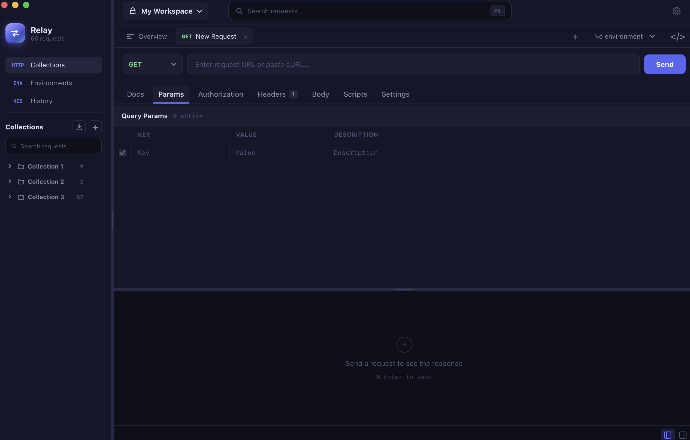

<div align="center">

# Relay

**A fast, local-first desktop API client. No accounts, no cloud sync, no telemetry — just you and your APIs.**

[](https://github.com/relay-client/relay/actions/workflows/ci.yml)
[](https://github.com/relay-client/relay/releases/latest)
[](LICENSE)
[](https://github.com/relay-client/relay/releases/latest)

Built with Go, Svelte 5, and Wails.

</div>



---

## Download

Grab the latest build from the [releases page](https://github.com/relay-client/relay/releases/latest).

| Platform | Installer |
|----------|-----------|
| macOS (Apple Silicon + Intel) | `.dmg` |
| Windows 10/11 (x64) | `.exe` (NSIS installer), `.msix` |
| Linux (x64) | `.AppImage` |

Every release ships SHA256 checksums and minisign signatures, and the in-app updater refuses any binary that fails either check.

Guides, the scripting reference, and the YAML workspace format live in the **[documentation site](https://relay-client.github.io/relay/)**.

---

## Features

**Requests**
- All HTTP methods: GET, POST, PUT, PATCH, DELETE, HEAD, OPTIONS
- Query params, headers, body (JSON, form-data, x-www-form-urlencoded, raw text/XML/HTML, binary file)
- cURL import — paste a curl command into the URL field, it parses automatically
- GraphQL, Server-Sent Events, WebSocket, Socket.IO, and gRPC request types
- Postman, Insomnia, Bruno/OpenCollection, OpenAPI/Swagger, HAR, cURL, and all-data backup import paths
- Postman, OpenAPI, OpenCollection, and all-data backup export paths

**Authentication**
- Bearer Token
- Basic Auth
- Digest Auth (full MD5 challenge-response)
- API Key — in header or query string
- OAuth 2.0 — Client Credentials and Authorization Code (with PKCE) grants; loopback browser sign-in, refresh tokens, and automatic token refresh before each send
- AWS Signature v4
- Per-request, collection, and folder defaults with inheritance

**Scripting** — pre-request and test scripts in sandboxed JavaScript, with legacy [Tengo](https://github.com/d5/tengo) support:
```js
// pre-request: inject a header
pm.request.headers.set("X-Client", "relay")

// test: assert status and parse JSON
pm.test("status is 200", () => pm.response.to.have.status(200))
const body = pm.response.json()
pm.test("has id", () => pm.expect(body).to.have.property("id"))
```

**Environments & Variables**
- Multiple environments per workspace, switch with one click
- `{{variable}}` template syntax in URLs, headers, params, body, auth fields
- Set variables from test scripts (`pm.variables.set`, `pm.environment.set`)
- Manual-save and autosave modes both cover request and environment edits

**Workspaces & Collections**
- Multiple workspaces for separate projects or clients
- Collections with nested folder hierarchy and empty-folder preservation
- Drag-and-drop organisation
- Full request history (14-day retention, 1000 entries)
- Git-backed YAML workspaces with diagnostics, conflict helpers, and local-only secrets

**Response viewer**
- Syntax-highlighted body with line numbers
- Paginated rendering for large responses (512 KB pages, once a response exceeds 10 MB)
- Full-text search with match navigation
- Save response to file, copy to clipboard
- Headers table, test results, script logs — all in one panel
- Realtime panels for SSE, WebSocket, Socket.IO, and gRPC responses

**Code generation** — copy the current request as:
- cURL
- Python `requests`
- JavaScript `fetch`
- Go `net/http`
- More in the side panel

**Settings per request**: HTTP version (auto / 1.1 / 2), SSL verification, redirect policy (follow, preserve method, preserve auth), cookie jar, timeout, URL encoding.

**Keyboard-first**: all actions have configurable shortcuts. Global search (`⌘K`), quick send (`⌘Enter`), tab switching (`⌘1`–`⌘9`).

**Dark and light themes**, with multiple built-in variations.

**Local-first storage** — the local Relay profile and its secrets are encrypted at rest with AES-256-GCM. The key is stored in the OS credential store when available and also kept as a `0600` recovery file in Relay's app-data directory. Git-backed workspace YAML is intentionally human-readable; secret values are replaced with local placeholders.

---

## Building from source

**Prerequisites**

- Go 1.25+
- Node.js 20+
- [Wails v2](https://wails.io/docs/gettingstarted/installation) — `go install github.com/wailsapp/wails/v2/cmd/wails@latest`
- macOS: Xcode Command Line Tools
- Windows: NSIS (for installer builds) and Windows SDK (for MSIX packaging/signing tools)
- Linux: `libgtk-3-dev`, `libwebkit2gtk-4.0-dev`

**Dev mode** (hot-reload frontend + Go backend):
```bash
git clone https://github.com/relay-client/relay
cd relay
npm install
make dev
```

**Production build** for the current platform:
```bash
make build
```

**All platforms** (requires each platform's toolchain):
```bash
make build-all
```

**Run the full check suite** — frontend types, unit tests, `gofmt`, `go vet`, and race-enabled Go tests:
```bash
make check
```

See `make help` for every available target, and [docs/RELEASING.md](docs/RELEASING.md) for how releases are cut, signed, and published.

---

## Project layout

```
apps/desktop/               Wails v2 desktop application
apps/desktop/main.go        Entry point, window config, native menus
apps/desktop/internal/
  api/                      HTTP executor, auth, request store, state
  api/auth/                 Bearer, Basic, Digest, API Key, OAuth2, AWS SigV4
  model/                    Shared Go types (request, response, auth config)
  script/                   JavaScript/Tengo scripting engines + pm.* API
apps/desktop/frontend/src/
  App.svelte                Root shell and layout
  lib/stores/app.svelte.ts  Composed app view-model
  lib/stores/features/      Feature slices for requests, collections, Git, import/export, etc.
  lib/components/           UI components
  lib/backend.ts            Wails bridge type definitions
apps/web/                   Astro Starlight documentation site
schemas/                    Public Git/YAML workspace JSON Schema
perf/                       Generated performance fixtures (ignored by Git)
```

---

## Scripting API reference

Scripts run in a sandboxed JavaScript environment by default, or in the legacy [Tengo](https://github.com/d5/tengo) engine for existing requests. Imports, `require`, filesystem, process, and network access are disabled. Execution timeout: 2 seconds.

**`pm.request`**

| Method | Description |
|--------|-------------|
| `pm.request.url` | Current request URL (string) |
| `pm.request.method` | HTTP method |
| `pm.request.headers.get(name)` | Get request header |
| `pm.request.headers.set(name, value)` | Set / override header |
| `pm.request.headers.unset(name)` | Remove header |
| `pm.request.params.get(name)` | Get query param |
| `pm.request.params.set(name, value)` | Set query param |
| `pm.request.set_url(url)` | Override URL before sending |

**`pm.response`** (test scripts only)

| Method | Description |
|--------|-------------|
| `pm.response.code` | HTTP status code (int) |
| `pm.response.status` | Status string, e.g. `"200 OK"` |
| `pm.response.time` | Duration in milliseconds |
| `pm.response.size` | Body size in bytes |
| `pm.response.body()` | Raw body as string |
| `pm.response.json()` | Body parsed as JSON (map/array) |
| `pm.response.headers.get(name)` | Get response header (case-insensitive) |

**`pm.variables` / `pm.environment`**

| Method | Description |
|--------|-------------|
| `.get(key)` | Read a variable |
| `.set(key, value)` | Write a variable |
| `.unset(key)` | Delete a variable |
| `.clear()` | Clear all variables |

**`pm.test(name, fnOrResult)`** — register a named test assertion. JavaScript accepts a callback or boolean; Tengo accepts a boolean expression.

**`pm.expect(value)`** — chainable assertion builder:
`.equal(v)` · `.not_equal(v)` · `.contains(s)` · `.exists()` · `.is_null()` · `.greater_than(n)` · `.less_than(n)` · `.has_key(k)` · `.type_of()` plus JavaScript Chai-style aliases such as `.to.equal(v)`, `.to.include(v)`, and `.to.have.property(k)`.

**`pm.log(...values)`** — output to the Scripts panel.

---

## Contributing

Bug reports, feature requests, and pull requests are welcome. Start with [CONTRIBUTING.md](CONTRIBUTING.md) — it covers the dev setup, what CI enforces, and how to scope a change. Everyone taking part is expected to follow the [Code of Conduct](CODE_OF_CONDUCT.md).

Found a security problem? Please **don't** open a public issue — see [SECURITY.md](SECURITY.md) for private reporting instead.

---

## License

[MIT](LICENSE)
