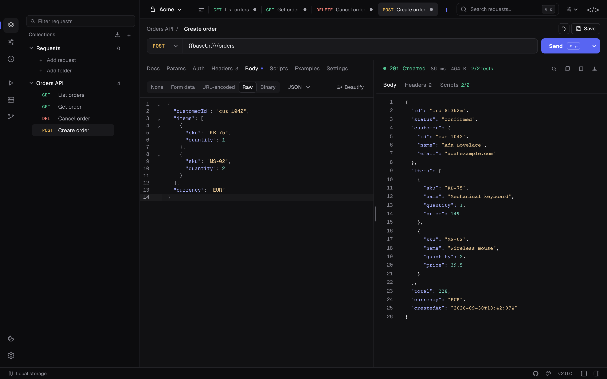

<div align="center">

# Kurlo

**A fast, local-first desktop API client. No accounts, no cloud sync, no telemetry — just you and your APIs.**

[](https://github.com/stormhop/kurlo/actions/workflows/ci.yml)
[](https://github.com/stormhop/kurlo/releases/latest)
[](LICENSE)
[](https://github.com/stormhop/kurlo/releases/latest)

Built with Go, Svelte 5, and Wails.

</div>



---

## Download

Grab the latest build from the [releases page](https://github.com/stormhop/kurlo/releases/latest).

| Platform | Installer |
|----------|-----------|
| macOS (Apple Silicon + Intel) | `.dmg` |
| Windows 10/11 (x64) | `.exe` (NSIS installer), `.msix` |
| Linux (x64) | `.AppImage` |

Every release ships SHA256 checksums and minisign signatures, and the in-app updater refuses any binary that fails either check.

The command line (`kurlo run` for CI, `kurlo mcp` for AI agents) is also on npm as [`@kurlo/cli`](https://www.npmjs.com/package/@kurlo/cli), with prebuilt binaries for macOS, Linux and Windows on x64 and arm64. It does not need the desktop app:

```bash
npx -y @kurlo/cli --version
```

Guides, the scripting reference, and the YAML workspace format live in the **[documentation site](https://kurlo.dev/)**.

---

## Features

**Requests**
- All HTTP methods: GET, POST, PUT, PATCH, DELETE, HEAD, OPTIONS
- Query params, headers, body (JSON, form-data, x-www-form-urlencoded, raw text/XML/HTML, binary file)
- cURL import — paste a curl command into the URL field, it parses automatically
- Bulk edit for params, headers and form fields — switch the table to a `key: value` text area and back
- GraphQL, Server-Sent Events, WebSocket, Socket.IO, gRPC, and MCP request types — an MCP call discovers the server's tools, resources and prompts, seeds the arguments from the tool's schema, and shows the raw JSON-RPC exchange
- Postman, Insomnia, Bruno/OpenCollection, OpenAPI/Swagger, HAR, cURL, and all-data backup import paths
- OpenAPI/Swagger imports from a link as well as a file — paste the spec URL and Kurlo fetches it and builds the collection
- Postman, OpenAPI, OpenCollection, and all-data backup export paths

**Authentication**
- Bearer Token
- Basic Auth
- Digest Auth — MD5, SHA-256 and SHA-512-256 plus their `-sess` variants, with `qop=auth` and `auth-int`
- API Key — in header or query string
- OAuth 2.0 — Client Credentials, Authorization Code (with PKCE), Password, and Device Code grants; loopback browser sign-in, refresh tokens, and automatic token refresh before each send
- AWS Signature v4
- Client certificates (mutual TLS), per request or inherited from a collection
- Per-request and collection defaults with inheritance

**Scripting** — pre-request and test scripts in sandboxed JavaScript, with legacy [Tengo](https://github.com/d5/tengo) support:
```js
// pre-request: inject a header
pm.request.headers.set("X-Client", "kurlo")

// pre-request: rewrite and sign the body
pm.request.body.update(JSON.stringify({ ...pm.request.body.json(), nonce: pm.crypto.randomHex(8) }))

// test: assert status and shape
pm.test("status is 200", () => pm.response.to.have.status(200))
pm.test("has an id", () => pm.response.to.have.jsonSchema({ type: "object", required: ["id"] }))
```

`require` resolves bundled stand-ins for `lodash`, `ajv`, `tv4`, `uuid`, `crypto-js`, and `chai`, so imported Postman scripts keep working. `pm.sendRequest` makes an HTTP call from a script, and `pm.execution.skipRequest()` skips the send.

**Environments & Variables**
- Multiple environments per workspace, switch with one click
- Matrix view — every variable as a row, every environment as a column, edited in place
- `{{variable}}` template syntax in URLs, headers, params, body, auth fields
- Set variables from test scripts (`pm.variables.set`, `pm.environment.set`)
- Manual-save and autosave modes both cover request and environment edits

**Workspaces & Collections**
- Multiple workspaces for separate projects or clients
- Collections with nested folder hierarchy and empty-folder preservation
- Drag-and-drop organisation
- Request history — every send on its own page, request and stored response side by side, reopenable in the editor (14-day retention, 1000 entries)
- Collection runner — sequential or parallel, data files, iterations, an HTML report, and the last run of every collection kept
- Git-backed YAML workspaces with diagnostics, conflict helpers, and local-only secrets
- **CLI runner** — `npx -y @kurlo/cli run ./workspace --env CI` executes requests and their test scripts for CI, with data-driven iterations (`--data`), pretty/JSON/JUnit reporters, variable export, and a non-zero exit code on failure

**AI agents (MCP server)** — the Kurlo binary is also a Model Context Protocol server, so Claude Code, Codex, Cursor, Claude Desktop or any other MCP client can list your collections and environments, read how a request is defined, run saved requests and whole collections with their auth, scripts and tests, and send one-off calls with your `{{variables}}`. A login request run once hands its token to every call after it. The workspace is re-read on every call, so your last edit in the app is what runs. Secret environment values are sent to the API but masked as `[secret]` in everything the model sees. `npx` fetches the server from npm, so it works with or without the app installed:

```bash
# Claude Code
claude mcp add kurlo -- npx -y @kurlo/cli mcp --env Staging

# Codex (CLI, IDE extension and desktop app share one config)
codex mcp add kurlo -- npx -y @kurlo/cli mcp --env Staging
```

Cursor, Claude Desktop and other clients with a JSON config (`.cursor/mcp.json`, `claude_desktop_config.json`, …):

```json
{
  "mcpServers": {
    "kurlo": {
      "command": "npx",
      "args": ["-y", "@kurlo/cli", "mcp", "--env", "Staging"]
    }
  }
}
```

Without Node.js, point the client at the desktop app instead: `/Applications/Kurlo.app/Contents/MacOS/kurlo mcp` on macOS, or the installed `kurlo` executable on Linux and Windows. Tools, flags and serving a Git-backed workspace are covered in the [MCP server guide](https://kurlo.dev/docs/guides/mcp-server/).

**Response examples** — save any response as a named example on its request: the status, headers and body it came back with, alongside the request that produced it. Secrets are redacted on capture, a clean body is stored byte for byte, and examples ride along through Postman, OpenCollection, HAR and OpenAPI imports and exports. A response can be diffed against an example instead of against the previous send.

**Cookies** — a per-workspace cookie jar with a per-domain editor, disableable per request.
- **Cookie sync**: pair Kurlo with the in-repo browser extension (`apps/extension`, Chromium + Firefox) and the session you already have in the browser is the session Kurlo sends with. A loopback-only bridge that stays off until you turn it on, an approval you give in Kurlo by matching a six-digit code, and a per-domain allowlist enforced on both sides. Cookies travel one way: browser into Kurlo.

**Mock server** — serve a collection's saved examples over HTTP on a local port, so a client can be built against an endpoint that does not exist yet. Routing is by method and the example's path template (`/orders/:id`), a recorded query narrows which example answers, and a live log shows what the client asked for and which example replied. Loopback only; CORS preflight is answered for any origin.

**Response viewer**
- Syntax-highlighted body with line numbers
- Paginated rendering for large responses (512 KB pages, once a response exceeds 10 MB)
- Full-text search with match navigation
- Save response to file, copy to clipboard
- Headers table, test results, script logs — all in one panel
- Preview tab for HTML, images and PDFs; binary bodies are detected rather than rendered as mojibake
- Diff against the previous response or a saved example
- Timeline with connection details and the request as it went on the wire, secrets masked, one block per redirect hop
- Realtime panels for SSE, WebSocket, Socket.IO, and gRPC responses

**Code generation** — copy the current request as a runnable snippet in one of 14 targets: cURL, HTTPie, JavaScript `fetch`, Node.js `fetch`, Axios, Python `requests`, Go `net/http`, Java OkHttp, C# `HttpClient`, PHP cURL, Ruby `Net::HTTP`, Swift `URLSession`, Kotlin OkHttp, and Rust `reqwest`. Secret variables stay as `{{name}}` placeholders.

**Browser request emulation** — send with a browser's rules instead of a client's: an `Origin` header, CORS preflight and response checks, and Content Security Policy enforcement, so a request can reproduce what the browser will do before the frontend is written.

**Settings per request**: HTTP version (auto / 1.1 / 2), SSL verification, redirect policy (follow, preserve method, preserve auth), cookie jar, timeout, proxy, URL encoding.

**Keyboard-first**: all actions have configurable shortcuts. A command palette (`Cmd/Ctrl K`) finds requests and runs commands, quick send (`Cmd/Ctrl Enter`), focus the URL (`Cmd/Ctrl L`), tab switching (`Cmd/Ctrl 1`–`8`, with `9` for the last tab). Kurlo shows `Cmd` on macOS and `Ctrl` on Windows and Linux.

**Dark and light themes**, with multiple built-in variations.

**Local-first storage** — the local Kurlo profile and its secrets are encrypted at rest with AES-256-GCM. The key is stored in the OS credential store when available and also kept as a `0600` recovery file in Kurlo's app-data directory. Git-backed workspace YAML is intentionally human-readable; secret values are replaced with local placeholders.

---

## Building from source

**Prerequisites**

- Go 1.25+
- Node.js 22.12+
- [Wails v2](https://wails.io/docs/gettingstarted/installation) — `go install github.com/wailsapp/wails/v2/cmd/wails@latest`
- macOS: Xcode Command Line Tools
- Windows: NSIS (for installer builds) and Windows SDK (for MSIX packaging/signing tools)
- Linux: `libgtk-3-dev`, `libwebkit2gtk-4.1-dev`

**Dev mode** (hot-reload frontend + Go backend):
```bash
git clone https://github.com/stormhop/kurlo
cd kurlo
npm install
make dev
```

**Production build** for the current platform:
```bash
make build
```

**All platforms** (requires each platform's toolchain):
```bash
make build-all
```

**Run the full check suite** — frontend types, unit tests, `gofmt`, `go vet`, and race-enabled Go tests:
```bash
make check
```

See `make help` for every available target.

---

## Project layout

```
apps/desktop/               Wails v2 desktop application
apps/desktop/main.go        Entry point, window config, native menus
apps/desktop/cmd/kurlo/     Headless CLI (run, mcp) published to npm as @kurlo/cli
apps/desktop/internal/
  api/                      HTTP executor, auth, request store, state
  api/auth/                 Bearer, Basic, Digest, API Key, OAuth2, AWS SigV4
  model/                    Shared Go types (request, response, auth config)
  script/                   JavaScript/Tengo scripting engines + pm.* API
apps/desktop/frontend/src/
  App.svelte                Root shell and layout
  lib/stores/app.svelte.ts  Composed app view-model
  lib/stores/features/      Feature slices for requests, collections, Git, import/export, etc.
  lib/components/           UI components
  lib/backend.ts            Wails bridge type definitions
apps/extension/             Cookie Sync browser extension (MV3 + Firefox event page)
apps/web/                   Astro Starlight documentation site
npm/cli/                    The @kurlo/cli npm launcher; scripts/build-npm-packages.mjs adds the binaries
schemas/                    Public Git/YAML workspace JSON Schema
perf/                       Generated performance fixtures (ignored by Git)
```

---

## Scripting API reference

Scripts run in a sandboxed JavaScript environment by default, or in the legacy [Tengo](https://github.com/d5/tengo) engine for existing requests. Imports, filesystem, process, and network access are disabled. Execution timeout: 2 seconds by default, configurable per request up to 60.

The full surface — every method, the variable-scope precedence rules, and the Chai-style assertion aliases — is in the [scripting API reference](https://kurlo.dev/docs/reference/scripting-api/). The short version:

| Surface | What it covers |
|---------|----------------|
| `pm.request` | `url`, `method`, `set_url()`, `headers.get/set/unset`, `params.get/set` |
| `pm.request.body` | `raw`, `mode`, `json()`, `update()`, plus `urlencoded` / `formdata` field lists |
| `pm.response` | `code`, `status`, `responseTime`, `size`, `body()`, `json()`, `headers.get()` — test scripts only |
| `pm.variables` · `pm.globals` · `pm.environment` · `pm.collectionVariables` | `get` / `set` / `unset` / `clear`, differing only in which scope they read and write |
| `pm.iterationData.get(key)` | The current data-row value in a data-driven run (read-only) |
| `pm.info` | `requestName`, `eventName`, `iteration`, `iterationCount` |
| `pm.cookies` | `get` / `has` / `names` for the cookies this request's jar would send |
| `pm.crypto` · `CryptoJS` | MD5/SHA digests, HMAC, base64, `randomHex()`, `uuid()` |
| `pm.sendRequest(req, cb)` | A synchronous HTTP call through the regular request engine |
| `pm.execution.skipRequest()` | From a pre-request script, skips the send — reported as skipped, not failed |
| `pm.test(name, fnOrResult)` | Register a named assertion |
| `pm.expect(value)` | `.equal` · `.contains` · `.exists` · `.has_key` · … plus `.to.equal(v)`, `.to.include(v)`, `.to.have.property(k)` |
| `pm.response.to.have.*` | `status(code)`, `header(name)`, `jsonBody(path?, value?)`, `jsonSchema(schema)` (draft-07) |
| `pm.log(...values)` | Output to the Scripts panel |

`require` resolves bundled stand-ins for `lodash`, `ajv`, `tv4`, `uuid`, `crypto-js`, and `chai`. There is no event loop: `setTimeout`, `async` and `await` are not available, and `pm.sendRequest`'s callback runs immediately.

---

## Contributing

Bug reports, feature requests, and pull requests are welcome. Start with [CONTRIBUTING.md](CONTRIBUTING.md) — it covers the dev setup, what CI enforces, and how to scope a change. Everyone taking part is expected to follow the [Code of Conduct](CODE_OF_CONDUCT.md).

Found a security problem? Please **don't** open a public issue — see [SECURITY.md](SECURITY.md) for private reporting instead.

---

## License

[MIT](LICENSE)
