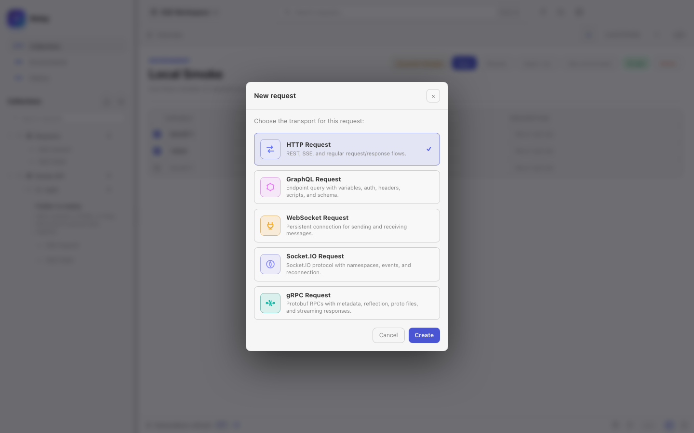
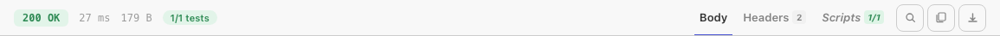
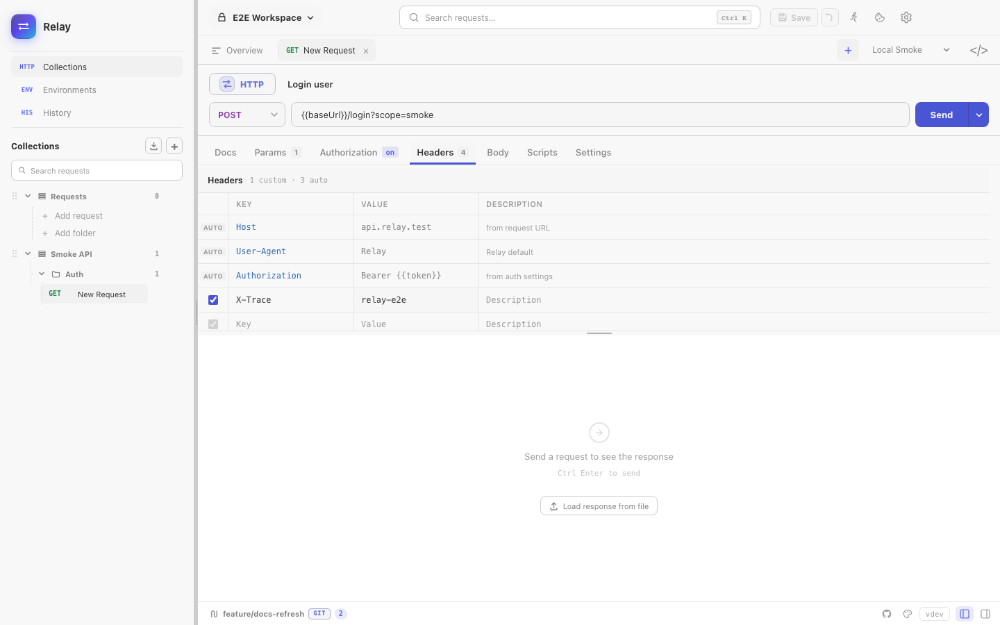

This walkthrough takes about five minutes. By the end you'll have:

1. A workspace with one collection.
2. A saved `GET` request against a public API.
3. An environment with a base URL variable.
4. A test script asserting the response.

## 1. Create a workspace

Workspaces are top-level containers — think one per project or per client. On first launch Relay creates a **Default** workspace; you can rename it or add more from the workspace switcher in the top-left.

## 2. Send an ad-hoc request

- Press `Cmd/Ctrl N` and choose **HTTP Request**, or use the request type picker in the sidebar.
- Paste `https://httpbin.org/get?lang=go&runtime=wails` into the URL bar.
- Hit `Cmd/Ctrl Enter` (or click **Send**).



The response panel shows the JSON body with syntax highlighting, response headers, timing, and size.




> Tip: you can paste a `curl ...` command into the URL field — Relay will parse method, headers, params, and body automatically.

## 3. Save it to a collection

- Click **Save** (or `Cmd/Ctrl S`).
- Pick **+ New collection**, name it `Examples`, and save the request as `Get with query`.

The request now lives in the sidebar tree. Drag-and-drop reorders requests and folders.

## 4. Parameterize with an environment

Hard-coded URLs don't survive across staging and prod. Replace the host with a variable:

- Open **Environments** in the side panel, click **+** to create `Local`.
- Add `baseUrl = https://httpbin.org`.
- Activate `Local` from the environment switcher.
- Edit the request URL to `{{baseUrl}}/get?lang=go&runtime=wails`.
- Send again — same result, but now portable.

See the [environments guide](/docs/guides/environments/) for active environments, collection variables, and script-created values.

Use the **Headers** tab for API-specific metadata such as trace IDs, content negotiation, or custom client headers:



## 5. Assert with a test script

Open the **Scripts** tab on the request and paste:

```js
pm.test("status is 200", () => pm.response.to.have.status(200))

const body = pm.response.json()
pm.test("query is echoed back", () => {
  pm.expect(body.args.lang).to.equal("go")
})
```

Send the request again. Your tests show green in the response **Scripts** panel.

## Next steps

- [Configure auth](/docs/guides/authentication/) — Bearer, OAuth2, AWS SigV4, etc.
- [Import an existing collection](/docs/guides/import-export/).
- [Full scripting API](/docs/reference/scripting-api/).
