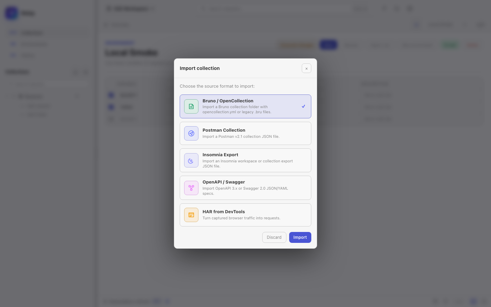

If you already have collections in Postman, Insomnia, or another HTTP client, Relay can import them directly. This page walks through the migration end-to-end and covers the few places where the formats don't quite line up.

## From Postman

Relay imports **Postman Collection v2.1** — the format produced by every modern Postman version.

### Export from Postman

1. Open Postman.
2. Right-click the collection → **Export**.
3. Choose **Collection v2.1 (recommended)** → **Export**.
4. Save the `.json` file somewhere you'll remember.

If you have environments too: Postman left sidebar → **Environments** → `⋯` next to each environment → **Export**. Save those `.json` files alongside the collection.

### Import into Relay

In Relay's sidebar header, click the **import** icon (the down-arrow into a tray, next to the **+** button), then pick the exported `.json`. Relay creates a new collection with the same name, preserves the folder tree, and imports every request inside.

You can also drag and drop the file onto the sidebar.

For environments, switch the sidebar to *Environments* view and use its import flow. **Import all data** is reserved for Relay backup JSON and replaces the current Relay profile.

### What carries over

| Postman concept | Maps to in Relay |
|-----------------|------------------|
| Collection name + folder tree | Collection + nested folders (up to 4 levels deep) |
| Request name, method, URL, params, headers, body (raw / form-data / urlencoded / binary / GraphQL) | All preserved verbatim |
| Authentication: Basic, Bearer, API Key, Digest, OAuth 2.0 | Imported into Relay's Auth tab. Relay supports inherited auth at the collection level; folder-level auth is flattened to the closest representable collection/request configuration. |
| AWS Signature v4 | Preserved with region / service / access keys |
| Pre-request and test scripts | Imported into Relay's sandboxed script fields — see compatibility notes below |
| Environments (variables) | One Relay environment per Postman environment |
| `{{variable}}` syntax everywhere | Preserved literally — Relay resolves them the same way |

### Pre-request / test script compatibility

Postman scripts are JavaScript with Postman's `pm.*` API. Relay supports sandboxed JavaScript for new imports and keeps legacy [Tengo](https://github.com/d5/tengo) script fields for older requests. The shared `pm.*` API mirrors the common Postman surface for headers, variables, environments, response JSON, tests, and logs.

Most simple Postman scripts import with minimal edits:

| Postman | Relay equivalent |
|---------|------------------|
| `pm.request.headers.add({key, value})` | `pm.request.headers.set("key", "value")` |
| `pm.response.json()` | `pm.response.json()` ✓ same |
| `pm.test("name", function () { ... })` | `pm.test("name", () => { ... })` or `pm.test("name", expr)`; see [Scripting API](/docs/reference/scripting-api/) |
| `pm.environment.set("k", "v")` | `pm.environment.set("k", "v")` ✓ same |
| `tests["name"] = ...` (legacy) | Rewrite to `pm.test(...)` |
| `postman.setNextRequest(...)` | Not supported — Relay's Collection Runner runs in declared order |
| Anything that calls Node.js libs (`crypto`, `xml2js`, etc.) | Not supported — scripts run in a sandbox without imports, `require`, filesystem, process, or direct network access |

After import, open the *Scripts* tab on a request and run a smoke request. If a script fails, the response panel shows a script-error block with the line number.

### What doesn't import

- **Postman mocks / monitors** — these are server-side Postman features without a local equivalent.
- **Postman Flows / workflows** — same.
- **Personal teams / sharing** — Relay is local-only.

Everything else round-trips cleanly. You can also **export** a Relay collection back to Postman v2.1 from the collection's `⋯` menu — useful for handing off to teammates who still use Postman.

## From Insomnia

Insomnia uses its own export format which is broadly similar to Postman's. Relay can import it directly.

### Export from Insomnia

1. Insomnia → **Application menu → Preferences → Data → Export Data**.
2. Choose **Insomnia v4 (JSON)**.
3. Save the file.

### Import into Relay

Same flow as Postman — sidebar header → import icon → pick the file. Relay auto-detects whether the file is Postman v2.1 or Insomnia v4 and uses the appropriate importer.

### What carries over

Insomnia's data model is a flat list of `requests`, `request_groups` (folders), and `workspaces`. Relay maps them as follows:

- Top-level workspaces → Relay collections (one Insomnia workspace = one Relay collection).
- `request_group` → folders (nested up to 4 levels deep).
- Each request — URL, method, headers, body, auth — preserved.
- Insomnia environments → Relay environments.
- Insomnia's template tag syntax (``) is converted to Relay's `{{variable}}` where it maps cleanly. Custom tag plugins (``, etc.) become literal strings — you'll need to replace them with environment variables or a pre-request script.

### Insomnia-specific gotchas

- Insomnia's "Request Groups" can be deeper than Relay's 4-level cap. Very deeply nested imports flatten the deepest levels into one folder.
- Insomnia's `nunjucks` template engine is more expressive than Relay's `{{variable}}` lookups. Anything beyond a plain variable substitution needs to be moved into a pre-request script.

## Verifying the import

After importing, do a smoke test:

1. Open the most-used request from the collection. Check headers, body, and auth all look right.
2. Pick the active environment (sidebar → *Environments* → click it). Confirm the variables resolve in the URL bar (`{{baseUrl}}` should turn purple when valid).
3. Press *Send*. The response should match what you'd get in the source app.

If something doesn't carry over correctly, the import is non-destructive — your Postman / Insomnia export is still untouched on disk. Re-export, re-import, or file an issue with the export attached.

## Keeping both tools in sync

You can keep Relay and Postman around in parallel during transition:

- Export Relay collections back to Postman v2.1 via the collection menu → *Export collection*.
- Use Git sync (Relay's *Workspace storage* → Git) to track changes over time; Relay stores shared workspace data as YAML and keeps local secrets outside Git.

Once you're committed to Relay, the export pipeline still works — your data is never trapped.
