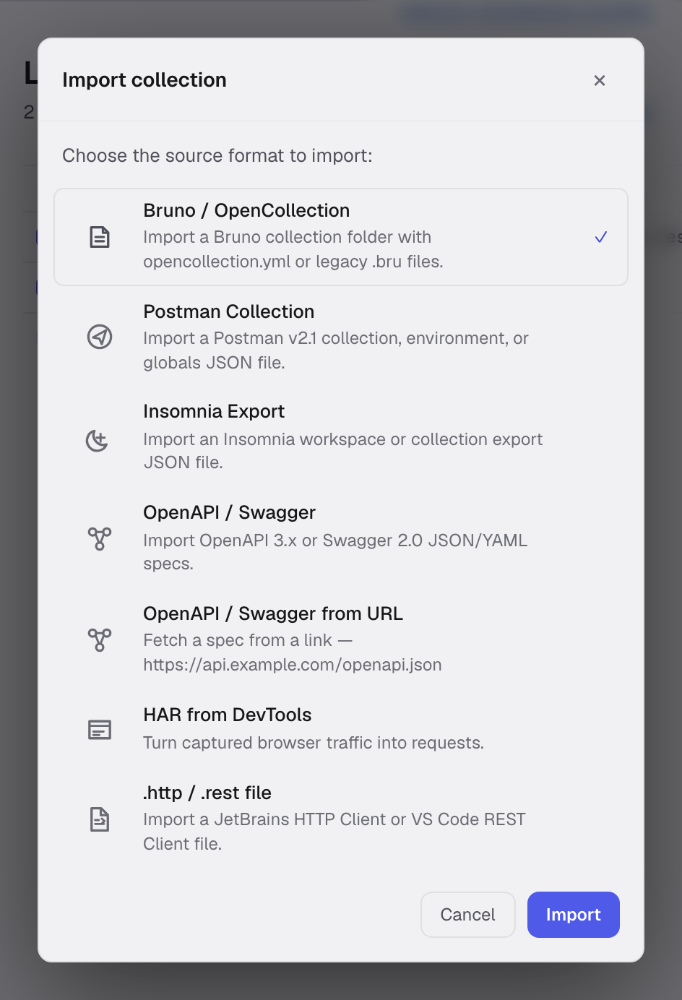

If you already have collections in Postman, Insomnia, or another HTTP client, Kurlo can import them directly. This page walks through the migration end-to-end and covers the few places where the formats don't quite line up.

## From Postman

Kurlo imports **Postman Collection v2.1** — the format produced by every modern Postman version.

### Export from Postman

1. Open Postman.
2. Right-click the collection → **Export**.
3. Choose **Collection v2.1 (recommended)** → **Export**.
4. Save the `.json` file somewhere you'll remember.

If you have environments too: Postman left sidebar → **Environments** → `⋯` next to each environment → **Export**. Save those `.json` files alongside the collection.

### Import into Kurlo

In Kurlo's sidebar header, click the **import** icon (the down-arrow into a tray, next to the **+** button), then pick the exported `.json`. Kurlo creates a new collection with the same name, preserves the folder tree, and imports every request inside.

You can also drag and drop the file onto the sidebar.

For environments, switch the sidebar to *Environments* view and use its import flow. **Import all data** is reserved for Kurlo backup JSON and replaces the current Kurlo profile.

### What carries over

| Postman concept | Maps to in Kurlo |
|-----------------|------------------|
| Collection name + folder tree | Collection + nested folders (up to 4 levels deep) |
| Request name, method, URL, params, headers, body (raw / form-data / urlencoded / binary / GraphQL) | All preserved verbatim |
| Authentication: Basic, Bearer, API Key, Digest, OAuth 2.0 | Imported into Kurlo's Auth tab. Kurlo supports inherited auth at the collection level; folder-level auth is flattened to the closest representable collection/request configuration. |
| AWS Signature v4 | Preserved with region / service / access keys |
| Pre-request and test scripts | Imported into Kurlo's sandboxed script fields — see compatibility notes below |
| Environments (variables) | One Kurlo environment per Postman environment |
| `{{variable}}` syntax everywhere | Preserved literally — Kurlo resolves them the same way |

### Pre-request / test script compatibility

Postman scripts are JavaScript with Postman's `pm.*` API. Kurlo supports sandboxed JavaScript for new imports and keeps legacy [Tengo](https://github.com/d5/tengo) script fields for older requests. The shared `pm.*` API mirrors the common Postman surface for headers, variables, environments, response JSON, tests, and logs.

Most simple Postman scripts import with minimal edits:

| Postman | Kurlo equivalent |
|---------|------------------|
| `pm.request.headers.add({key, value})` | `pm.request.headers.set("key", "value")` |
| `pm.response.json()` | `pm.response.json()` ✓ same |
| `pm.test("name", function () { ... })` | `pm.test("name", () => { ... })` or `pm.test("name", expr)`; see [Scripting API](/docs/reference/scripting-api/) |
| `pm.environment.set("k", "v")` | `pm.environment.set("k", "v")` ✓ same |
| `pm.collectionVariables.set(...)` / `pm.globals.set(...)` | ✓ same; see [Variable scopes](/docs/reference/scripting-api/#variable-scopes) |
| `pm.info.requestName`, `pm.info.iteration` | ✓ same |
| `pm.cookies.get(...)` / `.has(...)` | ✓ same (read-only) |
| `pm.execution.skipRequest()` | ✓ same |
| `CryptoJS.HmacSHA256(...)` | ✓ works via the [CryptoJS shim](/docs/reference/scripting-api/#cryptojs), or use `pm.crypto.hmacSha256(...)` |
| `pm.sendRequest(...)` | ✓ same, once **Allow pm.sendRequest** is enabled in the request's Settings tab |
| `tests["name"] = ...`, `responseBody`, `postman.setEnvironmentVariable(...)` (legacy) | ✓ same; see [Postman legacy globals](/docs/reference/scripting-api/#postman-legacy-globals) |
| `pm.variables.replaceIn("{{baseUrl}}/x")`, `xml2Json(...)` | ✓ same |
| `postman.setNextRequest(...)` | Not supported — Kurlo's Collection Runner runs in declared order |
| `require("lodash")`, `ajv`, `tv4`, `uuid`, `crypto-js`, `chai` | ✓ works via Kurlo's [bundled stand-ins](/docs/reference/scripting-api/#require) |
| `require("...")` of any other Node.js library (`xml2js`, `moment`, `cheerio`, …) | Not supported — the sandbox has no filesystem, process access or real npm modules. Hashing and HMAC are covered by `pm.crypto` / `CryptoJS`, XML by `xml2Json`, HTTP calls by `pm.sendRequest`. |
| `setTimeout` / `async` / `await` | Not supported — the sandbox has no event loop. `pm.sendRequest` is synchronous, and its callback runs immediately. |

After import, open the *Scripts* tab on a request and run a smoke request. If a script fails, the response panel shows a script-error block with the line number.

### What doesn't import

- **Postman monitors** — a server-side feature with no direct equivalent; the [CLI runner](/docs/guides/cli-runner/) on a schedule covers the same ground.
  Postman **mocks** do have an equivalent, and it runs locally: imported saved responses become [examples](/docs/guides/examples/), which the [mock server](/docs/guides/mock-server/) serves over HTTP without an account.
- **Postman Flows / workflows** — same.
- **Personal teams / sharing** — Kurlo is local-only.

Everything else round-trips cleanly. You can also **export** a Kurlo collection back to Postman v2.1 from the collection's `⋯` menu — useful for handing off to teammates who still use Postman.

## From Insomnia

Insomnia uses its own export format which is broadly similar to Postman's. Kurlo can import it directly.

### Export from Insomnia

1. Insomnia → **Application menu → Preferences → Data → Export Data**.
2. Choose **Insomnia v4 (JSON)**.
3. Save the file.

### Import into Kurlo

Same flow as Postman — sidebar header → import icon → pick the file. Kurlo auto-detects whether the file is Postman v2.1 or Insomnia v4 and uses the appropriate importer.

### What carries over

Insomnia's data model is a flat list of `requests`, `request_groups` (folders), and `workspaces`. Kurlo maps them as follows:

- Top-level workspaces → Kurlo collections (one Insomnia workspace = one Kurlo collection).
- `request_group` → folders (nested up to 4 levels deep).
- Each request — URL, method, headers, body, auth — preserved.
- Insomnia environments → Kurlo environments.
- Insomnia's template tag syntax (``) is converted to Kurlo's `{{variable}}` where it maps cleanly. Custom tag plugins (``, etc.) become literal strings — you'll need to replace them with environment variables or a pre-request script.

### Insomnia-specific gotchas

- Insomnia's "Request Groups" can be deeper than Kurlo's 4-level cap. Very deeply nested imports flatten the deepest levels into one folder.
- Insomnia's `nunjucks` template engine is more expressive than Kurlo's `{{variable}}` lookups. Anything beyond a plain variable substitution needs to be moved into a pre-request script.

## Verifying the import

After importing, do a smoke test:

1. Open the most-used request from the collection. Check headers, body, and auth all look right.
2. Pick the active environment with the environment switcher in the title bar. Confirm the variables resolve: in the URL bar, a `{{variable}}` the environment does not define is marked in red, and one it does define stays plain.
3. Press *Send*. The response should match what you'd get in the source app.

If something doesn't carry over correctly, the import is non-destructive — your Postman / Insomnia export is still untouched on disk. Re-export, re-import, or file an issue with the export attached.

## Keeping both tools in sync

You can keep Kurlo and Postman around in parallel during transition:

- Export Kurlo collections back to Postman v2.1 via the collection menu → *Export collection*.
- Use Git sync (Kurlo's *Workspace storage* → Git) to track changes over time; Kurlo stores shared workspace data as YAML and keeps local secrets outside Git.

Once you're committed to Kurlo, the export pipeline still works — your data is never trapped.
