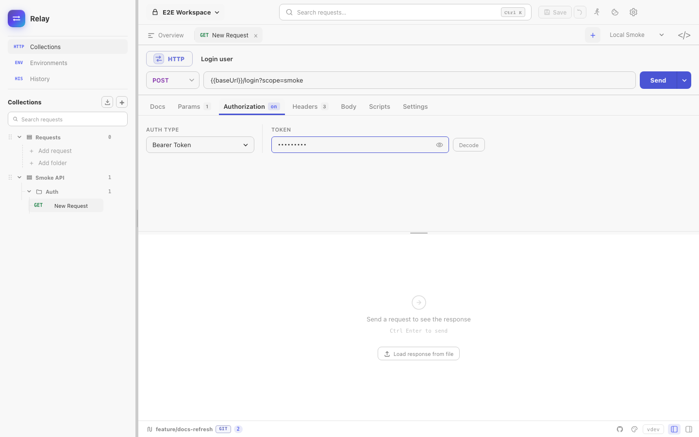
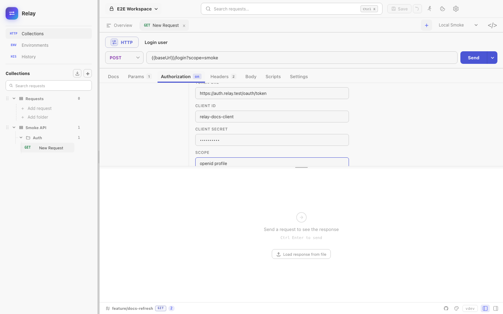

Auth is configured per request on the **Auth** tab. Collections can also define default auth; requests set to **Inherit Auth** use the collection default, while requests with an explicit auth type override it.

## Bearer token

The simplest case: paste the token, Relay sends `Authorization: Bearer <token>`. Use `{{tokenVar}}` to pull from an environment.

## Basic Auth

Username + password. Relay base64-encodes for you.

## Digest Auth

Full RFC 2617 MD5 challenge-response. Relay sends the first request unauthenticated, parses the `WWW-Authenticate` header, and replays with the digest. No configuration beyond username/password.

## API Key

- **In header** — choose the header name (`X-API-Key`, `apikey`, etc.).
- **In query string** — appended on send, not stored in the URL.

## OAuth 2.0

Relay supports two grant types:

- **Client Credentials** — enter the token URL, client ID, client secret, and optional scope, then click **Get Access Token**.
- **Authorization Code** — enter the authorization URL, token URL, client ID, optional client secret, and scope, then click **Authorize in browser**. Relay opens the system browser and receives the callback through a temporary loopback listener on `127.0.0.1`.

For Authorization Code, **Use PKCE** is enabled as the recommended option for public clients. Relay uses S256 PKCE. A client secret is optional when PKCE is used; confidential clients with a secret authenticate to the token endpoint with HTTP Basic.

The acquired `access_token` is injected as `Authorization: Bearer ...` on send. If the provider returns a refresh token, Relay exposes **Refresh token** and automatically refreshes an expired access token before sending a request.

The OAuth Password grant and Device Authorization grant are not supported. Fetch those tokens externally and use Bearer auth when needed.

## AWS Signature v4

Sign requests to AWS APIs (S3, API Gateway, etc.).

- Access key + secret key (use environment variables, never hard-code).
- Service name (e.g. `s3`, `execute-api`).
- Region (e.g. `us-east-1`).
Relay computes the canonical request, derives the signing key, and adds `Authorization`, `x-amz-date`, and `x-amz-content-sha256` headers automatically.

Temporary AWS credentials that require an STS session token are not currently represented by the AWS auth form.

## Inheriting auth

A request set to **Inherit Auth** uses the auth configured in the collection defaults. This is useful when an entire collection talks to the same API.

Imported Postman/Insomnia/Bruno folders that have their own auth are flattened into request-level or collection-level settings where Relay can represent them. After a large import, spot-check the Auth tab for the most sensitive requests.

## Secrets and storage

Auth fields in Relay's local profile are encrypted at rest with AES-256-GCM. Relay writes the key to the OS credential store when available and keeps a `0600` recovery-key file in its app-data directory. In Git-backed workspaces, shared YAML receives `{{relaySecret:...}}` placeholders while the real values remain in the encrypted local profile.

Never paste secrets into request URLs or committed YAML. Prefer secret environment variables or local auth fields.
