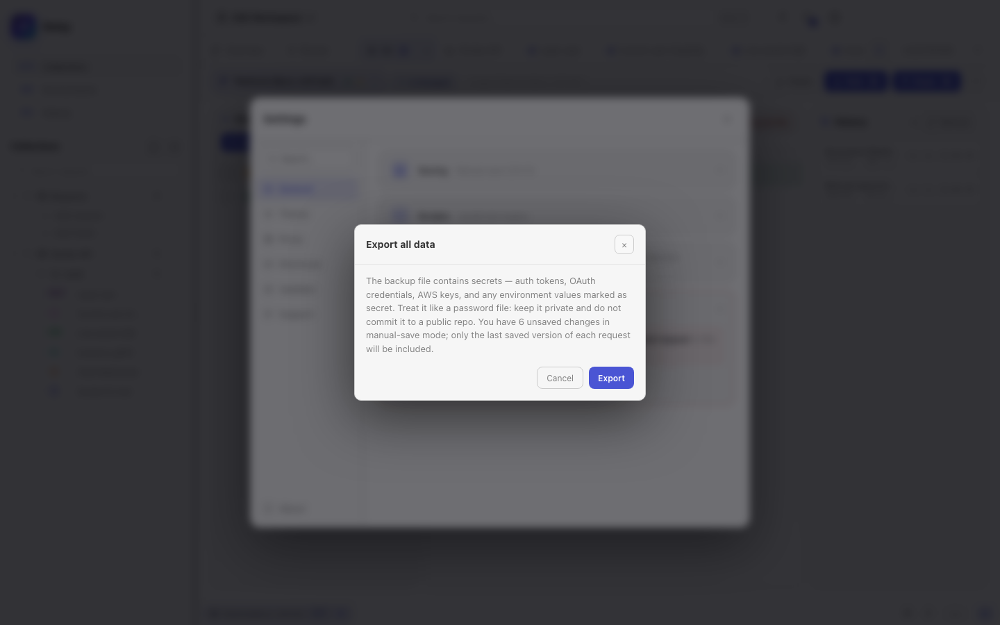

Relay has three complementary protection layers:

| Method | Best for | Important limitation |
|--------|----------|----------------------|
| All-data JSON export | Moving a Relay profile or creating a portable restore point | Plaintext file containing secrets; selected preferences only. |
| Closed-app filesystem backup | Exact recovery of local app data | `requests.json` and its matching key must stay together. |
| Git-backed workspace | Team sharing and version history for workspace YAML | Does not include local history, cookies, or real secret values. |

## Export all data

Open **Settings -> General -> Advanced data -> Export all data**.

The JSON backup includes:

- Workspaces, collections, folders, environments, and saved requests.
- Request history and workspace cookie jars.
- Collection defaults and request settings.
- Theme, autosave mode, shortcut overrides, and request-default preferences.
- Global proxy configuration except its password.

It does not include:

- Unsaved request edits in manual-save mode.
- The global proxy password.
- External folder or Git repository contents and Git history.
- Other local UI preferences, including the selected script engine, default workspace location, and automatic-update preference.

:::caution
The exported JSON is not encrypted. It can contain auth tokens, OAuth credentials, AWS keys, cookies, and environment values marked secret. Store it like a password file and never commit it to a public repository.
:::

## Restore an all-data export

1. Export the current profile first if it is still usable.
2. Open **Settings -> General -> Advanced data -> Import all data**.
3. Select a Relay backup JSON file.
4. Confirm the replacement.
5. Re-enter the global proxy password and reconnect any external workspace paths if needed.

Import replaces the local workspaces, collections, requests, environments, history, and cookies in the current profile. It is not a merge operation.

For cross-machine migration, the all-data export is usually safer than copying encrypted files because it does not depend on an OS credential-store entry.

## Filesystem backup

Quit Relay before copying its data directory:

| Platform | Default location |
|----------|------------------|
| macOS | `~/Library/Application Support/Relay/` |
| Windows | `%APPDATA%\Relay\` |
| Linux | `~/.config/Relay/` or `$XDG_CONFIG_HOME/Relay/` |

Keep at least these files together:

- `requests.json` - encrypted local profile.
- `request-store.key` - matching recovery copy of the encryption key.
- `request-store.key.dpapi` on Windows, when present.
- `preferences.json` and the rest of the app-data directory for the most complete local restore.

Back up folder-backed workspaces and cloned Git repositories separately when they live outside the app-data directory.

## Recover an encrypted profile

If Relay reports **Decryption failed**, restore `requests.json` and the `request-store.key` created with it. The recovery file is owner-readable only and normally has `0600` permissions on Unix-like systems.

Relay may also find the key in:

- macOS Keychain.
- Windows DPAPI for the same OS user.
- Linux libsecret.

The credential-store copy is an additional recovery path, not a substitute for keeping the matching recovery file with a disk backup.

:::caution
If no matching key copy exists, AES-256-GCM encrypted profile data cannot be recovered. A key from another Relay installation will not work.
:::

## Recommended routine

1. Use Git-backed workspaces for shared, reviewable API definitions.
2. Create an all-data export before upgrades, migrations, or destructive imports.
3. Keep periodic closed-app backups of the Relay data directory.
4. Verify that external workspace repositories are covered by their own backup or remote.
5. Test restore files in a disposable OS profile when the data is business-critical.

See [Privacy & security](/privacy/) for encryption details and [Git-backed workspaces](/docs/guides/git-workspaces/) for repository storage.
