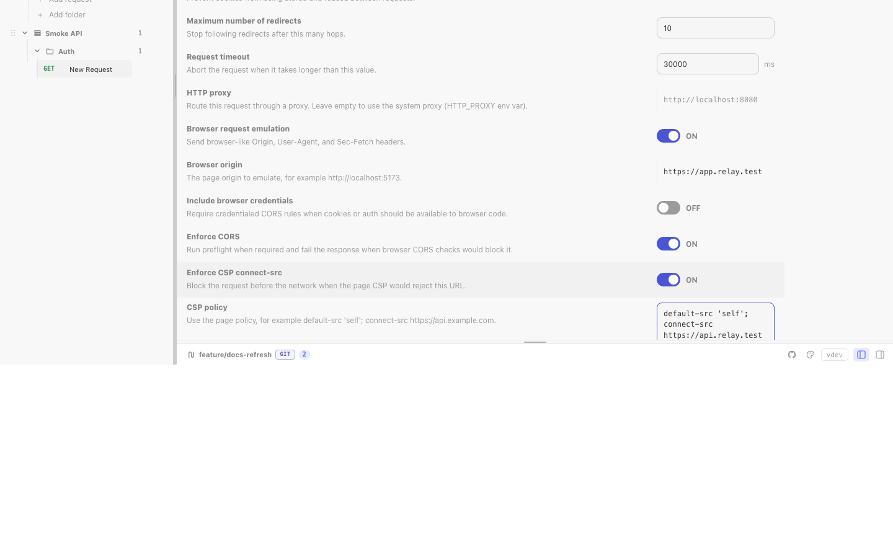

Relay normally behaves like an API client, so it is not restricted by browser CORS or CSP rules. Browser security settings let you reproduce the result that frontend code would see without moving the request into a browser.

Configure them in a request's **Settings** tab or as [collection defaults](/docs/guides/collection-defaults/).



## Browser origin

Enter the page origin that would initiate the request:

```text
http://localhost:5173
https://app.example.com
```

Relay accepts `http://`, `https://`, or the special CORS origin `null`. It normalizes host casing and removes default ports. CORS and CSP checks require an origin even if **Browser request emulation** itself is off.

For CSP checks, use an HTTP or HTTPS origin; `null` cannot act as the protected page origin.

## Request emulation

**Browser request emulation** sends a browser-like `User-Agent`, the configured `Origin`, and fetch metadata:

- HTTP and SSE requests receive `Sec-Fetch-Dest`, `Sec-Fetch-Mode`, and `Sec-Fetch-Site`.
- WebSocket and Socket.IO handshakes send `Origin` but do not add fetch metadata headers.
- Same-origin and cross-origin status is calculated from scheme, hostname, and effective port.

Enabling CORS or CSP checks also activates the browser-like user agent and origin handling.

## Credentials mode

**Include browser credentials** controls cross-origin cookie behavior and CORS validation:

- Off: Relay suppresses cookie-jar cookies on an active cross-origin browser-security request.
- On: cookies may be sent according to the normal cookie-jar rules, and CORS requires `Access-Control-Allow-Credentials: true`.

With credentials enabled, `Access-Control-Allow-Origin: *` is rejected; the server must return the exact emulated origin.

This option does not enable the cookie jar by itself. The request's **Disable cookie jar** setting still wins.

## Enforce CORS

For cross-origin HTTP requests, **Enforce CORS** validates the response as a browser would.

For standard HTTP requests, Relay sends an `OPTIONS` preflight when the method or request headers are not CORS-safelisted. The preflight:

- Does not include cookie-jar cookies.
- Does not follow redirects.
- Validates the 2xx status, allowed origin, method, headers, and credential rules.
- Honors `Access-Control-Max-Age`, capped at five minutes.

The actual response must also pass the origin and credential checks. Same-origin requests skip CORS enforcement.

SSE validates the actual cross-origin response but does not run the separate preflight path. WebSocket and Socket.IO settings expose origin/CSP emulation but not browser CORS enforcement; browsers apply their handshake-origin rules instead of Fetch CORS preflights.

Common failures include:

- Missing or duplicate `Access-Control-Allow-Origin`.
- A different allowed origin than the one configured in Relay.
- Wildcard origin on a credentialed request.
- Missing method or header permission in the preflight response.
- `Authorization` covered only by a wildcard header rule; it must be named explicitly.

## Enforce CSP connect-src

Paste the page's `Content-Security-Policy` value and enable **Enforce CSP connect-src**. Relay checks the target before opening the network connection and checks redirect targets as they are followed.

Relay uses `connect-src` when present and otherwise falls back to `default-src`. If neither directive exists, this check does not block the request.

Supported source matching includes:

- `'self'` and `'none'`
- `*`
- Explicit schemes such as `https:`
- Hosts, ports, and wildcard subdomains
- HTTP-to-HTTPS and WS-to-WSS upgrades allowed by the implemented source rules

This is focused `connect-src` emulation, not a complete browser CSP engine. Directives unrelated to network connections are ignored.

## Recommended workflow

1. Send the request with browser security disabled to verify basic connectivity.
2. Enter the frontend page origin and enable request emulation.
3. Enable CORS and fix server response headers until the request passes.
4. Paste the deployed page policy and enable CSP.
5. Turn on credentials only if frontend code intentionally sends cookies across origins.

For cookie storage and domain matching, see [Cookies](/docs/guides/cookies/).
