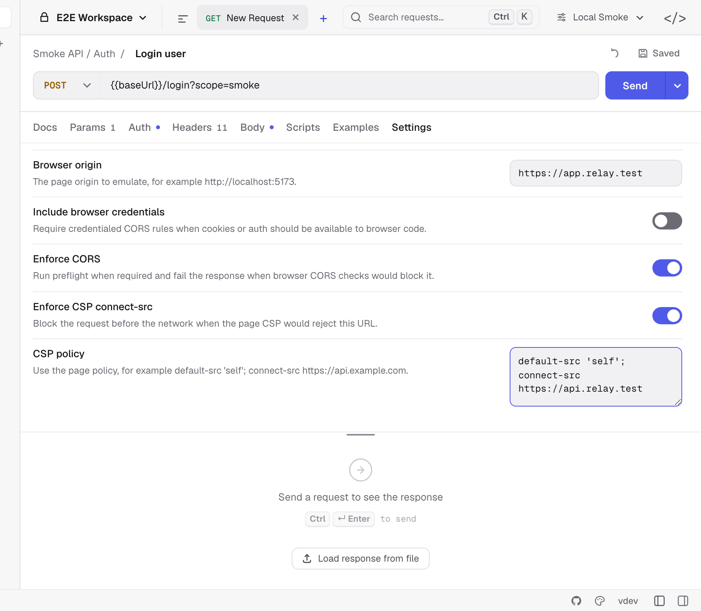

Kurlo normally behaves like an API client, so it is not restricted by browser CORS or CSP rules. Browser security settings let you reproduce the result that frontend code would see without moving the request into a browser.

Configure them in a request's **Settings** tab or as [collection defaults](/docs/guides/collection-defaults/).



## Browser origin

Enter the page origin that would initiate the request:

```text
http://localhost:5173
https://app.example.com
```

Kurlo accepts `http://`, `https://`, or the special CORS origin `null`. It normalizes host casing and removes default ports. CORS and CSP checks require an origin even if **Browser request emulation** itself is off.

For CSP checks, use an HTTP or HTTPS origin; `null` cannot act as the protected page origin.

## Request emulation

**Browser request emulation** sends a browser-like `User-Agent`, the configured `Origin`, and fetch metadata:

- HTTP and SSE requests receive `Sec-Fetch-Dest`, `Sec-Fetch-Mode`, and `Sec-Fetch-Site`.
- WebSocket and Socket.IO handshakes send `Origin` but do not add fetch metadata headers.
- Same-origin and cross-origin status is calculated from scheme, hostname, and effective port.

Enabling CORS or CSP checks also activates the browser-like user agent and origin handling.

## Credentials mode

**Include browser credentials** controls cross-origin cookie behavior and CORS validation:

- Off: Kurlo suppresses cookie-jar cookies on an active cross-origin browser-security request.
- On: cookies may be sent according to the normal cookie-jar rules, and CORS requires `Access-Control-Allow-Credentials: true`.

With credentials enabled, `Access-Control-Allow-Origin: *` is rejected; the server must return the exact emulated origin.

This option does not enable the cookie jar by itself. The request's **Disable cookie jar** setting still wins.

## Enforce CORS

For cross-origin HTTP requests, **Enforce CORS** validates the response as a browser would.

For standard HTTP requests, Kurlo sends an `OPTIONS` preflight when the method or request headers are not CORS-safelisted. Safelisting looks at the value as well as the name, as the Fetch standard does:

- `Accept`, `Accept-Language`, `Content-Language`, `Content-Type` and `Range` are the only safelisted names, and each value must be 128 bytes or shorter.
- No value may contain `"`, `(`, `)`, `:`, `<`, `>`, `?`, `@`, `[`, `\`, `]`, `{`, `}` or a control character.
- `Accept-Language` and `Content-Language` allow only letters, digits, space and `*,-.;=`.
- `Content-Type` must be `application/x-www-form-urlencoded`, `multipart/form-data` or `text/plain`.
- `Range` must be a single `bytes=N-` or `bytes=N-M`; a suffix range such as `bytes=-500` needs a preflight.
- When the safelisted values add up to more than 1 KB, all of them need a preflight.

The preflight:

- Does not include cookie-jar cookies.
- Does not follow redirects.
- Validates the 2xx status, allowed origin, method, headers, and credential rules.
- Honors `Access-Control-Max-Age`, capped at five minutes.

The actual response must also pass the origin and credential checks. Same-origin requests skip CORS enforcement.

### Redirects

Kurlo follows redirects the way a browser does in `cors` mode, checking every hop:

- A redirect response from a cross-origin server must pass the same origin and credential checks before Kurlo follows it.
- A request that starts same-origin becomes a CORS request as soon as a redirect leaves the page's origin, and stays one for the rest of the chain.
- A non-simple request is preflighted again at each new cross-origin target.
- When the chain moves from one cross origin to another, the `Origin` header becomes `null`, and the target must allow `null` or `*`.
- `Authorization` is removed whenever the origin changes, whatever the redirect settings say.
- Without **Include browser credentials**, cookies stop being sent and stored once the chain has left the page's origin.
- A `Location` with a username or password in it is refused.
- `Sec-Fetch-Site` stays `cross-site` once any URL in the chain was cross-origin.
- A `301` or `302` turns only `POST` into `GET`; a `303` turns everything but `GET` and `HEAD` into `GET` and drops `Content-Type` with the body.

### Headers hidden from page code

A browser hands page script only part of a cross-origin response: `Cache-Control`, `Content-Language`, `Content-Length`, `Content-Type`, `Expires`, `Last-Modified`, `Pragma`, and the headers the server lists in `Access-Control-Expose-Headers`. `Access-Control-Expose-Headers: *` exposes the rest, but not for a credentialed request, where `*` is just a header name. `Set-Cookie` is never exposed.

With **Enforce CORS** on, the response's Headers tab marks every other header *hidden from page*. They are still shown, and test scripts still see them, so a script can assert on `Access-Control-Allow-Origin`; the mark is there to explain why `response.headers.get("X-Total-Count")` returns `null` in the browser.

SSE validates the actual cross-origin response and follows the redirect rules above but does not run the separate preflight path. WebSocket and Socket.IO settings expose origin/CSP emulation but not browser CORS enforcement; browsers apply their handshake-origin rules instead of Fetch CORS preflights.

Common failures include:

- Missing or duplicate `Access-Control-Allow-Origin`.
- A different allowed origin than the one configured in Kurlo.
- Wildcard origin on a credentialed request.
- Missing method or header permission in the preflight response.
- `Authorization` covered only by a wildcard header rule; it must be named explicitly.

## Enforce CSP connect-src

Paste the page's `Content-Security-Policy` value and enable **Enforce CSP connect-src**. Kurlo checks the target before opening the network connection and checks redirect targets as they are followed.

Kurlo uses `connect-src` when present and otherwise falls back to `default-src`. If neither directive exists, this check does not block the request.

Supported source matching includes:

- `'self'` and `'none'`
- `*`
- Explicit schemes such as `https:`
- Hosts, ports, and wildcard subdomains
- HTTP-to-HTTPS and WS-to-WSS upgrades allowed by the implemented source rules

This is focused `connect-src` emulation, not a complete browser CSP engine. Directives unrelated to network connections are ignored.

## Mixed content

A page served over HTTPS may not fetch `http://` URLs or open `ws://` sockets. The exceptions are targets a browser already trusts — `localhost`, `*.localhost`, `127.0.0.0/8` and `[::1]` — and, under Local Network Access, private IP literals such as `192.168.1.20` and `.local` names.

When **Enforce CORS** or **Enforce CSP connect-src** is on, Kurlo blocks a mixed-content request before it opens a connection, and checks redirect targets the same way. With only **Browser request emulation** on, it sends the request and adds a warning.

## Local Network Access

Chrome treats a request from a page to an address that is *less public* than the page's own as a local network request. The address spaces, from most to least public, are public, local network (`10.0.0.0/8`, `172.16.0.0/12`, `192.168.0.0/16`, `100.64.0.0/10`, `169.254.0.0/16`, `fc00::/7`, `fe80::/10`, and `.local` names) and loopback (`127.0.0.0/8`, `::1`, `localhost`).

Kurlo classifies the target by the address it actually connected to, so a public name that resolves to a private address counts. Through a proxy only the URL itself can be judged. The page's space comes from the origin you entered: an IP literal, `localhost` or `.local`, and public otherwise.

For such a request Kurlo adds a warning to the response instead of blocking it, because the outcome depends on the person using the page:

- From an HTTPS page, Chrome first asks the user for permission to reach devices on the local network, and the request fails if they decline.
- From an HTTP page on a public or local origin, Chrome refuses the request: local network access is only available to secure contexts.

A page on `localhost` may reach any address. WebSocket and Socket.IO handshakes are not checked, because Chrome does not gate them yet. The older Private Network Access preflight (`Access-Control-Request-Private-Network`) is not sent; Chrome replaced it with the permission prompt.

## Recommended workflow

1. Send the request with browser security disabled to verify basic connectivity.
2. Enter the frontend page origin and enable request emulation.
3. Enable CORS and fix server response headers until the request passes.
4. Paste the deployed page policy and enable CSP.
5. Turn on credentials only if frontend code intentionally sends cookies across origins.

## In CI and for AI assistants

[`kurlo run`](/docs/guides/cli-runner/) and [`kurlo mcp`](/docs/guides/mcp-server/) honor the same settings, saved on a request or inherited from its collection. A run fails on a request the browser would refuse, so a CORS change breaks the build before it breaks the frontend. An assistant can also check any call against an origin with the `browserOrigin` argument of `run_request` and `send_request`.

For cookie storage and domain matching, see [Cookies](/docs/guides/cookies/).
