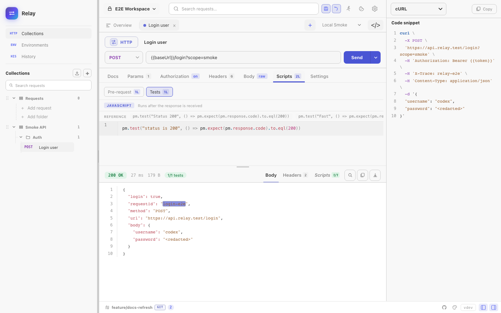

The **Code** side panel turns the currently-open request into a runnable snippet. Open it with the code-snippet icon in the status bar, the workspace overview quick action, or the right-sidebar shortcut from [Keyboard shortcuts](/docs/reference/keyboard-shortcuts/).

## Supported targets

Relay currently exposes 14 choices:

| Family | Targets |
|--------|---------|
| Command line | cURL, HTTPie |
| JavaScript | JavaScript `fetch`, Node.js `fetch`, Axios |
| General purpose | Python `requests`, Go `net/http`, Java OkHttp, C# `HttpClient` |
| Additional clients | PHP cURL, Ruby `Net::HTTP`, Swift `URLSession`, Kotlin OkHttp, Rust `reqwest` |

## What gets generated

Snippets are generated from the currently open HTTP/GraphQL request:

- Non-secret variables are expanded from the active environment and collection variables.
- Secret variables stay as `{{name}}` placeholders so copying a snippet does not silently disclose them.
- URL params, enabled headers, supported bodies, Bearer auth, and API keys are represented.
- cURL also emits Basic auth with `-u`.

## What's omitted

- Pre-request scripts. Snippets show the wire-level request, not the steps that produced it. If your auth depends on a token fetched in a script, copy that call separately.
- Test scripts — they're a Relay concept, not a client concept.
- Digest, OAuth 2.0, and AWS SigV4 handshakes/signing are not reproduced by the snippet generator. Add the resulting auth material in the target client or use a simpler Bearer/API-key representation where appropriate.
- Binary and multipart file handling varies by target; cURL has the most complete file-body output.

:::caution
Treat generated snippets as a starting point and review them before sharing. Literal auth values already present in the request, such as a Bearer token or API key, can appear in the output.
:::

## Copy + paste workflow

The button copies to clipboard and shows a toast. There's no "save snippet to file" affordance — by design, snippets are throwaway artefacts for sharing in bug reports and chat threads.
