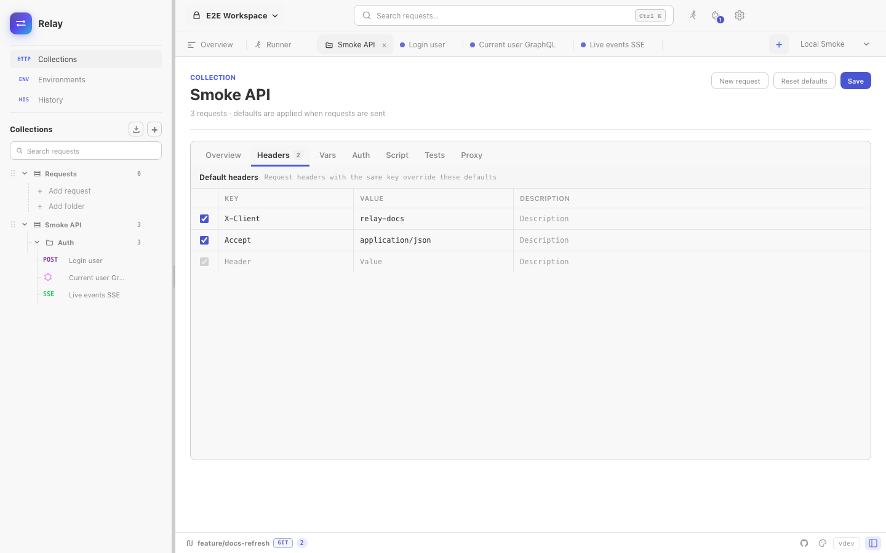

Collection defaults reduce repeated configuration while preserving request-level control. Open a collection's `...` menu, choose **Settings**, and edit the tabs in the collection workspace.



Defaults are applied when a request is sent. Relay currently supports defaults at the collection level; folders organize requests but do not define another inheritance layer.

## Available defaults

| Tab | What it defines |
|-----|-----------------|
| Overview | Collection name and documentation. |
| Headers | Header rows merged into child requests. |
| Vars | Collection variables, including values marked secret. |
| Auth | Default Bearer, Basic, Digest, API Key, OAuth 2.0, or AWS Signature v4 configuration. |
| Script | Collection pre-request script for the selected JavaScript or Tengo engine. |
| Tests | Collection test script for the selected engine. |
| Proxy | HTTP version, TLS verification, redirects, timeout, proxy URL, browser security, and cookie-jar defaults. |

Use the app-wide script-engine setting to switch between the independently stored JavaScript and Tengo fields.

## Precedence

### Headers

Collection headers are added unless the request contains a row with the same key. Matching is case-insensitive. A request row therefore overrides, or can intentionally suppress, the collection row.

### Variables

Collection variables are available as `{{name}}`. Active environment values override collection values with the same key:

```text
active environment > collection variable
```

Values marked **Secret** are masked in the UI and participate in Relay's local secret handling for Git-backed workspaces.

### Authentication

A request uses collection auth only when its Auth type is **Inherit Auth**. Selecting **No Auth** or another explicit request auth type overrides the collection.

See [Authentication](/docs/guides/authentication/) for each supported scheme.

### Scripts and tests

Relay combines scripts in a defined order:

1. Collection pre-request script.
2. Request pre-request script.
3. The network request.
4. Request test script.
5. Collection test script.

JavaScript and Tengo defaults are kept separately and combined only with request scripts from the active engine.

### Transport settings

Transport settings inherit per field. Editing a field in the request Settings tab marks only that field as overridden. Other fields can continue to inherit from the collection.

The request editor shows the applied collection defaults and labels individual values as inherited or overridden. Clicking **Reset** in the request Settings tab clears all request setting override markers, allowing collection values to apply again when the request is sent.

For proxy precedence beyond the collection, see [Proxy configuration](/docs/guides/proxy/).

## Saving and resetting

In autosave mode, collection edits are saved after a short delay. In manual-save mode, click **Save**.

**Reset defaults** clears collection headers, variables, auth, scripts, tests, and transport settings after confirmation. It does not delete requests or folders.

## Storage and export

Collection defaults are saved with the collection:

- Local profile data is inside encrypted `requests.json`.
- Folder and Git workspaces store shareable defaults in YAML.
- Relay/OpenCollection export preserves supported collection defaults.

Real secret values remain in Relay's encrypted local profile when shared YAML uses `{{relaySecret:...}}` placeholders. See [Relay YAML format](/docs/reference/relay-yaml-format/) for the storage contract.
