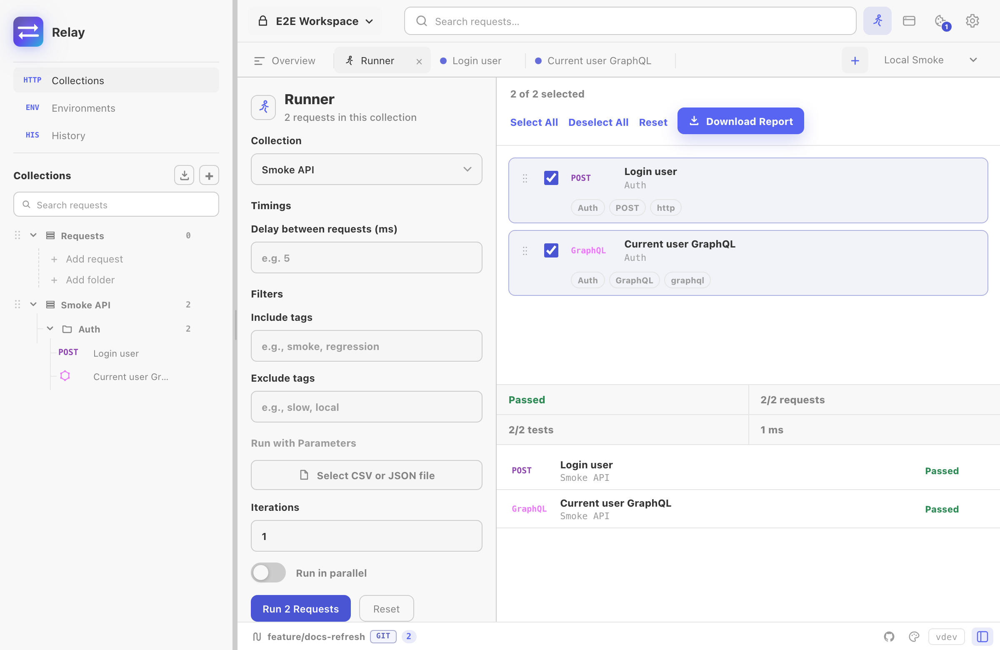

The Collection Runner executes saved requests from a collection or folder and turns the result into a pass/fail report. It is designed for local smoke tests: no account, no cloud monitor, no scheduler.



## Opening the runner

Open it from:

- A collection menu: **Run collection**.
- A folder menu: **Run folder**.
- The workspace overview quick action.

Relay opens the runner workspace and selects runnable requests from the current collection. Realtime sessions (`SSE`, WebSocket, Socket.IO) are skipped because they do not naturally finish. HTTP, GraphQL, and gRPC requests can run.

## Selecting requests

The runner list shows method/transport, request name, folder path, and tags. You can:

- Select/deselect individual requests.
- Select all or deselect all.
- Filter by include/exclude tags.
- Run just a folder by launching from that folder's menu.

Tags are inferred from folder path, transport label, and request type. For example, `Billing / Refunds / POST / http` gives you useful filters without adding a separate tagging UI.

## Timing and parallelism

Use **Delay between requests** when a server rate-limits or when order matters. Sequential runs wait between each request. Parallel runs execute one iteration at a time and wait between iterations.

Enable **Run in parallel** only for independent requests. If a test mutates shared environment values, keep the run sequential so each request sees the latest values from the previous request.

**Max concurrent requests** caps how many run at the same time (default 8, maximum 64). Raise it for fast, independent read-only endpoints; lower it when the server rate-limits or when a large collection would otherwise open more sockets than the machine is happy with.

## Iterations

Set **Iterations** to run the selected set multiple times. Each request gets a result row per iteration, so flaky endpoints are easier to spot.

Iterations are ignored when a data file is loaded; the number of rows in the file becomes the iteration count.

## Data-driven runs

The runner accepts CSV or JSON files. Each row becomes a set of variables for that iteration and overrides the active environment for the request being sent.

CSV:

```csv
userId,region
1001,eu
1002,us
```

JSON:

```json
[
  { "userId": "1001", "region": "eu" },
  { "userId": "1002", "region": "us" }
]
```

Inside a request, use `{{userId}}` or `{{region}}` like any other variable.

## Pass and fail rules

A request passes when:

- The transport succeeds.
- The response status is below 400 for HTTP/GraphQL.
- gRPC returns `OK`.
- All test-script assertions pass.

A request fails when the transport errors, headers are invalid, a script errors, a status is considered failed, or any test assertion fails.

## Reports

After a run, click **Download Report** to save an HTML report. It includes:

- Summary counts.
- Duration.
- Delay/parallel/filter/data-file settings.
- Every request result.
- Test names and failures.

Reports are local files; Relay does not upload them anywhere.

## Common gotchas

- **No runnable requests:** the selected collection only contains realtime requests or empty folders.
- **gRPC request fails immediately:** select a gRPC method before running it.
- **Environment values changed:** scripts can call `pm.environment.set`; after the run Relay merges the final environment state back into the active environment.
- **Cookies changed:** the cookie jar is refreshed after the run, just like after normal sends.
