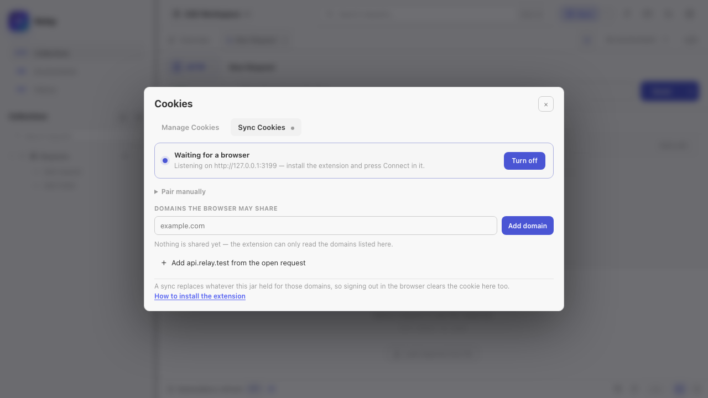
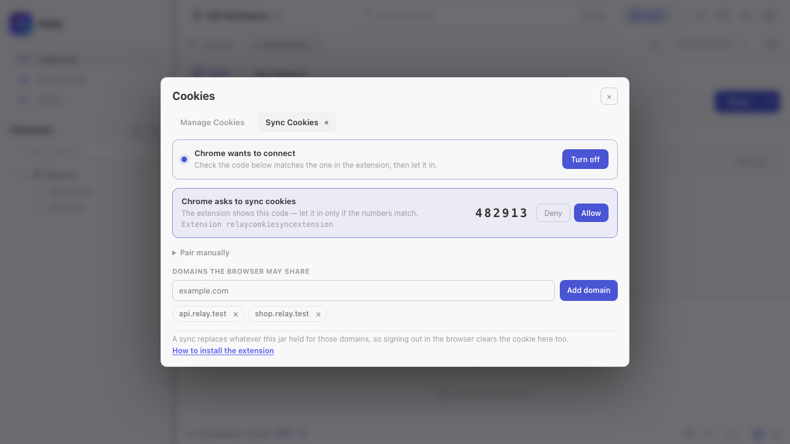
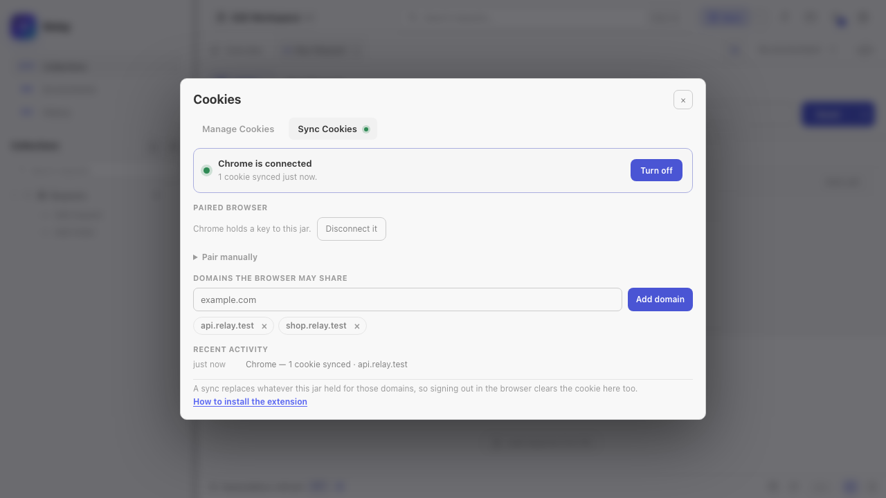

Relay keeps a per-workspace cookie jar, similar to a browser. Cookies received from `Set-Cookie` are stored locally and attached to future matching requests unless that request disables the jar.


## How cookies are sent

For HTTP, GraphQL, SSE, WebSocket, and Socket.IO handshakes, Relay checks the cookie jar before sending:

- Domain and path must match the request URL.
- Secure cookies are only sent over secure schemes.
- Expired cookies are ignored.
- Host-only cookies stay scoped to their original host.
- Manual `Cookie` headers remain visible in the request preview and are not hidden by the jar.

gRPC does not use the browser-style cookie jar path.

## Reading cookies from responses

When a response includes `Set-Cookie`, Relay stores it in the active workspace jar. The jar is encrypted alongside the rest of the request store.

Cookies are refreshed after normal sends and after Collection Runner runs.

## Managing cookies

Open the cookie modal from the cookie icon near the request URL. You can:

- Filter by domain.
- Add a domain manually.
- Add or edit a raw cookie string.
- Delete one cookie.
- Delete all cookies for a domain.
- Clear the entire jar.

Raw cookie input accepts standard `Set-Cookie` style syntax:

```text
session=abc123; Path=/; Secure; HttpOnly; SameSite=Lax
```

## Disabling the jar for one request

Open the request **Settings** tab and turn off **Use the cookie jar**. Relay will not store cookies from that response and will not attach jar cookies to that request.

You can still send a manual cookie:

```text
Cookie: debug=true; session=manual
```

This is useful when reproducing a production request exactly from a copied cURL command.

## Sync cookies from your browser

The **Sync Cookies** tab pairs Relay with a browser extension, so a session you already
have in Chrome, Edge, Brave or Firefox is the session Relay sends with. It is the local
answer to copying a `Cookie:` header out of DevTools after every login.



Cookies flow one way — browser into Relay — and three separate gates stand in front of
them:

1. **The bridge has to be on.** *Turn on* opens a listener bound to `127.0.0.1` (port 3199
   by default). Nothing listens until you ask for it.
2. **You have to let the browser in.** The extension finds Relay by itself and asks to
   connect; Relay shows the request with a six-digit code and the extension shows the same
   code. Approve it only if the numbers match — that is what stops anything else on the
   machine from being approved in its place.
3. **The domain has to be allowlisted twice.** Relay only accepts cookies for the domains
   listed in the tab, and the browser only lets the extension read the domains you grant in
   its popup. A domain missing from either list is never read and never sent.



A domain that cannot hold cookies of its own — a public suffix like `com` or `co.uk` — is
refused with an explanation rather than accepted and quietly ignored.

### Connecting a browser

1. Turn on **Sync Cookies** in Relay.
2. Install the extension from the Relay repository (`apps/extension`, loaded unpacked):
   `chrome://extensions` → **Developer mode** → **Load unpacked**.
3. Open the extension and press **Connect**. It scans ports 3199–3203 for Relay's bridge.
4. Approve the request in Relay once the codes match. Relay hands the extension a token;
   from then on it reconnects on its own and never asks again.
5. Press **Grant domain access** in the extension and accept the browser's prompt, so it
   may read the allowlisted domains.

**Pair manually** in both places is the fallback for when discovery cannot work — a
non-default port, say. The code it shows carries the port and the token, so treat it like a
password.

### What a sync does to the jar

Once connected, the extension holds an open WebSocket to Relay, and the two directions of
traffic are:

- **Live changes.** Every cookie the browser sets, updates or clears for an allowlisted
  domain is pushed as it happens, so a fresh login shows up in Relay within a second.
- **Reconciliation.** On connect and every five minutes the extension sends a full snapshot
  of the allowlisted domains. A snapshot is authoritative: Relay replaces everything the jar
  held for those domains, which is how a cookie you cleared while the browser was closed
  disappears here too. Domains the snapshot does not cover are left alone.
- **Allowlist updates.** Add or remove a domain in Relay and the extension is told
  immediately — no polling, and removing a domain stops it being read at once.

A cookie you typed by hand for a synced domain is replaced by the browser's view of it.



Cookies land in the jar of the workspace you have open, and follow you when you switch
workspaces. The bridge closes when Relay quits and reopens on the next start if you left it
on; the token is kept, so the browser reconnects on its own.

**Disconnect it** mints a new token, which drops the browser immediately. Relay tells the
extension that this is what happened, so it drops its own token and asks to connect again
rather than retrying with a key that no longer works. The extension's **Forget** does the
same from the other side.

### When it will not sync

- **Nothing on the allowlist.** The extension is told there is nothing to read.
- **Permission not granted.** The extension reports only the domains it could actually
  read, so a domain it cannot read is left out of the snapshot instead of looking empty and
  clearing the jar. Relay marks those domains in the tab and names them, rather than leaving
  you to wonder why nothing arrives.
- **Relay is closed or sync is off.** The extension retries with a backoff and reconnects
  when the bridge comes back.

## Browser emulation and CORS

Browser request emulation can apply Origin, user-agent, CORS, and CSP checks, but it does not move cookies into a browser. Cookies remain in Relay's local jar and follow Relay's request settings.

If **Browser request emulation** and **Use the cookie jar** are both on, the request preview shows which headers come from emulation and which cookie header comes from the jar.

## Backup and privacy

Cookies are included in all-data backups and in the encrypted local request store. Collection exports do not include the runtime cookie jar.

Cookie sync adds one local surface: a loopback-only HTTP listener, off unless you turn it on,
reachable only with the pairing token. The token and the sync allowlist live in
`preferences.json` next to the request store; no cookie leaves the machine, and the browser
extension talks to `127.0.0.1` and nothing else.

If you need to remove sensitive cookies, clear them from the cookie modal or clear request history/all data from Settings.
