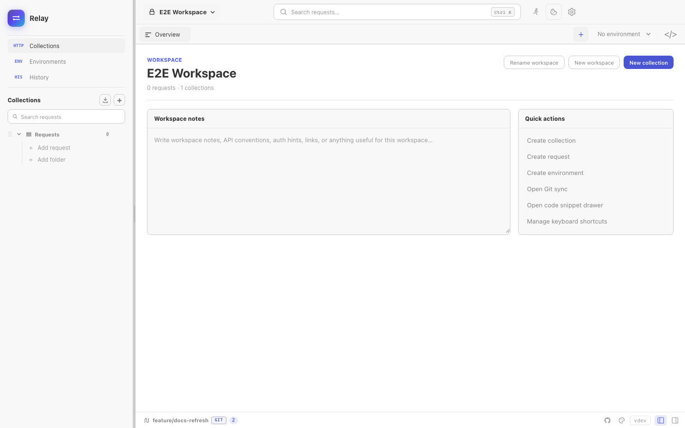
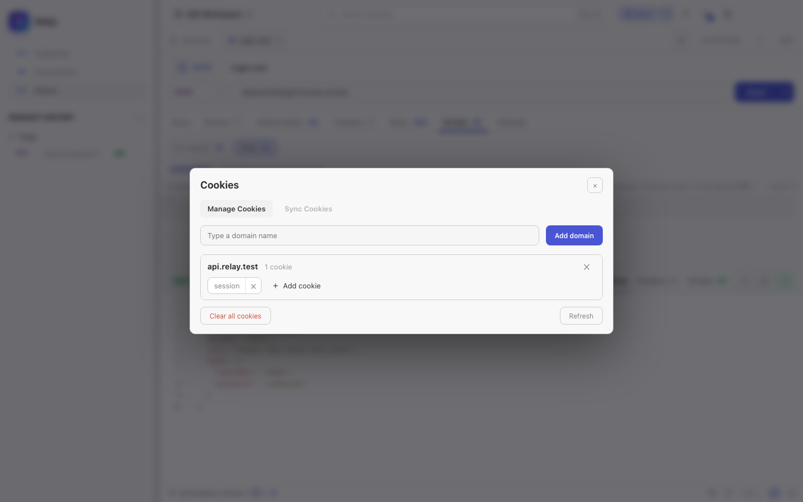

Relay keeps a per-workspace cookie jar, similar to a browser. Cookies received from `Set-Cookie` are stored locally and attached to future matching requests unless that request disables the jar.





## How cookies are sent

For HTTP, GraphQL, SSE, WebSocket, and Socket.IO handshakes, Relay checks the cookie jar before sending:

- Domain and path must match the request URL.
- Secure cookies are only sent over secure schemes.
- Expired cookies are ignored.
- Host-only cookies stay scoped to their original host.
- Manual `Cookie` headers remain visible in the request preview and are not hidden by the jar.

gRPC does not use the browser-style cookie jar path.

## Reading cookies from responses

When a response includes `Set-Cookie`, Relay stores it in the active workspace jar. The jar is encrypted alongside the rest of the request store.

Cookies are refreshed after normal sends and after Collection Runner runs.

## Managing cookies

Open the cookie modal from the cookie icon near the request URL. You can:

- Filter by domain.
- Add a domain manually.
- Add or edit a raw cookie string.
- Delete one cookie.
- Delete all cookies for a domain.
- Clear the entire jar.

Raw cookie input accepts standard `Set-Cookie` style syntax:

```text
session=abc123; Path=/; Secure; HttpOnly; SameSite=Lax
```

## Disabling the jar for one request

Open the request **Settings** tab and turn off **Use the cookie jar**. Relay will not store cookies from that response and will not attach jar cookies to that request.

You can still send a manual cookie:

```text
Cookie: debug=true; session=manual
```

This is useful when reproducing a production request exactly from a copied cURL command.

## Browser emulation and CORS

Browser request emulation can apply Origin, user-agent, CORS, and CSP checks, but it does not move cookies into a browser. Cookies remain in Relay's local jar and follow Relay's request settings.

If **Browser request emulation** and **Use the cookie jar** are both on, the request preview shows which headers come from emulation and which cookie header comes from the jar.

## Backup and privacy

Cookies are included in all-data backups and in the encrypted local request store. Collection exports do not include the runtime cookie jar.

If you need to remove sensitive cookies, clear them from the cookie modal or clear request history/all data from Settings.
