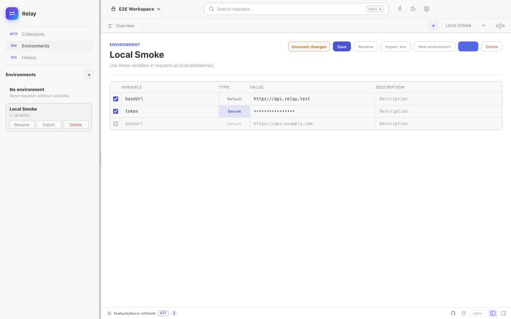

Variables in Relay use the `{{name}}` template syntax. They expand in URLs, headers, query params, request bodies, and auth fields just before send.



## Scopes

Resolution combines two saved scopes plus runtime script state:

1. **Collection variables** — defaults saved with the collection.
2. **Active environment variables** — the selected environment for the workspace. These override collection variables with the same key.
3. **Runtime variables** — values written with `pm.variables.set(...)` during scripts. These live in Relay's script runtime state and are useful for chained requests and assertions.

If nothing matches, the literal `{{name}}` is left untouched so the unresolved template is visible.

## Switching environments

Use the environment switcher in the top bar. The active environment is per-workspace — switching to a different workspace remembers its last-used environment.

## Setting variables from scripts

```js
// Use in a test script after parsing a login response:
const body = pm.response.json()
pm.environment.set("authToken", body.access_token)
pm.environment.unset("authToken")

// Runtime-scoped:
pm.variables.set("traceId", "relay-" + Date.now())
```

A common pattern: a "login" request fetches a token and stores it under `authToken`. Every other request uses `Authorization: Bearer {{authToken}}` and inherits the value.

## Secret variables

Mark a variable as **secret** in the environment editor — its value is masked in the UI and excluded from collection exports. Useful for tokens and keys.

## Manual save vs autosave

Environment edits follow the same save mode as requests:

- **Autosave on:** edits persist after a short debounce.
- **Manual save:** edits mark the environment dirty and persist only when you save.

Script updates from `pm.environment.set(...)` are merged back into the active environment after a request or runner execution.
