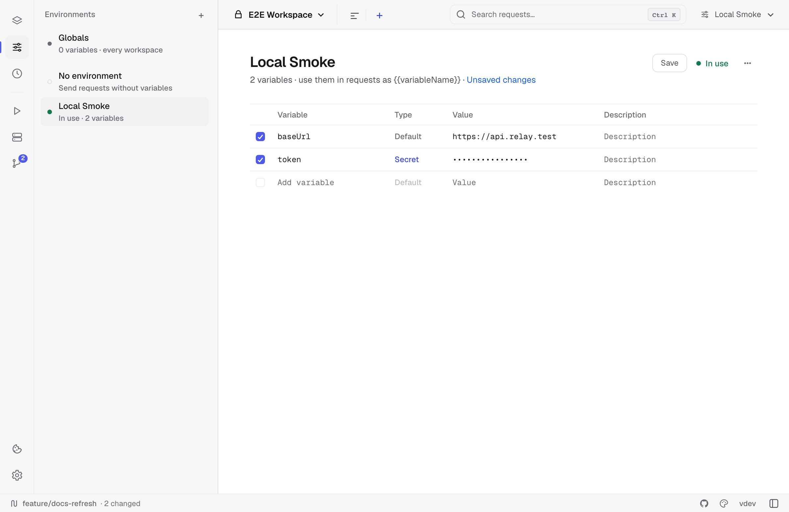
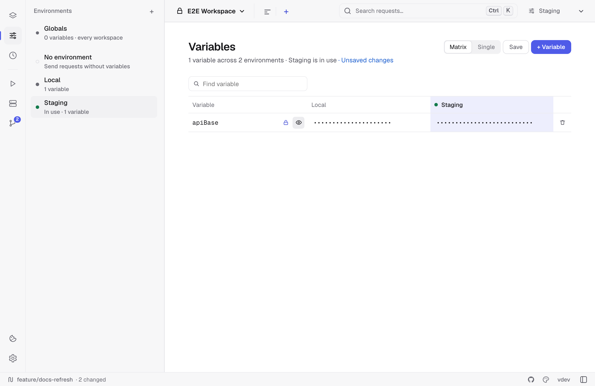

Variables in Kurlo use the `{{name}}` template syntax. They expand in URLs, headers, query params, request bodies, and auth fields just before send.



## Scopes

A name is looked up in four scopes; when the same name exists in several, the later one in this list wins:

1. **Globals** — **Environments → Globals**, plus values scripts write with `pm.globals.set(...)` or `pm.variables.set(...)`.
2. **Collection variables** — defaults saved with the collection.
3. **Active environment variables** — the selected environment for the workspace.
4. **Data row** — the current row of a data file in the [Collection Runner](/docs/guides/collection-runner/) or [`kurlo run --data`](/docs/guides/cli-runner/#data-driven-runs).

If nothing matches, the literal `{{name}}` is left untouched so the unresolved template is visible.

A name may contain any character except `{` and `}` — letters from any alphabet, spaces and colons included — and spaces around it are ignored, so `{{токен}}`, `{{api key}}` and `{{ token }}` all work.

### Values written by a pre-request script

A pre-request script runs before the templates are filled in for good. When it stores a value — `pm.environment.set("token", ...)`, `pm.collectionVariables.set(...)`, `pm.globals.set(...)` — every `{{token}}` in the same request already uses the new value. The script itself still sees the request as it was resolved before it ran, and edits it makes through `pm.request` are kept.

### Variables built from other variables

A value may itself contain `{{...}}`, and Kurlo keeps resolving until nothing changes:

```
scheme  = https
host    = api.example.com
baseUrl = {{scheme}}://{{host}}
```

A request pointed at `{{baseUrl}}/users` goes to `https://api.example.com/users`. This is the usual way to keep one place to edit when a whole collection moves to staging.

Resolution stops after 20 rounds. A chain that refers back to itself — `a = {{b}}`, `b = {{a}}` — keeps its braces rather than looping, so the send fails with an unresolved-variable message pointing at the real culprit.

## Dynamic variables

Names beginning with `$` are generated at send time and need no environment entry. They match Postman's names, so imported collections that use them keep working.

```
GET https://api.example.com/orders?trace={{$guid}}&ts={{$timestamp}}
```

Every occurrence is generated independently — two `{{$guid}}` in one request produce two different ids. An environment variable with the same name wins, so you can pin one when a test needs a fixed value.

| Group | Names |
|-------|-------|
| Identity & time | `$guid`, `$randomUUID`, `$timestamp`, `$isoTimestamp`, `$randomDatePast`, `$randomDateFuture`, `$randomDateRecent` |
| Numbers & text | `$randomInt`, `$randomBoolean`, `$randomAlphaNumeric`, `$randomWord`, `$randomWords`, `$randomLoremSentence`, `$randomLoremParagraph`, `$randomPassword`, `$randomSemver` |
| People | `$randomFirstName`, `$randomLastName`, `$randomFullName`, `$randomUserName`, `$randomEmail`, `$randomExampleEmail`, `$randomPhoneNumber`, `$randomJobTitle` |
| Network | `$randomIP`, `$randomIPV6`, `$randomMACAddress`, `$randomDomainName`, `$randomDomainWord`, `$randomUrl`, `$randomProtocol`, `$randomPort`, `$randomUserAgent` |
| Places | `$randomCity`, `$randomCountry`, `$randomCountryCode`, `$randomStreetAddress`, `$randomLatitude`, `$randomLongitude` |
| Business | `$randomCompanyName`, `$randomBankAccount`, `$randomCreditCardMask`, `$randomPrice`, `$randomCurrencyCode`, `$randomCurrencyName`, `$randomCurrencySymbol` |
| Files & colour | `$randomMimeType`, `$randomFileName`, `$randomFileExt`, `$randomColor`, `$randomHexColor` |

The editor's `{{` autocomplete lists them alongside your own variables. A `{{$name}}` Kurlo doesn't implement is left as-is rather than sent as an empty value.

## Comparing environments

With two or more environments, the environment page has a **Matrix** view: every variable of the workspace as a row, every environment as a column, the one in use highlighted. It answers "what is `baseUrl` in staging?" and "which environment is missing a token?" without opening each environment.



- Type in a cell to change that environment's value. A cell that says *Not set* has no such variable in that environment; click it to set one.
- Rename a variable in its row and it is renamed in every environment.
- The lock marks a variable secret everywhere — masking it in one environment and showing it in another would leak it anyway. The eye shows the values while you look.
- **+ Variable** adds a variable to every environment at once, empty; the bin removes it from all of them.
- Click an environment's name to open it on its own. **Single** switches back to one environment at a time; Kurlo remembers which view you used.

## Switching environments

Use the environment switcher in the title bar. The active environment is per-workspace — switching to a different workspace remembers its last-used environment.

## Setting variables from scripts

```js
// Use in a test script after parsing a login response:
const body = pm.response.json()
pm.environment.set("authToken", body.access_token)
pm.environment.unset("authToken")

// Runtime-scoped:
pm.variables.set("traceId", "kurlo-" + Date.now())
```

A common pattern: a "login" request fetches a token and stores it under `authToken`. Every other request uses `Authorization: Bearer {{authToken}}` and inherits the value.

## Secret variables

Mark a variable as **secret** in the environment editor — its value is masked in the UI and excluded from collection exports. Useful for tokens and keys.

## Global variables

**Environments → Globals** holds variables that apply to every request in every workspace. They are the lowest-priority scope: an environment (or collection) value with the same name wins.

Use them for values that are not tied to one environment — a personal API key, a machine-specific port, or something a script produced that later requests need. Scripts read and write them with [`pm.globals`](/docs/reference/scripting-api/#variable-scopes), and a value written during a send shows up in the editor once the request finishes.

Globals are saved with your local data rather than in the Git-backed workspace YAML, so they do not travel to teammates in a shared repository.

## Manual save vs autosave

Environment edits follow the same save mode as requests:

- **Autosave on:** edits persist after a short debounce.
- **Manual save:** edits mark the environment dirty and persist only when you save.

Script updates from `pm.environment.set(...)` are merged back into the active environment after a request or runner execution.
