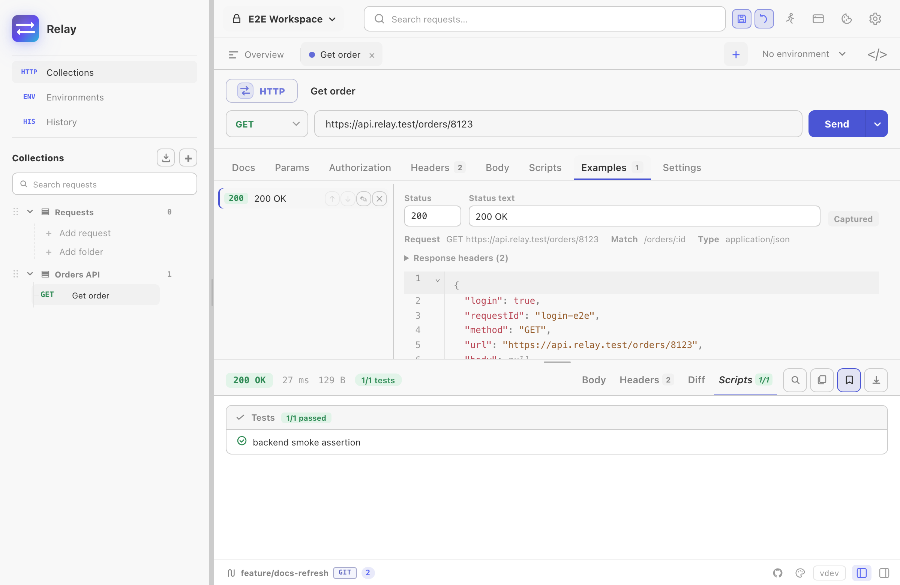

An **example** is a response Relay keeps: the status, headers and body that came back, paired with a snapshot of the request that produced them. It answers the question a README never quite does — *what does this endpoint actually return?* — and it does it with a recording rather than a description that drifted two releases ago.

Examples are not a cloud feature. Each one is a file in your workspace, so a change to an example is a diff someone can review, and a response that quietly changed shape shows up in a pull request instead of in production.

## Saving an example

Send a request, then in the response panel use **Save as example**. The name defaults to the status code; rename it to what the case actually is — `Empty list`, `Expired token`, `422 missing name`.

You can also save one from [request history](/docs/guides/history/): open a row's ••• menu and pick **Save as example**. This is the usual way to capture a failure you have already stopped being able to reproduce.

The request's **Examples** tab lists everything saved against it. From there you can rename, reorder, edit the status and body by hand, or delete.



Each example records the request it came from and the **match** template Relay derived from that URL — `/orders/8123` captured as `/orders/:id`. That template is what the [mock server](/docs/guides/mock-server/) routes on.

## Secrets are redacted on capture

A response body is the single most likely place for a token to end up in a commit, so capture redacts in three passes:

1. **Exact values.** Anything held by an environment variable you marked *secret* is replaced with `[secret]`, wherever it appears — including inside a `Location` URL or a message string, where a key-based rule would never look.
2. **A key sweep.** The same rule the export paths use blanks values under credential-shaped keys: `authorization`, `token`, `access_token`, `api_key`, `password`, `set-cookie`, and their relatives.
3. **A warning.** Anything credential-shaped that survived both passes is flagged when the example is saved, so you can look before it reaches a commit.

A body with nothing to redact is stored byte for byte. Relay does not reformat it: an id larger than JavaScript's safe integer range would come back a different number if it were reserialized, and an example that silently changed its own data would be worse than no example.

## Where examples live

In a [Git-backed workspace](/docs/guides/git-workspaces/), each example is one file under `collections/<collection>/examples/<request>/`, with the response body kept in a sibling file named for its media type:

```
collections/
  petstore/
    examples/
      list-pets/
        two-pets.yml
        two-pets.json
```

The body is a separate file on purpose. Embedded in YAML it would be a block scalar no reviewer can read; as its own `.json` it diffs line by line.

See the [Relay YAML format](/docs/reference/relay-yaml-format/) for the field-by-field reference.

## Examples arrive with your imports

Every import path that carries responses brings them in as examples:

| Source | What arrives |
|--------|--------------|
| Postman | `item.response[]`, both directions — Relay exports them too |
| HAR | A HAR file *is* a recording of request/response pairs; both halves are imported |
| OpenAPI / Swagger | Declared `responses`, including a body derived from the response schema when the spec gives no example |
| OpenCollection / Bruno | Saved responses |

See [Import & export](/docs/guides/import-export/).

## Comparing a response against an example

The response panel's **Diff** tab can use a saved example as its baseline instead of the previous response. This is what stops an example from quietly going stale: an endpoint that no longer matches the contract shows up as a diff rather than passing unnoticed.

The baseline is chosen per request, and falls back to the previous response if the example it pointed at is deleted. See [Response viewer](/docs/guides/response-viewer/).

## Examples feed the mock server

Once a collection has examples, Relay can serve them over HTTP — path templates, status codes, headers and bodies, exactly as captured. That is the [mock server](/docs/guides/mock-server/), and it needs no extra configuration: an example is already a route.

A captured URL is stored as a path template, so `/orders/8123` is recorded as `/orders/:id` and the mock answers for any id. You can edit that template on the example if the guess was wrong.
