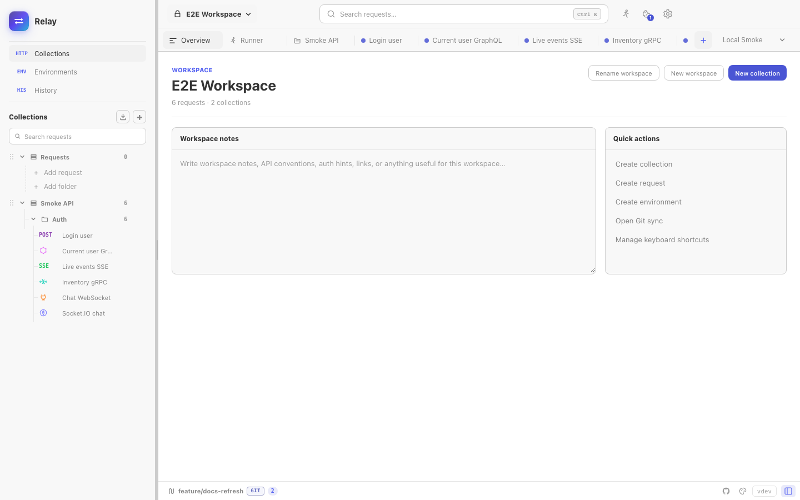
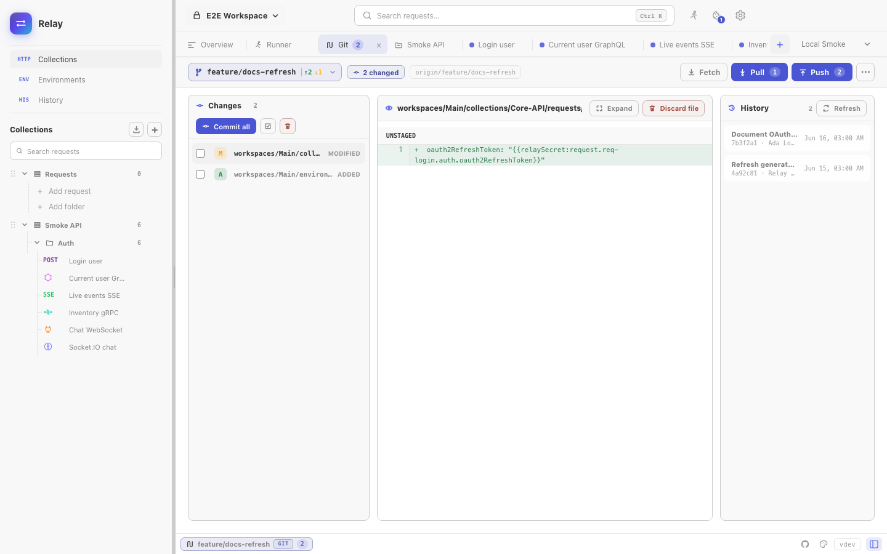

Relay can store workspace data in a folder instead of only inside the encrypted app profile. When that folder is a Git repository, the workspace becomes reviewable, branchable, and shareable with a team.



## When to use Git storage

Use a Git-backed workspace when you want:

- API collections reviewed in pull requests.
- Stable YAML files instead of opaque JSON exports.
- Local-only secrets.
- Branches for API changes.
- Diff, conflict, commit, pull, and push workflows inside Relay.

Use the default app storage when the workspace is private, short-lived, or not meant to be shared.

## What Relay writes

Shared files:

```text
relay.yml
.gitignore
workspaces/**/*.yml
```

The shared YAML contains workspaces, collections, explicit folder paths, requests, environments, defaults, scripts, and settings. Secret values are replaced with `{{relaySecret:...}}` placeholders. Their real values stay in Relay's encrypted local `requests.json` profile instead of the Git workspace.

See [Relay YAML format](/docs/reference/relay-yaml-format/) for the public schema.

## Starting a folder workspace

From the workspace overview or Git workspace screen:

1. Choose a folder you control.
2. Let Relay write the workspace YAML files.
3. Optionally initialize Git in that folder.
4. Add a remote when you are ready to share.

Relay only manages its own files. Other project files in the same repository are left alone.

## Opening or cloning

You can open an existing folder workspace or clone a remote repository. After opening, Relay reads the YAML store, merges local secrets where available, and shows diagnostics for files it could not fully understand.

If the folder is missing or moved, Relay enters recovery mode and lets you choose another folder, open an existing repository, or clone again.

## Daily Git flow

The Git workspace screen covers the common loop:



1. **Fetch** to update remote refs.
2. **Pull** using fast-forward, merge, or rebase strategy.
3. Edit requests, environments, folders, and collection defaults in Relay.
4. Review changed YAML files and diffs.
5. Stage selected files or all Relay files.
6. Commit with a message.
7. Push to the configured upstream.

Relay shows ahead/behind counts, current branch, upstream status, remotes, stashes, changed files, commit history, and outgoing commits.

## Branches and stashes

Branch tools include:

- Checkout local or remote branches.
- Create a branch from current HEAD or from a remote branch.
- Rename and delete branches.
- Pull a specific branch.
- Set tracking/upstream where needed.

Stash tools are available when local changes would block a pull or branch operation. You can stash, pop a stash, or let Relay offer an autostash-style flow before pulling.

## Conflicts

When Git reports conflicts, Relay blocks normal workspace editing until the conflict is resolved. The conflict resolver can:

- Show ours/theirs versions.
- Parse inline conflict markers.
- Step through unresolved hunks.
- Accept ours, accept theirs, or edit the merged result.
- Continue or abort the Git operation.

This is intentionally conservative: Relay would rather pause than silently overwrite workspace YAML.

## Diagnostics

Diagnostics appear when YAML exists but is incomplete, invalid, or references something Relay cannot load cleanly. A diagnostic does not always mean data is lost; often it means a third-party edit missed a required field.

Use diagnostics to jump to the affected workspace, collection, request, or environment. After fixing the item in Relay or editing the YAML, refresh the Git workspace status.

## Safety rules

- Relay does not write real secret values into managed workspace YAML.
- Local secret values remain in the encrypted Relay profile and are not staged by the Git workspace UI.
- Relay does not discard unrelated repository files.
- Destructive actions such as discard and force-push are explicit UI actions.
- Unknown YAML fields are preserved where possible so future versions and third-party tools can coexist.
