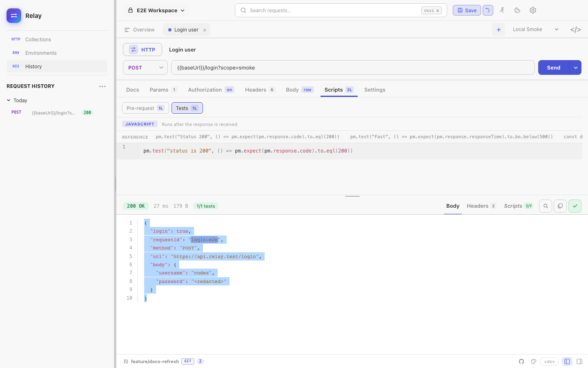
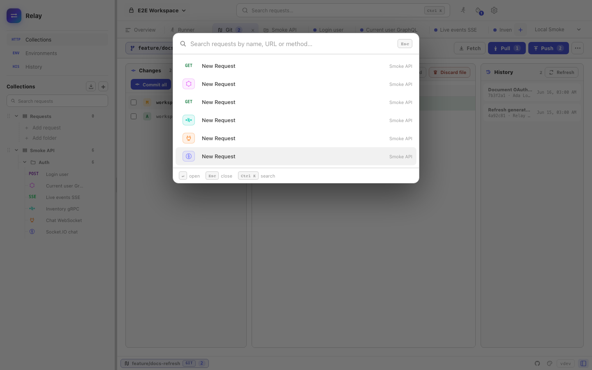

Every request you send (or every WebSocket / SSE / Socket.IO session you open) is automatically archived to your local **request history**. History is per-workspace, encrypted alongside the request store, and pruned to keep the last 14 days or 1 000 entries — whichever comes first.

## Opening history

In the sidebar, switch from *Collections* to *History* via the toggle at the top. The list groups entries by **day**:

```
Today
  10:42  GET    200  /v1/users
  10:41  POST   201  /v1/users
  10:38  GET    404  /v1/users/missing
Yesterday
  18:11  GET    500  /v1/billing
  …
```

Each row shows the time, method, status, and URL. The status is color-coded with the same palette as the response panel (green 2xx, orange 4xx, red 5xx).

Toggle a day open or closed with the chevron. Days collapse independently — you can keep "Today" open and the rest minimized.



## Reopening a request from history

Click any entry to load it into the editor as a **draft**. The request URL, method, headers, body, auth, and scripts are restored exactly as they were sent. The original response is also restored into the response panel — no need to re-send if you just want to inspect what you got.

Drafts loaded from history don't belong to any collection. You can:

- Edit and send again — the new send becomes a fresh history entry.
- Save the draft to a collection: click *Save* in the request bar, choose the target collection, give it a name.
- Discard it by closing the tab.

## History entry menu

The `⋯` button on each history row offers:

- **Save to collection** — pick an existing collection in this workspace; Relay drops the request into it. Useful when an ad-hoc curl-paste turns out to be worth keeping.
- **Save to new collection** — same, but creates the collection on the fly with a name you pick.
- **Delete entry** — removes just this one history record. Useful for clearing out one-off mistakes.

## Bulk operations

The header `⋯` button (top right of the history panel) has:

- **Clear all** — wipes every history entry in the current workspace. Asks for confirmation. *This does not touch your saved collections.*

There's no per-day clear in the UI — if you want to keep specific days, save them to a collection first, then *Clear all*.

## Retention

By default Relay keeps:

- **14 days** of history, or
- **1 000 entries** total, whichever comes first.

When you exceed either cap, the oldest entries are pruned the next time the request store is saved. Pruning happens silently in the background; you don't need to clear history manually unless you want to.

These caps aren't exposed in Settings yet — they're constants in the source. If you find yourself wanting longer retention, file a request on GitHub.

## Search across history

The global search modal (default shortcut `Cmd/Ctrl K`) searches across:



- Open tabs
- Saved requests in collections
- **History entries** — last 14 days

A history entry is marked with a small clock icon in the results so you can tell at a glance it's not a saved request.

## Privacy & data location

History entries are stored in encrypted `requests.json` with the rest of the local profile. They never leave your machine unless you explicitly include them in an all-data export. If you delete the data directory (see [Privacy](/privacy/)), history goes with it.

When you *Export all data* from Settings, history is included in the JSON export. *Import all data* replaces the entire profile, including history.

## Common questions

**Does history persist across restarts?**
Yes. History is persisted in encrypted `requests.json`.

**What about responses larger than 100 MB?**
Responses are stored truncated to the same 100 MB cap as the live response viewer. The status code, headers, and duration are kept intact; only the body is truncated.

**Can I disable history?**
Not yet — there's no toggle. If you need this for a sensitive endpoint, you can clear all history after sending, or use a separate workspace just for that work and clear it.
