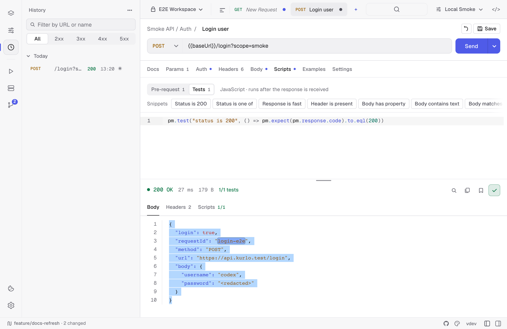
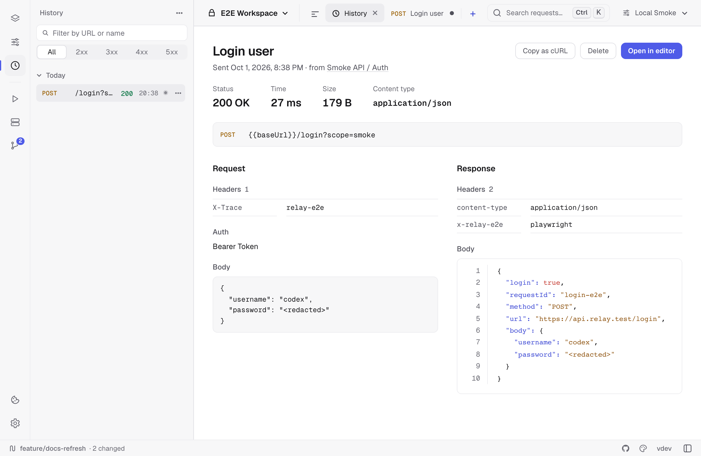

Every request you send (or every WebSocket / SSE / Socket.IO session you open) is automatically archived to your local **request history**. History is per-workspace, encrypted alongside the request store, and pruned to keep the last 14 days or 1 000 entries — whichever comes first.

## Opening history

In the sidebar, switch from *Collections* to *History* via the toggle at the top. The list groups entries by **day**:

```
Today
  10:42  GET    200  /v1/users
  10:41  POST   201  /v1/users
  10:38  GET    404  /v1/users/missing
Yesterday
  18:11  GET    500  /v1/billing
  …
```

Each row shows the time, method, status, and URL. The status is color-coded with the same palette as the response panel (green 2xx, orange 4xx, red 5xx).

Toggle a day open or closed with the chevron. Days collapse independently — you can keep "Today" open and the rest minimized.



## The entry view

Click an entry to open it on its own page — a *History* tab in the title bar, closed like any other tab. It shows what was sent and what came back, side by side:

- **Request** — the method and full URL, the header rows the request carried (secret values stay masked), the auth type, and the body. Headers Relay adds on the wire, such as `Host` and `User-Agent`, are not part of the entry.
- **Response** — status, time, size and content type, then the stored response headers and body in the same viewer as the response panel, with syntax highlighting and line numbers.

If the request it was sent from still exists, the page says where it lives, and the link opens it. **Copy as cURL** copies the request as it was sent, **Delete** removes the entry, and **Open in editor** brings it back as a request you can change and send again.



### Open in editor

**Open in editor** copies the entry into the collection you are working in as a new request, opens it, and restores the stored response into the response panel — no need to re-send just to look at what you got. Re-sending would answer a different question anyway: the server may not reply the same way it did an hour ago. The new send becomes a fresh history entry.

### Stored responses

Relay keeps the response of each entry — status, headers and body — in the encrypted profile, up to 2 MB per entry. A larger body is cut to fit and the page says so; a binary body is not kept. A row whose response was kept shows a small dot next to its status code.

## History entry menu

The `•••` button on each history row offers:

- **Open in editor** — as above.
- **Save as example** — keeps the stored response as an example on the request that is open. Shown when a request is open and the entry's response was kept.
- **Save to** a collection — pick an existing collection in this workspace; Relay drops the request into it. Useful when an ad-hoc curl-paste turns out to be worth keeping.
- **New collection…** — same, but creates the collection on the fly with a name you pick.
- **Delete** — removes just this one history record.

## Bulk operations

The `•••` button in the History header has:

- **Clear all** — wipes every history entry in the current workspace. Asks for confirmation. *This does not touch your saved collections.*

There's no per-day clear in the UI — if you want to keep specific days, save them to a collection first, then *Clear all*.

## Retention

By default Relay keeps:

- **14 days** of history, or
- **1 000 entries** total, whichever comes first.

When you exceed either cap, the oldest entries are pruned the next time the request store is saved. Pruning happens silently in the background; you don't need to clear history manually unless you want to.

These caps aren't exposed in Settings yet — they're constants in the source. If you find yourself wanting longer retention, file a request on GitHub.

## Finding an entry

The filter at the top of the History panel matches URLs and request names, and the status buttons narrow the list to `2xx`, `3xx`, `4xx` or `5xx`. The command palette (`Cmd/Ctrl K`) searches saved requests, not history.

## Privacy & data location

History entries are stored in encrypted `requests.json` with the rest of the local profile. They never leave your machine unless you explicitly include them in an all-data export. If you delete the data directory (see [Privacy](/privacy/)), history goes with it.

When you *Export all data* from Settings, history is included in the JSON export. *Import all data* replaces the entire profile, including history.

## Common questions

**Does history persist across restarts?**
Yes. The entries live in the encrypted `requests.json`; the response bodies live beside it in `history/`, one file per entry, encrypted with the same key. They are kept out of `requests.json` on purpose — that file is rewritten in full every time anything is saved, and a thousand entries carrying bodies would turn every keystroke into a large write.

**What about large responses?**
A stored response is capped at 2 MB. Past that only the head is kept, and reopening it says so. The status code, headers, duration, and test results are kept in full.

**What about binary responses?**
The status, headers and size are recorded, but no body. Binary bytes do not survive the trip from the sender to the interface, so what history could store would not be what the server sent.

**Are stored responses cleaned up?**
Yes. A response file is deleted when its entry falls out of the 14-day window, when you delete the entry, and when you clear history.

**Can I disable history?**
Not yet — there's no toggle. If you need this for a sensitive endpoint, you can clear all history after sending, or use a separate workspace just for that work and clear it.
