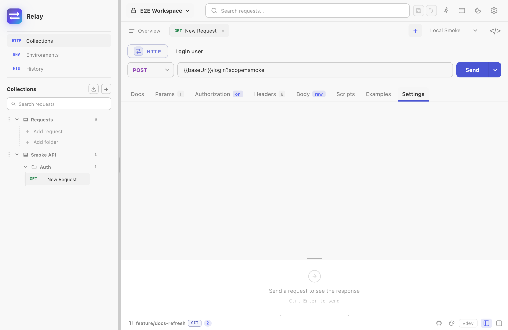

Open the *Settings* tab inside any request to override Relay's defaults for that single request. The Settings tab is the rightmost tab in the request editor, after *Scripts*.

Every setting on this page is **per-request** — changing it on `Get user` doesn't affect `Get billing`. Settings travel with the request when you export, duplicate, or commit it to Git.

App-wide preferences (autosave, theme, shortcuts, updates) live in a separate Settings modal opened from the gear icon in the title bar. See [App settings](/docs/guides/settings/) for that surface.

## HTTP version

Choose how Relay negotiates the protocol:

| Value | Behaviour |
|-------|-----------|
| `Auto` *(default)* | ALPN negotiates HTTP/2 if both ends support it, otherwise HTTP/1.1. |
| `1.1` | Force HTTP/1.1. Useful when an upstream proxy mishandles HTTP/2. |
| `2` | Require HTTP/2 over TLS. Connect fails if the server doesn't speak it. |

HTTP/3 is not yet supported.

## Redirect policy

By default Relay follows up to **10 redirects**. You can change this and decide what to do with them:

- **Follow redirects** — toggle. Off means a 3xx returns the redirect response itself, with the `Location` header visible in the Headers tab.
- **Max redirects** — integer cap. Set to `0` to behave like *Follow off*.
- **Preserve original method** — when on, a 301/302 redirect from `POST` stays `POST` instead of becoming `GET`. RFC 7231 allows the agent to switch the method; this toggle forces the safer "preserve" behaviour.
- **Preserve Authorization header** — by default, redirecting to a different host **drops** the `Authorization` header to avoid leaking credentials. Turn this on if you're following redirects within a trusted multi-host system. Same-host redirects always keep the header.
- **Remove Referer when downgrading** — drop the `Referer` header when redirecting from `https://` to `http://`. Matches browser behaviour.

## TLS / SSL verification

The toggle **Enable SSL certificate verification** is on by default. Turning it off makes Relay accept any certificate the server presents, including self-signed and expired ones.

When you disable it, Relay shows a one-time confirmation dialog explaining the risk. Re-enabling is one click in the same place.

:::caution
Disabling SSL verification opens you to MITM attacks on that request. Only use it against a server you control or a known-good staging endpoint.
:::

For corporate root CAs, the cleaner fix is to install the CA into your system trust store — Relay uses the OS trust roots, so once the CA is trusted system-wide it works in Relay too.

## Client certificate (mutual TLS)

For servers that require **mutual TLS**, present a client certificate under *Settings → Client certificate (mTLS)*:

- **Certificate (CRT/PEM)** — the client certificate file, in PEM format.
- **Private key (optional)** — the key file. Leave it blank when the key is in the same file as the certificate (a combined PEM).
- **Key passphrase** — only for an encrypted key. It accepts a `{{variable}}`, so you can point it at a workspace secret instead of storing it in the YAML.

Set it under *Collection settings → Settings* to reuse one certificate across every request in the collection, the same way other settings inherit.

A missing file, a mismatched certificate/key pair, or a wrong passphrase fails the request before it dials, with a message that says which. Relay supports PEM keys, including the legacy openssl encrypted format; PKCS#8-encrypted keys need converting first (`openssl pkcs8 -in key.pem -out key.dec.pem`).

## Timeout

**Request timeout (ms)** caps the total time from connection start to body fully read. Default: **30 000 ms** (30 seconds). Set to `0` to disable.

The timeout includes:

- DNS resolution
- TCP connect / TLS handshake
- Request body upload (for `POST` / `PUT`)
- Server processing time
- Full response body read

If the timeout fires, the response shows a friendly error: *"The request timed out after 30 s. Check the URL and try again."* The duration counter still shows how long Relay actually waited.

## Script settings

**Script timeout (ms)** caps how long a single pre-request or test script may run. Leave it at `0` for the default **2 000 ms**; raise it for a heavy assertion suite or a signing step. The ceiling is 60 000 ms, so a runaway loop can never wedge a send.

**Allow pm.sendRequest** lets this request's scripts make their own HTTP calls — fetching a token before the send, or chaining setup. It is **off** by default: the script sandbox has no network access unless you ask for it. See [`pm.sendRequest`](/docs/reference/scripting-api/#pmsendrequest) for its limits.

Both live under *Collection settings → Settings* as well, and a request that has not touched them inherits the collection's value — in the app and in [`relay run`](/docs/guides/cli-runner/) alike. `--script-timeout` and `--allow-send-request` override the whole run.

## Cookie jar

The toggle **Use the cookie jar** controls whether `Set-Cookie` responses are stored and replayed:

- **On** (default) — cookies sent in responses are added to the per-workspace cookie jar. On subsequent requests to the same domain, matching cookies are attached automatically.
- **Off** — Relay neither stores nor sends jar cookies for this request. You can still set cookies manually via the `Cookie` header.

The jar is shared across all requests in a workspace. View / edit it via the cookie icon next to the URL bar.

See [Cookies](/docs/guides/cookies/) for manual cookie editing, matching rules, and backup behavior.

## URL encoding

**Encode URL automatically** (on by default) percent-encodes characters in path segments and query values when Relay sends the request. Examples:

- A space in a query value (`q=hello world`) becomes `q=hello%20world`.
- Cyrillic / emoji / other non-ASCII characters are encoded per RFC 3986.

Turn this off if your server uses non-standard encoding rules — Relay will then transmit your URL byte-for-byte as you typed it.

## Proxy

**HTTP proxy** accepts a complete HTTP, HTTPS, or SOCKS5 proxy URL. A non-empty request value overrides both the collection proxy and the app-wide proxy.

Leave the field untouched to inherit the collection setting. If no collection URL applies, Relay uses **Settings -> Proxy**. Clearing the field after editing it creates an empty request override, skips the collection value, and falls back to the app-wide setting.

See [Proxy configuration](/docs/guides/proxy/) for the complete precedence and bypass rules.

## Browser security emulation

Use these controls to add a browser-like origin and user agent, enforce CORS preflights and response checks, or block URLs rejected by a page's CSP `connect-src`.

See [Browser security emulation](/docs/guides/browser-security/) for credentials mode, same-origin behavior, supported CSP sources, and protocol differences.

## WebSocket / Socket.IO–specific settings

For `ws://` / `wss://` and Socket.IO requests, extra knobs appear:

- **Handshake timeout (ms)** — how long to wait for the initial HTTP upgrade. `0` uses the transport default.
- **Reconnect attempts** — number of automatic reconnect attempts after an abnormal close. `0` = never reconnect. Default `0`.
- **Reconnect interval (ms)** — delay between reconnect attempts. Default `5 000`.
- **Max message size (MB)** — read limit per message. Default `10 MB`. Reduce if you're testing constrained servers; increase if you legitimately stream larger messages.

gRPC requests also show gRPC-specific settings: TLS, reflection, server name, default-value inclusion, and max response message size. See [Request types](/docs/guides/request-types/) for how the protocol-specific editors differ.

## Reset to defaults

Click **Reset** at the top of the request Settings tab to restore Relay's built-in request values and clear collection override markers. Collection defaults can then apply again when the request is sent.

## Where these settings live in your data

Per-request settings are saved alongside the request. Local profile state is stored in encrypted `requests.json`; folder/Git workspaces store shareable settings in YAML. Settings are exported where the target format can represent them and preserved by Relay/OpenCollection round-trips.
