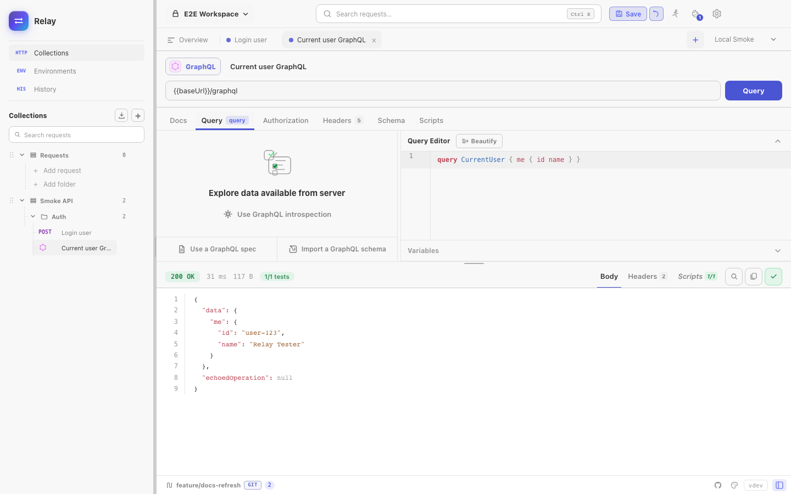
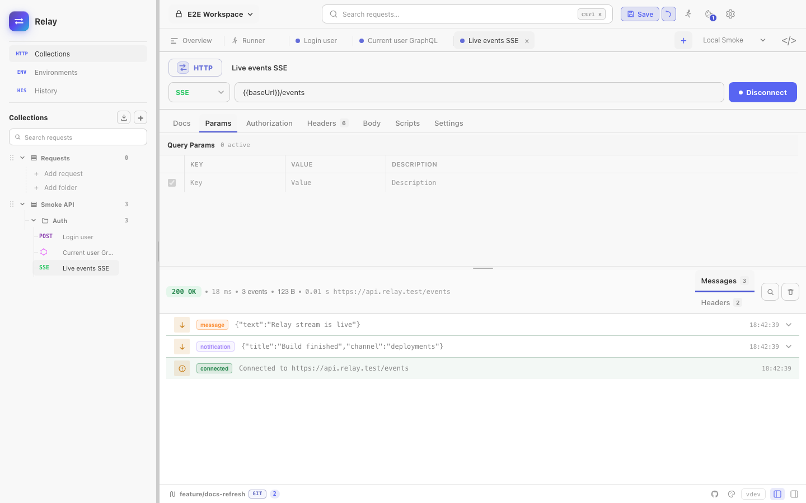
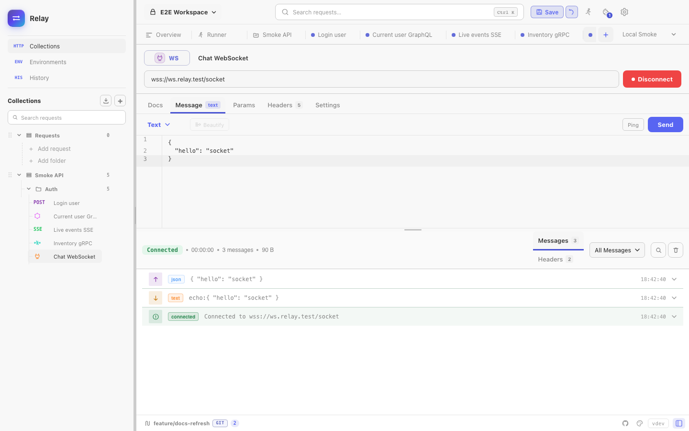
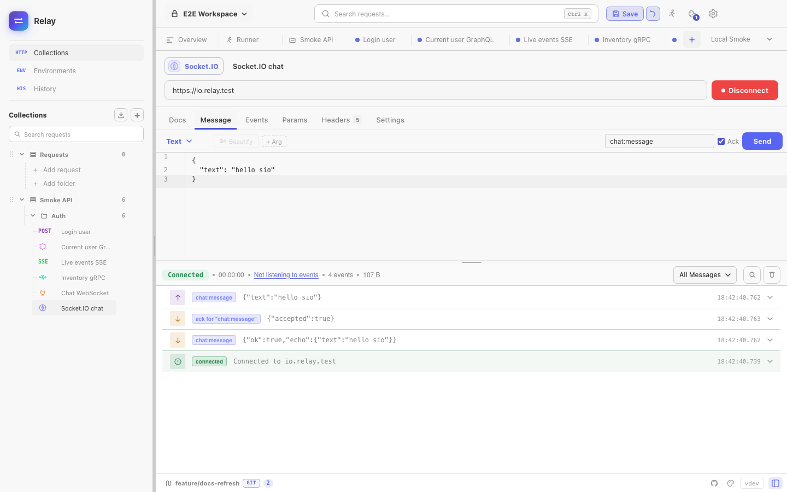
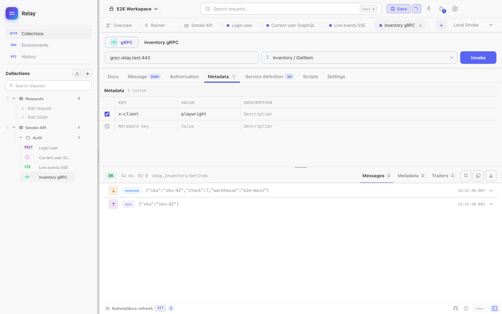

Relay has separate request modes for protocols that behave differently on the wire. Pick the type when creating a request; Relay changes the editor tabs, send/connect controls, response panel, and export behavior to match.

## At a glance

| Type | Use it for | Main tabs | Response surface | Runner support |
|------|------------|-----------|------------------|----------------|
| HTTP | REST, JSON APIs, forms, files, regular request/response flows | Params, Auth, Headers, Body, Scripts, Settings | Body, Headers, Scripts | Yes |
| GraphQL | Queries, mutations, variables, schema exploration | Query, Auth, Headers, Schema, Scripts, Settings | Body, Headers, Scripts | Yes |
| SSE | `text/event-stream` subscriptions over HTTP | Params, Auth, Headers, Settings | SSE event stream | No |
| WebSocket | Raw `ws://` / `wss://` sessions | Headers, Message, Settings | Frames, handshake, logs | No |
| Socket.IO | Socket.IO servers with namespaces/events | Headers, Events, Message, Settings | Events, handshake, logs | No |
| gRPC | Protobuf RPCs with metadata/reflection/proto files | Metadata, Body, Service, Scripts, Settings | Messages, metadata, trailers, scripts | Yes |

Realtime requests are intentionally skipped by the Collection Runner because they are long-lived sessions. gRPC is runnable because each invocation produces a bounded response.

## HTTP

HTTP is the default mode. It supports:

- Methods: `GET`, `POST`, `PUT`, `PATCH`, `DELETE`, `HEAD`, `OPTIONS`, and `SSE`.
- Query params and headers as editable rows.
- Auth, body, scripts, request notes, and per-request settings.
- JSON, text, XML, HTML, form-data, urlencoded, GraphQL-shaped body, and binary-file bodies.
- cURL import from the URL bar.

Use HTTP for normal REST APIs. Use the `SSE` method only when the endpoint keeps an event stream open.

## GraphQL

GraphQL requests use `POST` and store the query, variables, and operation name as a GraphQL payload. The Query tab is optimized for editing GraphQL text and variables; the Schema tab can hold an imported schema or an introspection result.

GraphQL still uses the normal auth, headers, scripts, environments, cookies, and response viewer paths. Exports preserve GraphQL where the target format supports it.

## Server-Sent Events

SSE is an HTTP request with long-lived streaming semantics:

1. Create an HTTP request.
2. Set the method to `SSE`.
3. Enter the stream URL and any auth/headers.
4. Press **Connect**.

Relay adds `Accept: text/event-stream`, `Cache-Control: no-cache`, and `Connection: keep-alive` when building the request. Events appear as they arrive and the session is written to history once the stream connects or errors.

The SSE event list keeps the latest events bounded for UI performance. Clear or restore visible events from the SSE panel while the session is open.

## WebSocket

WebSocket requests connect to `ws://` or `wss://` URLs. Relay shows:

- A handshake record with request/response headers.
- Incoming/outgoing frames.
- Text, binary, ping, pong, close, reconnect, and error events.
- Reconnect settings and a max-message-size guard.

Use the Message tab to send a text or binary payload after connecting. Per-request headers and cookies are applied to the handshake.

## Socket.IO

Socket.IO mode speaks the Socket.IO protocol rather than raw WebSocket frames. Configure:

- Client version: v2 or v3.
- Path, usually `/socket.io`.
- Namespace, usually `/`.
- Event name, arguments, and ack behavior.
- Reconnect attempts and interval.

Socket.IO events are displayed with namespace, direction, args, and system/error rows. Cookies and headers are applied to the Engine.IO handshake unless the request disables the cookie jar.

## gRPC

gRPC requests target `host:port` or a `grpc://` / `grpcs://` style target. Relay can discover services by reflection when enabled, or use a selected `.proto` file with import paths.

The request body is JSON in protobuf JSON shape. Metadata lives in its own tab. The response panel separates:

- Messages.
- Response metadata.
- Trailers.
- Script output and test results.

gRPC supports pre-request/test scripts, environment variables, collection defaults, and runner reports.

## Import and export notes

| Format | Supported request types |
|--------|-------------------------|
| Postman export | HTTP, GraphQL, SSE |
| OpenAPI/Swagger export | HTTP, SSE |
| OpenCollection export | HTTP, GraphQL, explicit folders |
| All-data backup | All request types |
| Git/YAML workspace | All request types |

When a format cannot represent a request type, Relay skips it and shows an in-app message instead of writing a misleading partial export.
