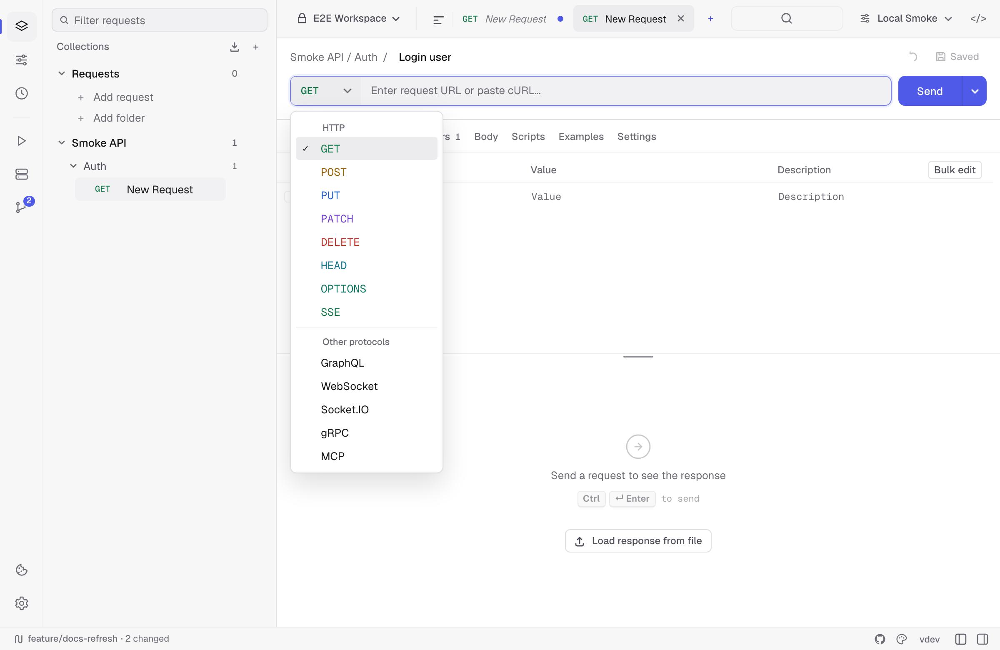
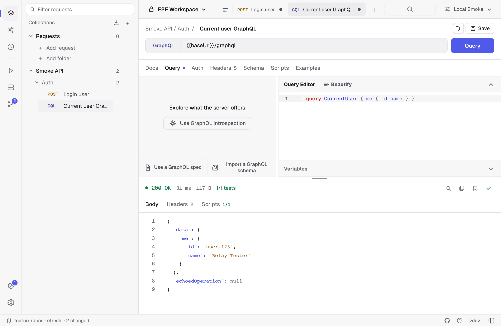
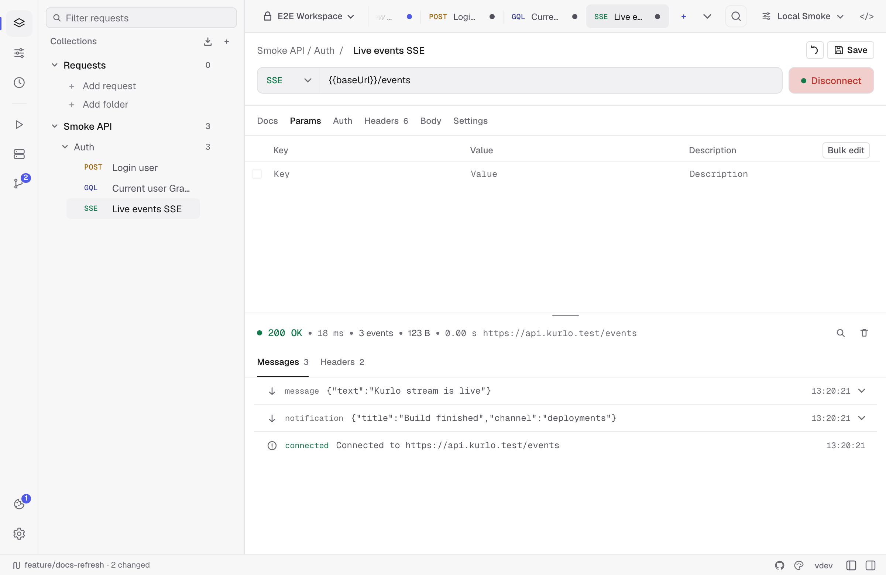
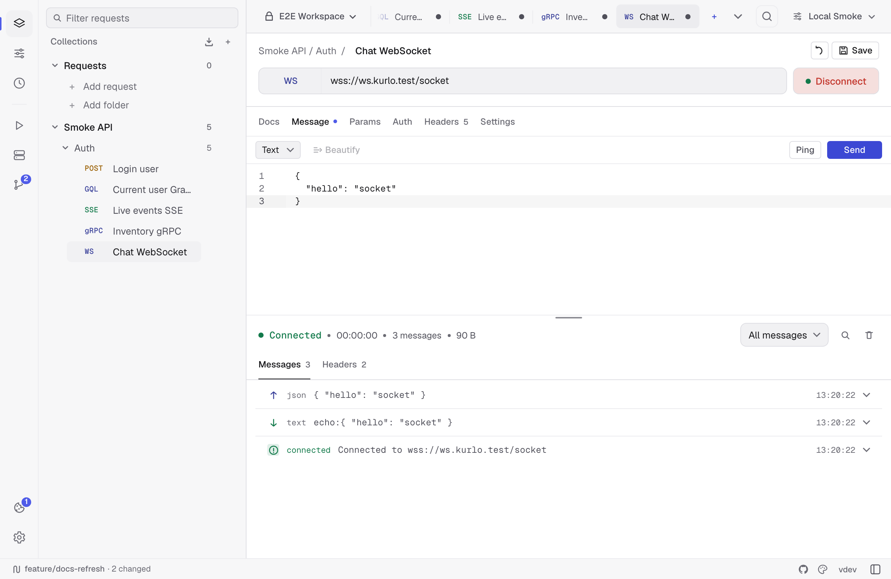
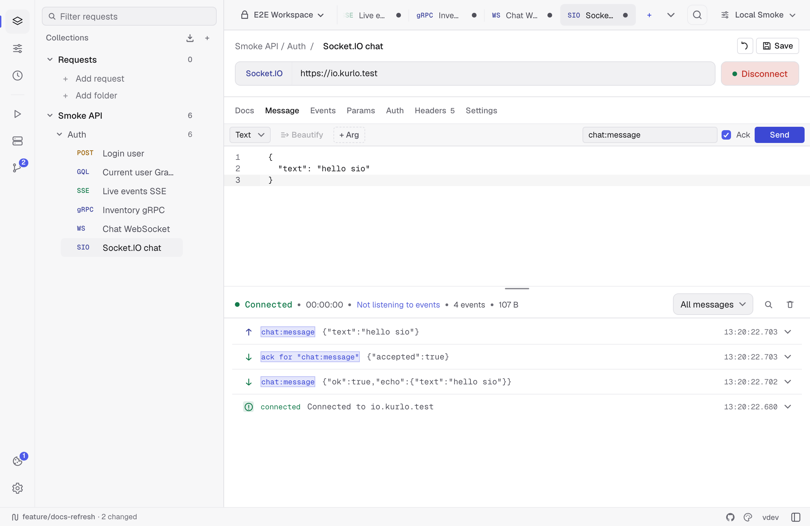
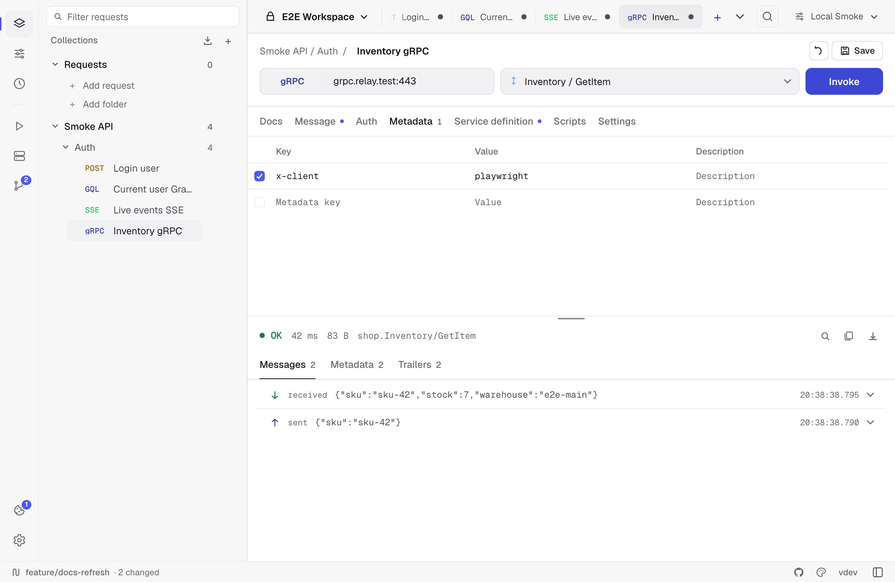
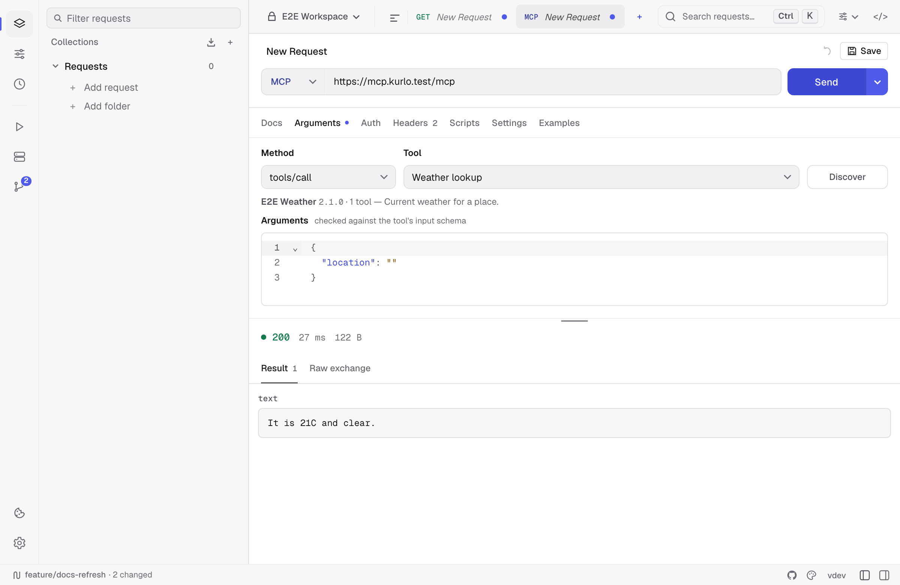

Kurlo has separate request modes for protocols that behave differently on the wire. Each mode changes the editor tabs, send/connect controls, response panel, and export behavior to match.

A new request always starts as HTTP — the `+` in the tab bar, `Cmd/Ctrl N`, and **Add request** in the sidebar open it straight away, with no dialog. To use another protocol, pick it from the menu at the start of the address bar, or run **New GraphQL request**, **New WebSocket request**, **New Socket.IO request**, **New gRPC request**, or **New MCP request** from the command palette.

The picker holds both decisions: the HTTP methods on top, the other protocols below. A draft can switch protocol at any time — pick `POST` on a GraphQL draft and it becomes an HTTP request. A saved request can switch until it has a URL; after that its protocol is fixed, the picker still changes an HTTP request's method, and a request of any other type shows its protocol without a menu.

## At a glance

| Type | Use it for | Main tabs | Response surface | Runner support |
|------|------------|-----------|------------------|----------------|
| HTTP | REST, JSON APIs, forms, files, regular request/response flows | Params, Auth, Headers, Body, Scripts, Settings | Body, Headers, Scripts | Yes |
| GraphQL | Queries, mutations, variables, schema exploration | Query, Auth, Headers, Schema, Scripts, Settings | Body, Headers, Scripts | Yes |
| SSE | `text/event-stream` subscriptions over HTTP | Params, Auth, Headers, Settings | SSE event stream | No |
| WebSocket | Raw `ws://` / `wss://` sessions | Params, Auth, Headers, Message, Settings | Frames, handshake, logs | No |
| Socket.IO | Socket.IO servers with namespaces/events | Params, Auth, Headers, Events, Message, Settings | Events, handshake, logs | No |
| gRPC | Protobuf RPCs with metadata/reflection/proto files | Metadata, Body, Service, Scripts, Settings | Messages, metadata, trailers, scripts | Yes |
| MCP | Model Context Protocol servers — list their tools and call one by hand | Arguments, Auth, Headers, Scripts, Settings | Result, raw exchange, notifications | Yes |

Realtime requests are intentionally skipped by the Collection Runner because they are long-lived sessions. gRPC is runnable because each invocation produces a bounded response.

## HTTP

HTTP is the default mode. It supports:

- Methods: `GET`, `POST`, `PUT`, `PATCH`, `DELETE`, `HEAD`, `OPTIONS`, and `SSE`.
- Query params and headers as editable rows.
- Auth, body, scripts, request notes, and per-request settings.
- JSON, text, XML, HTML, form-data, urlencoded, GraphQL-shaped body, and binary-file bodies.
- cURL import from the URL bar.

Use HTTP for normal REST APIs. Use the `SSE` method only when the endpoint keeps an event stream open.

## GraphQL

GraphQL requests use `POST` and store the query, variables, and operation name as a GraphQL payload. The Query tab is optimized for editing GraphQL text and variables; the Schema tab can hold an imported schema or an introspection result.

GraphQL still uses the normal auth, headers, scripts, environments, cookies, and response viewer paths. Exports preserve GraphQL where the target format supports it.

## Server-Sent Events

SSE is an HTTP request with long-lived streaming semantics:

1. Create an HTTP request.
2. Set the method to `SSE`.
3. Enter the stream URL and any auth/headers.
4. Press **Connect**.

Kurlo adds `Accept: text/event-stream`, `Cache-Control: no-cache`, and `Connection: keep-alive` when building the request. Events appear as they arrive and the session is written to history once the stream connects or errors.

An SSE request has no Scripts tab: a subscription is opened rather than sent, and pre-request and test scripts do not run on that path. Reconnection is configurable — see [SSE-specific settings](/docs/guides/request-settings/#sse-specific-settings).

The `SSE` method subscribes with a `GET` and no body. An endpoint that streams events back from a `POST` — the streaming mode of most LLM APIs — is sent as an ordinary `POST`: Kurlo reads the stream until the server closes it and shows the raw events as the response body, within the request timeout.

The SSE event list keeps the latest events bounded for UI performance. Clear or restore visible events from the SSE panel while the session is open.

## WebSocket

WebSocket requests connect to `ws://` or `wss://` URLs. Kurlo shows:

- A handshake record with request/response headers.
- Incoming/outgoing frames.
- Text, binary, ping, pong, close, reconnect, and error events.
- Reconnect settings and a max-message-size guard.

Use the Message tab to send a text or binary payload after connecting. Per-request headers and cookies are applied to the handshake, and so is the Authorization tab — Bearer, Basic, Digest and API-key auth all go out with the upgrade request, the same way they would on an ordinary send. There is no Scripts tab: the handshake does not run pre-request or test scripts.

## Socket.IO

Socket.IO mode speaks the Socket.IO protocol rather than raw WebSocket frames. Configure:

- Client version: v2 or v3.
- Path, usually `/socket.io`.
- Namespace, usually `/`.
- Event name, arguments, and ack behavior.
- Reconnect attempts and interval.

Socket.IO events are displayed with namespace, direction, args, and system/error rows. Cookies, headers, and the Authorization tab are applied to the Engine.IO handshake unless the request disables the cookie jar. As with WebSocket, there is no Scripts tab.

## gRPC

gRPC requests target `host:port` or a `grpc://` / `grpcs://` style target. Kurlo can discover services by reflection when enabled, or use a selected `.proto` file with import paths.

The request body is JSON in protobuf JSON shape. Metadata lives in its own tab. The response panel separates:

- Messages.
- Response metadata.
- Trailers.
- Script output and test results.

gRPC supports pre-request/test scripts, environment variables, collection defaults, and runner reports.

## MCP

An MCP request calls a [Model Context Protocol](https://modelcontextprotocol.io) server — the servers agents talk to — without an agent in the loop. Kurlo speaks protocol revision **2026-07-28**, which is stateless: every call is a single HTTP POST to the server's endpoint, so an MCP call is an ordinary saved request that can be replayed, diffed, scripted and committed.

Put the server's endpoint in the URL bar, then press **Discover**. Kurlo calls `server/discover` and follows it with `tools/list`, `resources/list` and `prompts/list` for the capabilities the server actually declares, so a server with no prompts is never asked for any. The panel then names the server, its version and what it holds.

Choose a method and, for `tools/call`, `resources/read` or `prompts/get`, the tool, resource or prompt to address. Picking a tool seeds the **Arguments** editor from the tool's own input schema, and the arguments are checked for being a JSON object before anything is sent.

The response panel has three views:

- **Result** — the content blocks the server returned, its `structuredContent`, and, when a tool asked for more input, the `inputRequests` it sent back.
- **Raw exchange** — the JSON-RPC envelope exactly as it arrived, including the individual frames when the server answered with a stream. This is the view that makes a failing tool call diagnosable.
- **Notifications** — the progress and log notifications a streamed answer carried before its result.

What Kurlo checks on your behalf:

- **A tool that contradicts its own output schema is called out.** If the server publishes an `outputSchema` and its `structuredContent` does not match, the mismatch is listed as a warning — and the content is still shown, because the server is the one at fault.
- **A tool whose `x-mcp-header` annotations the specification forbids cannot be called.** Kurlo names the reason instead of quietly dropping the tool from the list, which is what a conforming agent client does.
- **Headers the protocol derives from the body are yours to read, not to set.** `Mcp-Method`, `Mcp-Name`, `MCP-Protocol-Version` and the `Mcp-Param-*` headers are built from the call; a header of the same name in the Headers tab is replaced and you are told so, because a server must reject a request whose headers and body disagree.

Auth, proxy, client certificates, redirects and the response cap are the ordinary HTTP ones — an MCP call is an HTTP request, and it carries the same settings.

Not in this release: the **stdio** transport, so servers launched as a local command (`npx some-server`) cannot be reached yet; the protocol revisions before `2026-07-28`; `subscriptions/listen`; and sampling, which Kurlo declines because it has no model and is not going to acquire one.

## Import and export notes

| Format | Supported request types |
|--------|-------------------------|
| Postman export | HTTP, GraphQL, SSE |
| OpenAPI/Swagger export | HTTP, SSE |
| OpenCollection export | HTTP, GraphQL, explicit folders |
| All-data backup | All request types |
| Git/YAML workspace | All request types |

When a format cannot represent a request type, Kurlo skips it and shows an in-app message instead of writing a misleading partial export.
