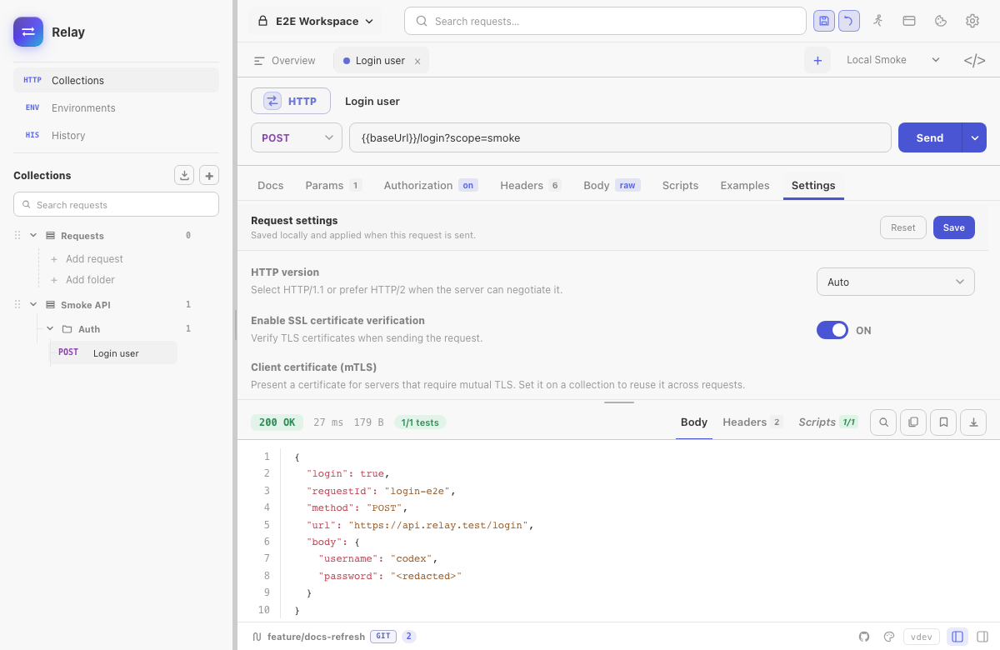
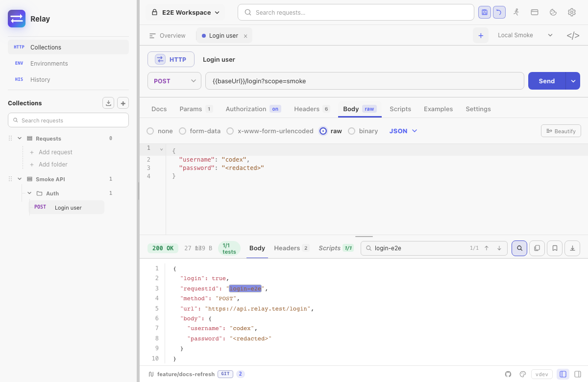
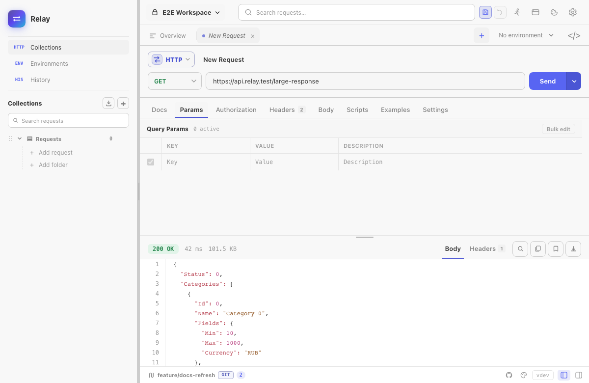
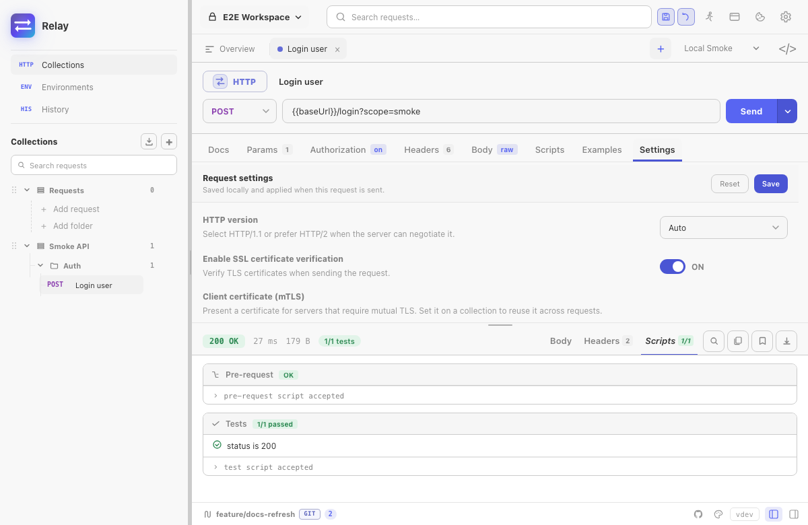

The Response panel takes the bottom half of the request workspace. After a request finishes you'll see four useful surfaces here: the body, headers, test results, and the response metadata bar at the top.

## The status bar

The thin row at the top of the response panel summarizes the result:

- **HTTP status** — `200 OK`, `404 Not Found`, etc. Colour-coded by class: green for 2xx, yellow for 3xx, orange for 4xx, red for 5xx and transport errors.
- **Duration** — total time from request build to body fully read, in milliseconds. Hover the duration pill to see a timing breakdown (DNS, TCP connect, TLS handshake, time-to-first-byte, body read).
- **Size** — uncompressed body size. For paged responses (see below) this is the size of the original payload, not what's currently visible.

Click the *Save response* button (the disk icon) to write the raw body to a file. Click the *Copy response* button to put the body on the clipboard.

## Body view

The body view auto-detects how to render the payload:

- **JSON** — syntax-highlighted, two-space indent, line numbers in the gutter. Folding is enabled if your response is deeply nested.
- **HTML** / **XML** — syntax-highlighted with line numbers.
- **Plain text / unknown** — rendered verbatim. No reformatting.
- **Binary or `application/octet-stream`** — preview is skipped; *Save response* writes the bytes untouched.
- **Server-Sent Events (`text/event-stream`)** — Relay switches automatically to the SSE panel with streamed event rows.
- **WebSocket / Socket.IO / gRPC** — realtime and RPC requests use dedicated response surfaces for frames, events, metadata, status, and logs.

### Searching the body

Click the magnifying glass next to the response tabs (or press the search shortcut configured in *Settings → Shortcuts*) to open the inline search bar. As you type, matches highlight in place and the counter shows `current/total`:

- `↓` / `↑` — jump to next / previous match
- `Enter` / `Shift+Enter` — same as next / previous
- `Esc` — close the search bar without clearing the response

Search is case-insensitive and matches across the entire visible page (see paging below). If the response is huge, only the currently visible page is searched at a time — switch pages to search the rest.

### Paging through large responses

Bodies whose reported response size is over **10 MB** are rendered in ~512 KiB pages so the editor stays responsive. The page bar appears above the body when paging is active:

> Large response preview · Page 2 / 6 · `←` `2/6` `→`

Page navigation buttons (or the keyboard shortcuts mapped to "next/prev response page" in Settings) move you through the chunks. The response itself is held intact in memory — paging only affects rendering.

### Truncation

If the server returns more than **100 MB**, Relay stops reading after the first 100 MB and marks the response with a banner such as *"response truncated — showing 100 MB of 450 MB"*. The status code and headers are unaffected.

The response-panel **Save response** action and **Send and Download** currently write the body Relay retained, so they do not recover bytes beyond this 100 MB cap.

## Headers view

Switch to the *Headers* tab to see the response headers exactly as the server sent them. They're listed in the order the server emitted them — for `Set-Cookie` and other headers that can repeat, each occurrence has its own row.

Hover any value to reveal a copy button. The header table is plain text — you can also select-and-copy with your usual editor shortcuts.

## Timeline view

The *Timeline* tab appears once a response carries connection details. It answers "where did the time go, and what did Relay actually send?".

- **Timeline** — connection requested, DNS lookup, TCP connect, TLS handshake, request sent, and first response byte, each stamped in milliseconds from the start of the send.
- **Connection** — whether the connection was newly opened or reused from the pool, the local and remote addresses, every resolved address, and the negotiated TLS version, cipher suite, ALPN protocol, and SNI server name.
- **Request** — the request line and headers as they went on the wire, after auth, cookie jar, and redirect handling. A redirect chain shows one block per hop, so you can see exactly what was re-sent and what was dropped.

Secret environment values are masked here the same way they are in script logs, so the panel is safe to screenshot.

A failed request keeps its timeline: when a connection times out or a TLS handshake fails, the last event tells you how far it got.

## Diff view

The *Diff* tab appears the second time you send the same request. It compares the previous response body with the current one:

- Removed lines are red, added lines are green, and both original line numbers are kept.
- Long unchanged runs collapse to a `… unchanged lines` marker — *Show all lines* expands them.
- *Clear baseline* forgets the previous response and hides the tab until the next send.

Baselines are per-request and live in memory only; they are never written to the workspace and are dropped when Relay restarts.

## Scripts view (test results)

The *Scripts* tab is enabled whenever a request had a pre-request or test script attached. It groups results into blocks:

- **Pre-request** — outcome of the pre-request script and any logs emitted via `pm.log(...)`. If the pre-request script errored, the request was not sent.
- **Tests** — each `pm.test(name, assertion)` is rendered as a green tick or red cross with the assertion name. The header shows a summary like `4/5 passed`.
- **Logs** — anything emitted with `pm.log(...)` from inside the test script.

If a request had no scripts attached, this tab shows *"No scripts ran for this request."*

For the full script API, see the [Scripting API reference](/docs/reference/scripting-api/).

## Common gotchas

- **"This endpoint returned an SSE stream."** Your request used a regular method but the server replied with `text/event-stream`. Switch the request to SSE mode and press *Connect*.
- **Binary download with the wrong Content-Type.** Some servers send `application/json` for what's actually a `.pdf` or `.zip`. The body view will show garbled text — use *Save response* to write the raw bytes.
- **"Response body is empty"** with a non-2xx status. Some APIs return a status code but no body (e.g. 204 No Content). This is shown as an empty body view, not an error.
- **Slow rendering on huge JSON.** If your response is over a few MB of densely nested JSON, switch the body view to *Raw* in the editor settings to skip syntax highlighting.

## Binary responses

A body that is not text — an image, a PDF, an archive, a font — is not rendered as text. Relay inspects the actual bytes rather than trusting `Content-Type`, so a payload mislabelled as `text/html` is still recognised, and shows what it found (the sniffed type and the size) with buttons to open the [preview](#preview) or save the body to a file.

## Preview

A **Preview** tab appears next to Body when the response is something worth rendering:

- **Images** (PNG, JPEG, GIF, WebP, BMP, AVIF, SVG, ICO) render on a checkerboard with their dimensions and size. An image response opens on this tab automatically, since the raw bytes are meaningless in the text view. An image served as `application/octet-stream` is still detected by sniffing its contents.
- **HTML** renders in a fully sandboxed frame. Scripts do not run and the page cannot reach the network or the app around it, so the preview is safe for a response from any server. It is a rendering aid, not a browser.

Images travel to the viewer through a separate lossless channel, because the response body crosses to the interface as text and binary bytes would not survive intact. Images over 16 MB, and any truncated response, are not previewed.

## Related

- [Per-request settings](/docs/guides/request-settings/) — `httpVersion`, redirect policy, timeout, cookie jar
- [Request types](/docs/guides/request-types/) — GraphQL, SSE, WebSocket, Socket.IO, and gRPC response surfaces
- [Request history](/docs/guides/history/) — every response is automatically archived for 14 days
- [Code generation](/docs/guides/code-generation/) — copy the request that produced this response in any supported language
