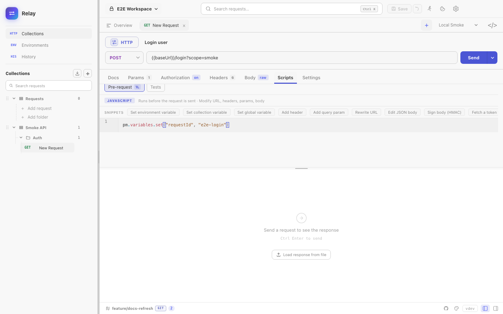
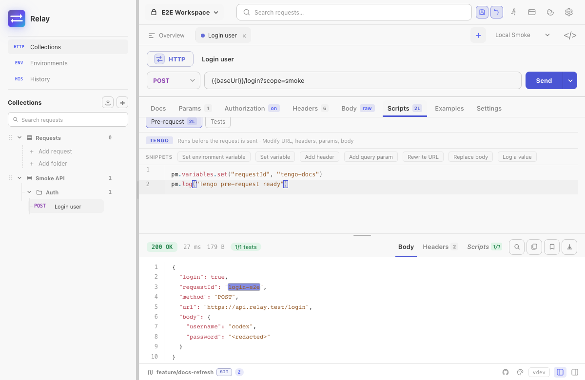

Relay scripts run in a sandboxed JavaScript VM by default. Existing requests can still use the legacy [Tengo](https://github.com/d5/tengo) engine. Both engines expose the same `pm.*` API and execution caps at **2 seconds**.

There are two script hooks per request:

- **Pre-request** — runs after variable substitution, before the wire send. Use it to inject auth, set query params, log inputs.
- **Tests** — runs after the response is received. Use it to assert and to extract values for chained requests.





## Anatomy of a pre-request script

```js
// Set a trace header for every request
pm.request.headers.set("X-Trace", "relay-" + pm.variables.get("runId"))

// Override the URL conditionally
if (pm.environment.get("region") === "eu") {
  pm.request.set_url("https://eu.api.example.com" + pm.request.url)
}
```

## Anatomy of a test script

```js
pm.test("status is 200", () => pm.response.to.have.status(200))
pm.test("response under 500ms", () => pm.expect(pm.response.responseTime).to.be.below(500))

const body = pm.response.json()
pm.test("has user id", () => pm.expect(body.user).to.have.property("id"))
pm.test("role is admin", () => pm.expect(body.user.role).to.equal("admin"))

// Persist for downstream requests
pm.environment.set("userId", body.user.id)
pm.log("captured userId:", body.user.id)
```

Test results appear in the response **Scripts** panel with pass/fail counts.

## Snippets

The **Snippets** row above the editor inserts working code at the end of the current script — setting a variable, adding a header, editing or signing the body, asserting a status, checking a JSON schema. The list follows the active engine, so Tengo requests get Tengo snippets. Hovering a snippet shows the code it will insert.

## Building the request body

A pre-request script can read and rewrite the body that goes on the wire, which is what request signing needs:

```js
const payload = pm.request.body.json()
payload.nonce = pm.crypto.randomHex(8)
pm.request.body.update(JSON.stringify(payload))
pm.request.headers.set("X-Signature", pm.crypto.hmacSha256(pm.request.body.raw, pm.environment.get("secret")))
```

See [`pm.request.body`](/docs/reference/scripting-api/#pmrequest) for the details, including how binary file bodies behave.

## Common patterns

**Chained auth — fetch token in pre-request:** put the login call in a separate request, run it once, persist the token with `pm.environment.set("authToken", ...)`. Downstream requests reference `{{authToken}}`. To do it inline instead, turn on **Allow pm.sendRequest** in the request's Settings tab and call [`pm.sendRequest`](/docs/reference/scripting-api/#pmsendrequest).

**Conditional skip:** `pm.execution.skipRequest()` in a pre-request script skips the send. It is reported as a skip rather than a failure, so a conditional request does not fail a run or a CI exit code.

**Schema checks:** `pm.response.to.have.jsonSchema(schema)` validates the body against a JSON Schema. `tv4` and `require("ajv")` are available for collections that were written against those.

**Logging:** `pm.log(...)` writes to the **Scripts** panel. Output is per-request and cleared on next send.

## Limits

- 2-second wall clock per script by default, configurable per request up to 60 seconds.
- No module imports, process access, filesystem access, or direct network sockets. `require` resolves only [Relay's bundled stand-ins](/docs/reference/scripting-api/#require) — `lodash`, `ajv`, `tv4`, `uuid`, `crypto-js`, `chai`.
- Scripts make HTTP calls only through `pm.sendRequest`, and only when the request opts in.
- Tengo uses expression-style assertions: `pm.test("status", pm.response.code == 200)`.
- JavaScript supports Postman-style callbacks: `pm.test("status", () => pm.response.to.have.status(200))`.

See the full method reference in [Scripting API](/docs/reference/scripting-api/).
