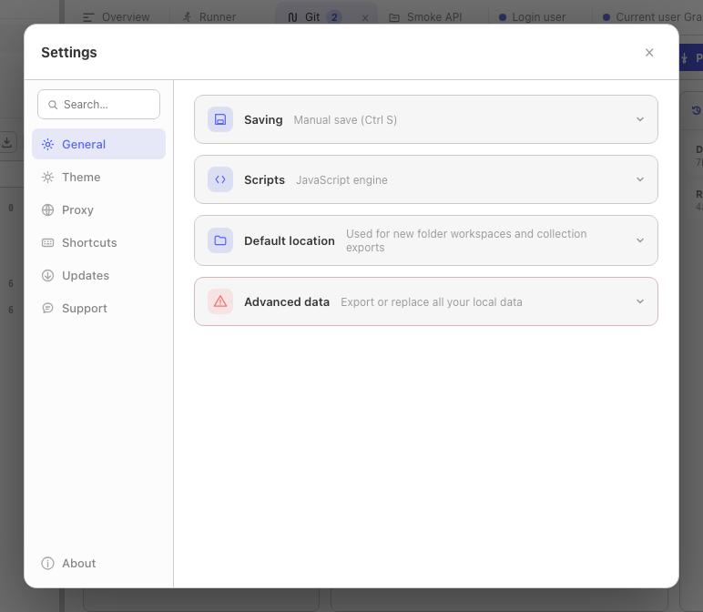
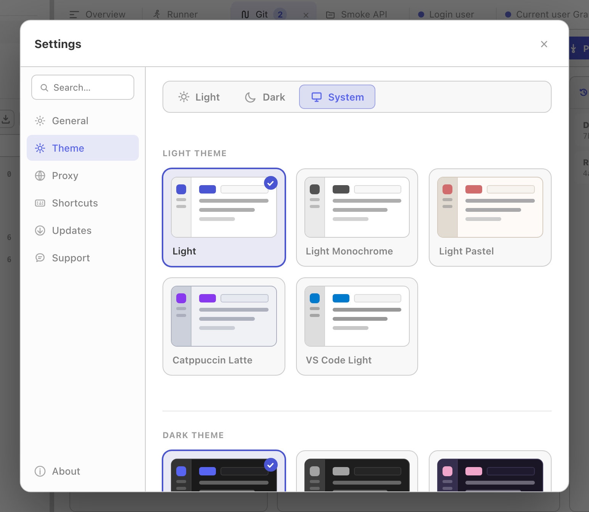

Open app settings from the gear button in the title bar or with the **Settings** keyboard shortcut. The search field filters the settings navigation and the cards shown on the General tab.

App settings are different from the settings attached to API data:

| Scope | Where to edit | What it affects |
|-------|---------------|-----------------|
| App | Gear button -> Settings | Relay on this device: saving mode, theme, global proxy, shortcuts, updates, and local preferences. |
| Collection | Collection menu -> Settings | Defaults applied to requests in that collection. |
| Request | Open request -> Settings tab | Transport and protocol behavior for one request. |

See [Collection defaults](/docs/guides/collection-defaults/) and [Per-request settings](/docs/guides/request-settings/) for the other two scopes.

## General

### Saving

Choose one of two modes:

- **Autosave** saves request and collection edits automatically.
- **Manual save** keeps edits dirty until you click **Save** or use the save shortcut. A dot on the request tab marks unsaved work.

In manual-save mode, an all-data export contains the last saved version of each request, not unsaved editor changes. Relay warns you before exporting when dirty requests exist.

### Script engine

Choose **JavaScript** for Postman-style scripts or **Tengo** for the legacy lightweight engine. The selection controls which script fields Relay displays and runs.

Each request and collection keeps separate JavaScript and Tengo source. Switching engines does not delete the script stored for the other engine.

See [Scripting](/docs/guides/scripting/) for runtime behavior and examples.

### Default location

The default location is the starting directory for:

- New folder-backed workspaces.
- Collection exports that ask for a destination folder.

Changing it does not move existing workspaces or repositories.

### Advanced data

**Export all data** creates a Relay-to-Relay JSON backup. **Import all data** replaces the current local profile after confirmation.

Read [Backup & recovery](/docs/guides/backup-recovery/) before using the import action.

## Theme

Choose **Light**, **Dark**, or **System**, then select separate light and dark variants. System mode follows the operating-system appearance and uses the matching selected variant.

Theme preferences apply only to Relay's UI; they do not change generated code, request headers, or response rendering.

## Proxy

The Proxy tab configures the fallback used across requests on this device. Request and collection proxy URLs can override it.

See [Proxy configuration](/docs/guides/proxy/) for precedence, authentication, bypass rules, and the difference between Off, On, and System modes.

## Shortcuts

Click a command and press the desired key combination. Individual shortcuts and the complete set can be reset to their defaults.

The current command list and default bindings are documented in [Keyboard shortcuts](/docs/reference/keyboard-shortcuts/).

## Updates

Release builds can:

1. Check for an update.
2. Show release notes.
3. Download and install the selected build.
4. Restart Relay to apply it.

Development builds created with `make dev` or `go run` do not use the release updater.

The **About** tab also has **Automatically install updates**. When enabled, Relay performs the background check, installs a discovered release, and asks you to restart. The setting is disabled in development builds.

## What's new

The first time Relay starts after updating to a new version, it opens a **What's new** screen with that release's notes. It appears once per version: relaunching the same build, downgrading, and a first-ever install all stay quiet — a brand-new user has nothing to catch up on.

You can reopen it any time from **About → What's new**. The notes are bundled with the build, so the screen works offline and always describes the version you are actually running.

## Support and About

**Support** opens Relay's public issue tracker for bugs and questions. **About** shows the installed Relay version and platform; include both when reporting a problem.

For common failures, start with [Troubleshooting](/docs/troubleshooting/).
