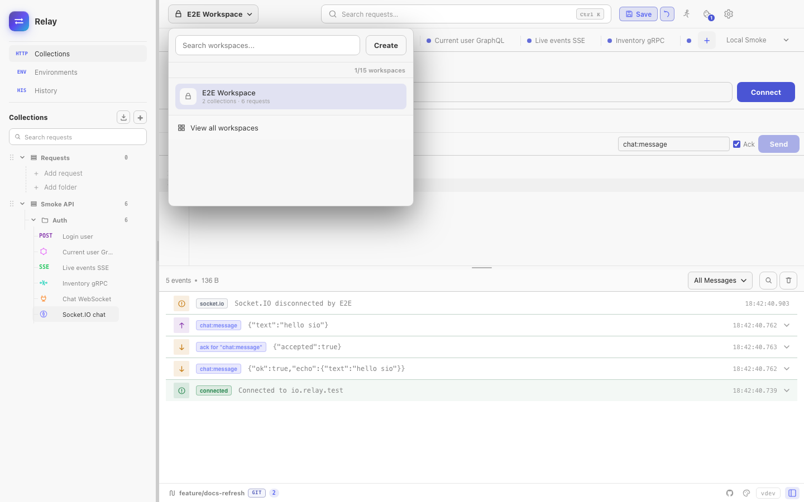
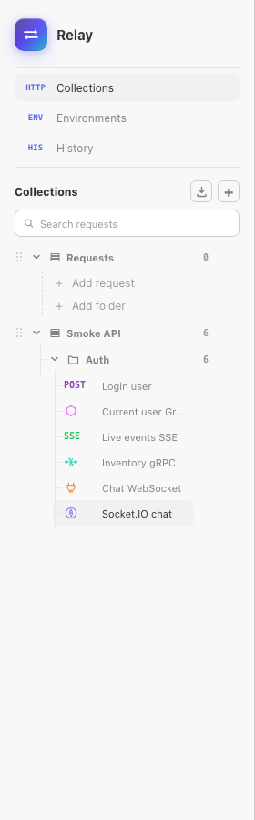

Relay arranges your requests in a workspace -> collection -> folder tree:

```
Workspace
└─ Collection
   ├─ Folder
   │  ├─ Subfolder
   │  │  └─ Request
   │  └─ Request
   └─ Request
```

Use **workspaces** to separate unrelated work (personal · day-job · client X), **collections** to group requests by API or domain (`Stripe v2024` · `internal billing`), and **folders/subfolders** to slice a large collection by feature, version, or test scenario.


## Workspaces

A workspace is the top-level container. Everything inside it — collections, environments, request history, cookie jar — is scoped to that workspace and invisible to the others.

### Creating a workspace

Click the workspace name in the title bar and choose **+ New workspace**. Pick a short name; you can rename it any time via the same menu.

### Switching workspaces

The same dropdown shows all workspaces with their request counts. Switching is instant — Relay keeps each workspace's open tabs, active environment, and last-viewed request restored separately.



### Workspace overview

If no request is open, the workspace overview is shown. It surfaces:

- **Workspace notes** — a freeform textarea that's saved with the workspace. Great for noting API base URLs, regex for the auth header, conventions, or onboarding pointers for teammates.
- **Quick actions** — one-click access to create collections / requests / environments, jump to Git sync, open the code-snippet drawer, or hop into Settings.

## Collections

A collection groups related requests inside a workspace. There's no maximum — you can have hundreds of small collections or a few large ones.

### Creating a collection

- Sidebar header → **+** (the plus button)
- Workspace overview → *Create collection* quick action
- Right-click anywhere in the empty sidebar area → *New collection*
- Empty-state CTA when a workspace has no collections yet

Each collection has a **name**, a **filesystem name** (auto-derived for Git sync), and child folders/requests. Inline rename: double-click the collection title in the sidebar.

### Collection menu

The `⋯` button next to a collection reveals:

- **Add request** / **Add folder** — quick creators that drop new items into this collection
- **Run collection** — opens the [Collection Runner](/docs/guides/collection-runner/) with every runnable request inside. Useful for smoke-testing a whole API surface in order.
- **Rename** — opens the same inline editor as double-click.
- **Export collection** — writes a Postman, OpenAPI, or OpenCollection export to a file of your choice.
- **Delete** — destroys the collection and **everything inside it**. Asks for confirmation.

### Drag-and-drop reorder

Hover the `⋮⋮` handle on the left of a collection row to grab it. Drag onto another collection — drop above (top half) or below (bottom half) to set the new position. Order persists between sessions.

Drag-and-drop is disabled while a search is active in the sidebar (the order you see is sorted by relevance, not user order).

## Folders

Folders are optional. They're useful when a single collection has too many requests to scan quickly.

### Creating a folder

- Collection `⋯` menu → **Add folder**
- Inside a folder, the folder's `⋯` menu → **Add subfolder**

Folders can nest up to **4 levels deep** (a cap to keep the tree usable). Empty folders are preserved, so creating a folder does not force you to create a request immediately. Each folder caps at **50 requests** before you should split it; the *+ Request* button is disabled once you hit that limit, with a tooltip explaining why.

## Collection defaults

Open a collection workspace to configure reusable headers, variables, auth, scripts, tests, and transport settings. Requests can override headers and settings per field; auth is inherited only when the request uses **Inherit Auth**. Active environment values override collection variables with the same key.

Defaults exist at the collection level, not the folder level. See [Collection defaults](/docs/guides/collection-defaults/) for merge order, script order, reset behavior, and storage.

### Folder menu

The `⋯` next to a folder offers:

- **Add request** — drops a new request inside this folder
- **Add subfolder** — creates a child folder
- **Run folder** — Collection Runner scoped to just this folder's requests
- **Rename** — inline rename
- **Delete** — removes the folder and everything in it (with confirmation)

## Requests

A request is the leaf of the tree. Each request has its own URL, method, headers, body, auth config, pre-request and test scripts, settings, and notes.

### Creating a request

- Collection or folder `⋯` menu → **Add request**
- Workspace overview → *Create request* quick action
- Drafts: top of the sidebar → the request type picker (HTTP / GraphQL / WebSocket / Socket.IO). Drafts live in a special "scratch" area until you save them to a collection.

### The request `⋯` menu

Right-click (or click the `⋯` button on hover) on any request to reveal:

- **Rename** — inline rename; double-click the title also works
- **Duplicate** — clones the request, including auth/headers/body/scripts
- **Star** / **Unstar** — pins the request to the *Starred* group at the top of the sidebar. Star count appears in the workspace header.
- **Copy cURL** — copies a runnable `curl` command. Variables stay as `{{name}}` placeholders so the export doesn't leak secrets.
- **Delete** — asks for confirmation, then removes the request. If you deleted the only open tab, Relay switches to the workspace overview.

### Drag-and-drop between collections

Hover a request to reveal its `⋮⋮` handle, then drag it into another collection or folder. The new parent is highlighted while you hover; drop to commit.

You can't drag requests into a folder that's reached the 50-request cap — Relay refuses the drop and shows a tooltip.

## Starred (favourites)

Use **Star** to mark requests you reach for often. Starred requests appear in their own group at the top of the sidebar, **above all collections**, regardless of which collection they live in. Unstar from the same menu to remove them from the favourites group (the request itself stays in its collection).

The Starred group only appears when at least one request is starred and can be collapsed like a collection section.

## Search

The sidebar search input filters requests by name, URL, and method as you type:

- Plain text matches request names and URLs
- Prefixing with `m:` filters by method (`m:POST users`)
- Filter is workspace-scoped — searching doesn't leak between workspaces

Press the *Global search* shortcut (default `Cmd/Ctrl K`) for a workspace-wide search that opens the matching request directly.

## Empty states

When something is empty, Relay shows a hint so you're never staring at blank space:

- **No collections yet** — sidebar onboarding with *New collection* / *Import collection* buttons
- **Empty collection** — inline *+ Add request* / *+ Add folder* rows inside the collection
- **Empty folder** — same pattern, nested one level deeper



Once an item is added, the hint disappears.

## Git storage

If the workspace is backed by a folder or Git repository, collections and folders are written to YAML files with explicit `folderPaths`, so empty folders survive round-trips through Git and OpenCollection export. See [Git-backed workspaces](/docs/guides/git-workspaces/) for the full workflow.
