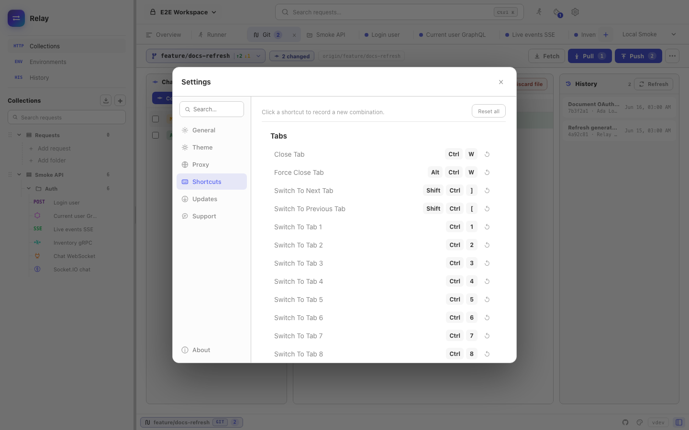

On macOS Relay displays `Cmd` shortcuts with `⌘`. On Windows and Linux the same defaults display and run as `Ctrl`.

Every shortcut is rebindable from **Settings → Shortcuts**. Click any shortcut chip, press the new combo, done. Reset all to factory defaults with the *Reset all* button.

## Global

| Shortcut | Action |
|----------|--------|
| `Cmd/Ctrl K` | Global search (requests, collections, history) |
| `Cmd/Ctrl ,` | Open settings |
| `Cmd/Ctrl Backslash` | Toggle sidebar |
| `Alt Cmd/Ctrl Backslash` | Toggle right sidebar / code snippet panel |
| `Cmd/Ctrl /` | Open shortcut help |

## Requests

| Shortcut | Action |
|----------|--------|
| `Cmd/Ctrl N` | New request / collection / environment dialog |
| `Cmd/Ctrl W` | Close current tab |
| `Alt Cmd/Ctrl W` | Force close current tab |
| `Shift Cmd/Ctrl T` | Reopen last closed tab |
| `Cmd/Ctrl Enter` | Send request |
| `Cmd/Ctrl S` | Save request |
| `Cmd/Ctrl 1` … `Cmd/Ctrl 9` | Switch to tab 1–9 |
| `Shift Cmd/Ctrl [` / `Shift Cmd/Ctrl ]` | Previous / next tab |

## Sidebar

| Shortcut | Action |
|----------|--------|
| `Cmd/Ctrl F` | Search sidebar |
| `↑` / `↓` | Previous / next sidebar item |
| `→` / `←` | Expand / collapse selected item |
| `Alt →` / `Alt ←` | Expand all / collapse all |
| `Cmd/Ctrl E` | Rename selected item |
| `Cmd/Ctrl D` | Duplicate selected item |
| `Cmd/Ctrl C` / `Cmd/Ctrl V` | Copy / paste selected item |
| `Backspace` | Delete selected item |

## Remapping

**Settings → Shortcuts** lists every action with its current binding. Click a shortcut, press the desired key combination, and the new binding is saved immediately. Assigning an existing combination unassigns it from the previous action. **Reset all** restores the default table.
