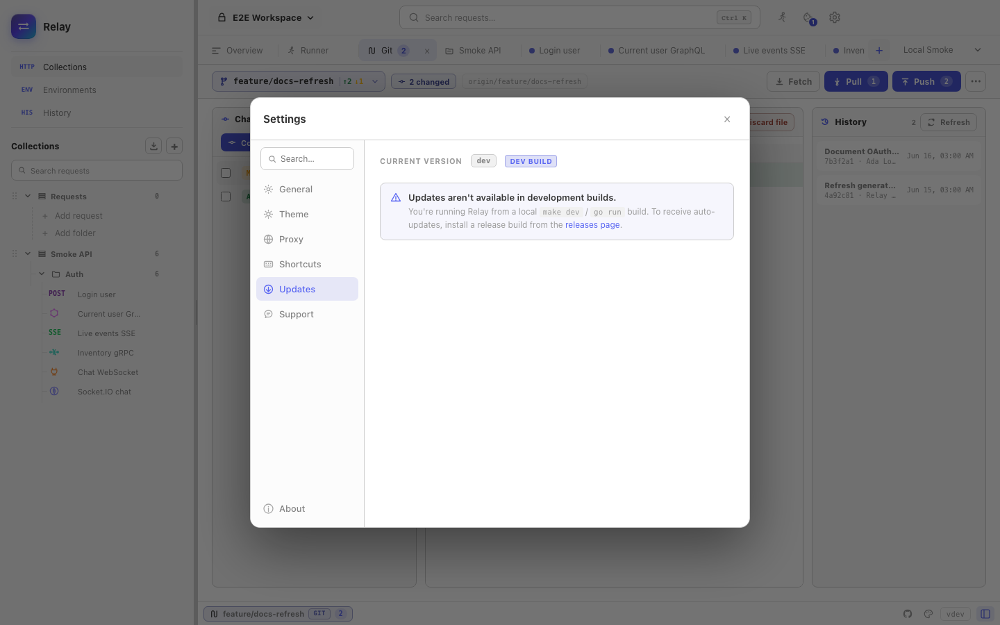

This page collects the issues people run into most often. If your situation isn't listed, the fastest path is the [GitHub issue tracker](https://github.com/relay-client/relay/issues) — please include your Relay version (Settings → About), OS, and a reproduction.

## Installation

### macOS: "Relay can't be opened because Apple cannot check it for malicious software"

Current Relay DMGs are not Apple-notarized, so Gatekeeper can block the first launch. You have three options:

1. **One-time bypass.** Right-click `Relay.app` in Finder → **Open**, then **Open** again in the dialog. From then on macOS remembers your choice.
2. **System Settings.** Try to open Relay once (you'll see the error), then open *System Settings → Privacy & Security*. Scroll down — there's a "Relay was blocked" entry with an **Open Anyway** button.
3. **Terminal.** `xattr -dr com.apple.quarantine /Applications/Relay.app`.

### macOS: "Relay is damaged and can't be opened"

This is the second-tier Gatekeeper error after the previous one was bypassed too aggressively. Run:

```bash
xattr -dr com.apple.quarantine /Applications/Relay.app
```

then open from Finder normally.

### Windows: SmartScreen warning "Windows protected your PC"

Confirm the installer came from the official release repository and verify its SHA-256 checksum, then click **More info** → **Run anyway**. The NSIS installer is not currently Authenticode-signed. In-app updater binaries are separately verified by SHA-256 and minisign before installation.

### Linux: AppImage won't launch

The most common cause is a missing executable bit:

```bash
chmod +x relay-*.AppImage
./relay-*.AppImage
```

If you see `libfuse.so.2: cannot open shared object file`, install FUSE 2:

```bash
sudo apt install libfuse2     # Debian/Ubuntu
sudo dnf install fuse-libs    # Fedora
```

### Linux: GTK / WebKit errors

Relay needs the GTK 3 and WebKit 2 runtime libs. Install:

```bash
# Debian / Ubuntu
sudo apt install libgtk-3-0 libwebkit2gtk-4.0-37

# Fedora
sudo dnf install gtk3 webkit2gtk4.0
```

## Connectivity

### "The request timed out" on every request

Check, in order:

1. Can you `curl` the same URL from a terminal on the same machine?
2. Is your VPN / corporate proxy blocking it? See [Proxy setup](#requests-go-through-a-corporate-proxy).
3. Open *Per-request settings* and bump the timeout to `60000` (60 s). Some upstream services are slow to respond on the first request.

### "TLS handshake failure" / "certificate signed by unknown authority"

Most often a corporate root CA isn't trusted by your OS. Install the CA into your system trust store — Relay uses OS trust roots. After installing, restart Relay.

If you can't install the CA system-wide, you can disable verification just for the offending request in *Per-request settings → Enable SSL certificate verification* (a confirmation dialog explains the risk). Don't ship a request with this off to a server you don't control.

### Requests go through a corporate proxy

Open **Settings -> Proxy** and choose **System** to use standard environment proxy behavior:

- `HTTP_PROXY` / `HTTPS_PROXY` - proxy URL, optionally with credentials.
- `NO_PROXY` - comma-separated hosts that connect directly.

Alternatively, choose **On** and configure an HTTP, HTTPS, or SOCKS5 proxy directly in Relay. A non-empty request or collection proxy URL overrides the global mode.

See [Proxy configuration](/docs/guides/proxy/) for precedence, bypass matching, password persistence, and direct connections.

### DNS resolution fails inside Relay but works in browser

Check whether the browser and Relay are taking different proxy paths. In System mode, add the hostname to `NO_PROXY`. In custom On mode, add it to **Proxy Bypass**. Use a hostname only, without protocol or port.

## Updates

### "No compatible update package is available for this device yet"

This error means the auto-updater couldn't find a binary for your platform in the latest release. Either:

- A new platform was added in the latest release and your old build doesn't know about it (unlikely),
- Or the release was partial — e.g. the maintainer published a macOS-only patch release. Wait for the next full release.

### Updates aren't available in development builds

If you're running a `make dev` / `go run` build, Settings → Updates shows a *DEV BUILD* badge and a notice instead of a Check button. This is intentional — there's no released version newer than your local source tree. Install a release build to receive updates.



### "The downloaded update could not be verified"

The downloaded binary's SHA-256 or minisign signature didn't match what `latest.json` claimed. Causes:

- Network interruption during download — try again.
- Antivirus modified the binary in transit — temporarily allowlist the Relay update cache.
- Compromised release channel — file a security issue immediately ([SECURITY.md](https://github.com/relay-client/relay/blob/main/SECURITY.md)).

### Update applied but Relay didn't restart

Click *Restart now* in Settings → Updates. If that doesn't work, quit Relay manually and reopen it — the new binary is already in place.

## Data and storage

### My collections / environments are gone

First, don't panic and don't reinstall — your data is on disk, not in the app bundle. Check whether:

- You're in a different workspace than you remember. Switch via the workspace dropdown in the title bar.
- You signed into a different OS user / Profile and Relay is reading another directory.

Find your data manually:

| Platform | Location |
|----------|----------|
| macOS    | `~/Library/Application Support/Relay/` |
| Windows  | `%AppData%\Relay\` |
| Linux    | `~/.config/Relay/` |

The `requests.json` file is an AES-256-GCM encrypted JSON envelope containing local profile state and secrets. If it's present but Relay can't read it, see "Decryption failed" below.

### "Decryption failed" or empty on startup

Relay couldn't decrypt `requests.json` with any available key copy. Relay normally keeps `request-store.key` in the app-data directory as a `0600` recovery copy and also stores the key in Keychain, DPAPI, or libsecret when available.

Common causes:

- `requests.json` was restored without the matching `request-store.key`.
- Files were copied from another OS user without preserving access to the key.
- The encrypted profile and recovery key came from different installations.

Restore `requests.json` and its matching `request-store.key` together. If no matching key exists, the encrypted data cannot be recovered; export/import backups are the safer migration path between machines. See [Backup & recovery](/docs/guides/backup-recovery/) for the full restore procedure.

### "Warning: changes could not be saved"

Disk full, or Relay's data directory is no longer writable (permissions changed, drive unmounted). Free up space or fix permissions and the next save will succeed.

## UI quirks

### Settings → Updates says "DEV BUILD" but I downloaded a release

Your build has `appVersion=dev` baked in — the release ldflags didn't apply. If you built it yourself, run `make build` from a tagged commit. If you downloaded it from GitHub releases, file an issue.

### Sidebar drag-and-drop doesn't work

Drag-and-drop is disabled while the sidebar search has text in it (because the sorted order is by relevance, not user-defined). Clear the search box and drag works again.

### A folder won't accept any more requests

Folders cap at 50 requests for performance. Either move some requests up to the parent collection, or split the folder into subfolders.

## Performance

### "App feels sluggish when typing in the URL"

Relay defaults to **Manual save**, where typing only refreshes the unsaved-changes indicator (debounced 250 ms) and the write happens on `Cmd/Ctrl S`. With **Autosave** enabled, each pause also persists the request to the encrypted store (debounced 1.2 s); on a multi-MB store that write can stutter on slow disks. Try:

- *Settings → General → Manual save* (the default) — write only on `Cmd/Ctrl S` instead of autosaving on every pause.
- Clean up old history: *Sidebar → History → ⋯ → Clear all*.

### Huge response slows everything down

Responses over 100 MB are truncated while being read; bytes beyond the cap are not kept in memory and cannot be recovered with **Save response**. For very large downloads, use a dedicated download tool until Relay supports uncapped streaming-to-file.

## Asking for help

If you're stuck, the fastest path is:

1. Open *Settings → About* and note your version + platform.
2. Open the browser DevTools inside Relay (right-click → *Inspect Element* in dev/source builds, or run with `RELAY_DEVTOOLS=1` if your build supports it) and copy any console errors.
3. File a [GitHub issue](https://github.com/relay-client/relay/issues/new) with the version, platform, console output, and a reproduction.

For security issues, please use [SECURITY.md](https://github.com/relay-client/relay/blob/main/SECURITY.md) instead of public issues.
