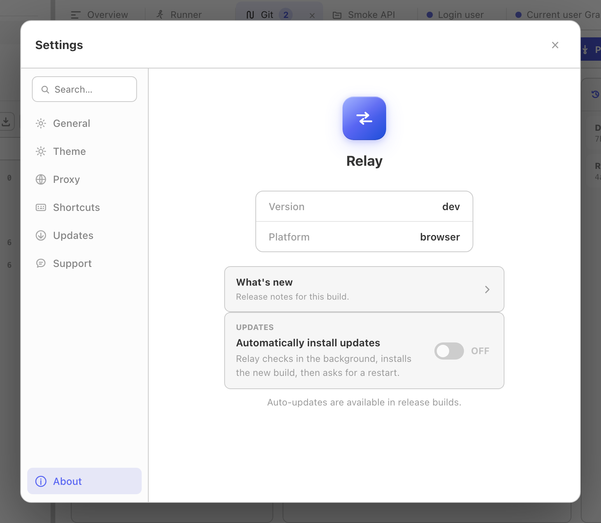

Relay is a local-first desktop application. There is no Relay backend, account system, cloud sync, usage analytics, crash reporting, or telemetry. Network access occurs only for product features that require it, such as requests, Git operations, OAuth flows, schema introspection, and update checks.

This page documents exactly what data Relay stores, where, how it's protected, and the few cases where the app talks to a network on your behalf.

None of it has to be taken on trust: Relay is open source under the MIT license, so every claim below can be checked against the code at [relay-client/relay](https://github.com/relay-client/relay), and the binaries can be reproduced from that source.

## What Relay stores on your machine

Workspace state, requests, environments, response history, cookies, secrets, and preferences are written to local disk. Relay is a single-tenant, file-based application:

| Platform | Location |
|----------|----------|
| macOS    | `~/Library/Application Support/Relay/` |
| Windows  | `%AppData%\Relay\` |
| Linux    | `~/.config/Relay/` or `$XDG_CONFIG_HOME/Relay/` |

Inside that directory you may find:

- `requests.json` — an AES-256-GCM encrypted JSON envelope containing local profile state, history, workspace cookies, Git-local secret values, and storage metadata.
- `request-store.key` — a base64-encoded recovery copy of the encryption key, written with owner-only `0600` permissions.
- `request-store.key.dpapi` — an additional Windows DPAPI-protected key copy.
- `preferences.json` — the configured default workspace location. Other UI preferences are stored by the desktop WebView.
- `workspaces/` — the default folder-backed YAML workspace location.

If you select another workspace folder or Git repository, its shared YAML files live at that selected path. Those files are intentionally human-readable and are not encrypted as a unit.

You can move, back up, or delete this directory at any time. Deleting it returns Relay to a clean state on next launch.

## Encryption at rest

The request store is encrypted with **AES-256-GCM**:

- A fresh 256-bit key is generated locally the first time Relay starts.
- The key is additionally stored in the OS credential store wherever possible:
  - **macOS** — Keychain (the same store used by Safari / login items)
  - **Windows** — DPAPI (current user; non-exportable to another user account)
  - **Linux** — libsecret via `secret-tool` (GNOME Keyring, KWallet, etc.)
- Relay also keeps `request-store.key` as a recovery copy even when the credential-store write succeeds. This avoids losing encrypted data if the credential-store entry disappears.
- The recovery file is owner-readable only, but it is not protected by another secret. Anyone who can read both `requests.json` and `request-store.key` can decrypt the local profile.
- Every encrypted payload uses a unique random nonce. There is no nonce reuse across writes.

For folder/Git workspaces, Relay replaces sensitive YAML values with `{{relaySecret:...}}` placeholders and stores the real values inside the encrypted local profile.

## What leaves your machine

A few bounded categories of network calls happen on your behalf:

1. **Requests you send.** This is the whole point — when you press Send, Relay opens a connection to the host you typed in the URL bar. The request is built on your machine and sent directly unless you configured a system, global, or per-request proxy.
2. **Auto-update checks.** On launch (and when you press *Check for updates*), Relay fetches `latest.json` from the public release repository (`github.com/relay-client/relay`) over HTTPS. Release builds verify the downloaded binary by SHA-256 and minisign signature. No usage data is included in the request.
3. **OAuth 2.0 authorization and token calls.** Relay can open the provider's authorization page and call the authorization/token endpoints you configured.
4. **GraphQL schema introspection.** When you load a GraphQL schema URL in the Schema tab, Relay sends a standard introspection query to that URL.
5. **Git remotes.** Clone, fetch, pull, push, remote tests, and remote branch actions contact the Git server you configured.

Proxy settings can route these requests through your selected system or custom proxy. There is no separate telemetry channel or first-launch ping.

## Scripting safety

Pre-request and test scripts run in a sandboxed JavaScript VM by default, with a legacy [Tengo](https://github.com/d5/tengo) engine for existing requests:

- Imports, `require`, process access, filesystem access, and direct network sockets are disabled.
- Execution is capped at **2 seconds** per script.
- Scripts have access only to the explicit `pm.*` API (request/response/variables/environment/log). They cannot reach the file system, spawn processes, or open network sockets directly. Any HTTP call goes through the regular request engine.

## Cookies

By default Relay maintains a cookie jar across requests, just like a browser. Cookies are stored in encrypted `requests.json`. You can:

- Inspect and edit cookies per domain in the Cookies modal (the icon next to the URL bar).
- Clear all cookies from that modal.
- Disable the cookie jar for an individual request in *Per-request settings*.

Cookies are never transmitted anywhere except in the request to the domain that set them, following standard browser rules.

## Data export and deletion

- **Export** - *Settings -> General -> Advanced data -> Export all data* writes workspace data, history, cookies, secrets, and selected preferences to a plaintext JSON file you choose. External Git repositories, the global proxy password, and some local UI preferences are not bundled. See [Backup & recovery](/docs/guides/backup-recovery/).
- **Import** — replaces the current profile with a previous export. This is destructive; Relay shows a confirmation dialog before running.
- **Delete** — quit Relay and remove the directory listed under [What Relay stores on your machine](#what-relay-stores-on-your-machine).

## Reporting a security issue

If you find a vulnerability, please follow the process in our [security policy](https://github.com/relay-client/relay/blob/main/SECURITY.md). Please do not file public GitHub issues for security problems.
